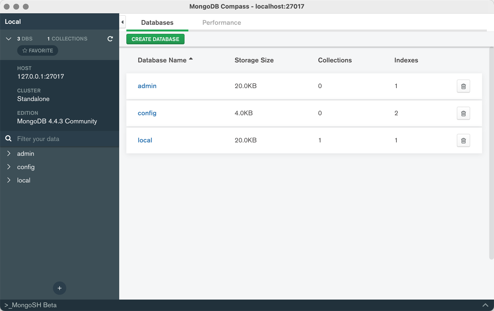

```
{
    "url": "mongo-install",
    "time": "2018/12/10 06:37",
    "tag": "MongoDB"
}
```

# 一、安装

通过官方下载社区版本（MongoDB Community Server），选择对应平台下载后解压即可看到可执行程序。

```
$ ls ~/data/mongodb-macos-x86_64-4.4.3/
LICENSE-Community.txt MPL-2                 README                THIRD-PARTY-NOTICES   bin

$ ll ~/data/mongodb-macos-x86_64-4.4.3/bin/
total 320808
-rwxr-xr-x@ 1 peng  staff      7683 12 22 07:42 install_compass
-rwxr-xr-x  1 peng  staff  43147504 12 22 07:39 mongo
-rwxr-xr-x  1 peng  staff  68692572 12 22 07:40 mongod
-rwxr-xr-x  1 peng  staff  52399600 12 22 07:32 mongos
```

方便访问以设置bin目录到环境变量，创建配置文件`mongod.conf`：

```
systemLog:
    destination: file
    path: "/Users/peng/data/mongodb-macos-x86_64-4.4.3/logs/mongodb.log"
    logAppend: true
storage:
    dbPath: "/Users/peng/data/mongodb-macos-x86_64-4.4.3/data/"
    journal:
        enabled: true
net:
    port: 27017
    bindIp: 127.0.0.1
processManagement:
    fork: true
    pidFilePath: "/Users/peng/data/mongodb-macos-x86_64-4.4.3/logs/mongod.pid"

```

启动服务

```
$ mongod -f ~/data/mongodb-macos-x86_64-4.4.3/mongod.conf
about to fork child process, waiting until server is ready for connections.
forked process: 49268
child process started successfully, parent exiting
```

停止服务

```
$ mongo
MongoDB shell version v4.4.3
connecting to: mongodb://127.0.0.1:27017/?compressors=disabled&gssapiServiceName=mongodb
Implicit session: session { "id" : UUID("ef69ef5a-9a83-45f4-a1ca-b63717183535") }
MongoDB server version: 4.4.3
switched to db admin
> db
admin
> db.shutdownServer()
server should be down...
```

通过官方安装MongoDB GUI管理工具：MongoDB Compass，效果图如下：



**MongoDB与Mysql结构对比**

| MYSQL         | MongoDB           | 说明                             |
| ------------- | ----------------- | -------------------------------- |
| 库 - database | 库 - database     |                                  |
| 表 - table    | 集合 - collection | 表示一组文档                     |
| 行 - row      | 文档 - document   | 基本单元，类似关系型数据库中的行 |

# 二、基本用法

## 2.1 登录

```
$ mongo --host 127.0.0.1 --port 27017
$ use demo

# 配置文件有开启授权认证时需要先验证
$ db.auth("demo", "passwd")
$ show collections
```

也可以直接登录时指定密码，前面的demo是demo库

```
> mongo demo -udemo -p
MongoDB shell version v3.4.24
Enter password:
connecting to: mongodb://127.0.0.1:27017/demo
MongoDB server version: 3.4.24
```

## 2.2 基本查询

```
# 显示数据库列表
> show dbs
> show databases

# 显示库中的集合
> show tables
> show collections

# 切换数据库
> use demo

> db.articles.find().pretty()
{
	"_id" : ObjectId("6006394a1e1382e154503c71"),
	"title" : "Hbase配置及数据迁移",
	"href" : "https://itopic.org/hbase.html"
}

> db.articles.find({top:1}).pretty()
{
	"_id" : ObjectId("6006396c1e1382e154503c72"),
	"title" : "Apache Airflow数据库迁移",
	"href" : "https://itopic.org/airflow-data-migration.html",
	"top" : 1
}

> db.articles.find({'author.name':'peng'}).pretty()
{
	"_id" : ObjectId("60063a931e1382e154503c74"),
	"title" : "Python入门知识点整理",
	"href" : "https://itopic.org/python.html",
	"top" : 1,
	"author" : {
		"name" : "peng",
		"age" : 18
	}
}

> db.articles.count()
4

# 按创建时间倒叙取3条
> db.articles.find().limit(3).sort({created_ts: -1})
```

## 2.3 插入与更新

**数据插入**

```
> db.articles.insert({title: "Shell脚本入门", href: "https://itopic.org/shell-start.html"})
WriteResult({ "nInserted" : 1 })
```

**数据更新**

```
> db.articles.update({title: "Shell脚本入门"}, {title: "Shell脚本入门", href: "", top:0})
WriteResult({ "nMatched" : 1, "nUpserted" : 0, "nModified" : 1 })
```

## 2.4 数据删除

```
> db.articles.remove({title: "Shell脚本入门"})
WriteResult({ "nRemoved" : 1 })
```

# 三、用户管理

## 3.1 创建用户

创建admin用户，创建用户时指定角色为root。内置了一些角色：

| **角色**             | **介绍**                                                     |
| -------------------- | ------------------------------------------------------------ |
| read                 | 提供读取所有非系统的集合（数据库）                           |
| readWrite            | 提供读写所有非系统的集合（数据库）和读取所有角色的所有权限   |
| dbAdmin              | 提供执行管理任务的功能，例如与架构相关的任务，索引编制，收集统计信息。此角色不授予用户和角色管理权限。 |
| dbOwner              | 提供对数据库执行任何管理操作的功能。此角色组合了readWrite，dbAdmin和userAdmin角色授予的权限。 |
| userAdmin            | 提供在当前数据库上创建和修改角色和用户的功能。由于userAdmin角色允许用户向任何用户（包括他们自己）授予任何权限，因此该角色还间接提供对数据库的超级用户访问权限，或者，如果作用于管理数据库，则提供对群集的访问权限。 |
| clusterAdmin         | 提供最佳的集群管理访问。此角色组合了clusterManager，clusterMonitor和hostManager角色授予的权限。此外，该角色还提供了dropDatabase操作。 |
| readAnyDatabase      | 仅在admin 数据库中使用，提供所有数据库的读权限。             |
| readWriteAnyDatabase | 尽在admin 数据库中使用，提供所有数据库的读写权限             |
| userAdminAnyDatabase | 尽在admin 数据库中使用，提供与userAdmin相同的用户管理操作访问权限，允许用户向任何用户（包括他们自己）授予任何权限，因此该角色还间接提供超级用户访问权限。 |
| dbAdminAnyDatabase   | 仅在admin 数据库中使用，提供与dbAdmin相同的数据库管理操作访问权限，该角色还在整个群集上提供listDatabases操作。 |
| root                 | 尽在admin 数据库中使用，提供超级权限                         |

```
> use.admin  
> db.createUser({
  user: 'admin',
  pwd: '123456',
  roles:[{
    role: 'root',
    db: 'admin'
  }]
})

Successfully added user: {
	"user" : "admin",
	"roles" : [
		{
			"role" : "root",
			"db" : "admin"
		}
	]
}
```

**查看用户**，需要切换到对应的库下面

```
> use demo
switched to db demo
> show users
{
	"_id" : "demo.demo",
	"userId" : BinData(4,"dzjECUu2Q4aNATGogyNRTw=="),
	"user" : "demo",
	"db" : "demo",
	"roles" : [
		{
			"role" : "dbOwner",
			"db" : "demo"
		}
	]
}
> use admin
> db.system.users.find().pretty()
```

**创建用户**

```
> use demo
> db.createUser({
  user: 'demo',
  pwd: '123456',
  roles:[{
    role: 'dbOwner',
    db: 'demo'
  }]
})
```

## 3.2 删除用户

```
> use demo
> db.dropUser('demo')
```

## 3.3 更新密码

```
> db.updateUser('demo', {pwd: '123456'})
```

# 四、数据库管理

## 4.1 创建数据库

**创建数据库**，需要传入一条记录才可以看到对应的数据库。

```
> use demo
> db.articles.insert({title: "Shell脚本入门", href: "https://itopic.org/shell-start.html"})
```

## 4.2 删除集合

````
> show collections
> db.articles.drop()
````

## 4.3 删除数据库

```
> use demo
> db.dropDatabase()
```

# 五、数据修复

同步数据后可能出现**ERROR: child process failed, exited with error number 51**

```
$ rm /data/mongodb-macos-x86_64-4.4.3/data/mongod.lock
$ /data/mongodb-macos-x86_64-4.4.3/bin/mongod --repair --dbpath=/data/mongodb-macos-x86_64-4.4.3/data
```


---

- [1] [MongoDB官网](https://www.mongodb.com)
- [2] [MongoDB数据库系列](https://www.kancloud.cn/noahs/linux/1425612)

