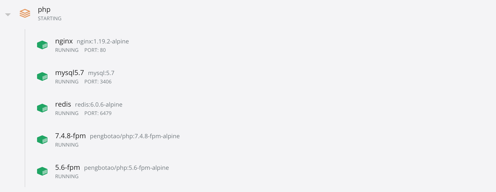

```
{
    "url": "docker-compose",
    "time": "2020/07/21 15:19",
    "tag": "Docker"
}
```

# 一、Docker Compose

## 1.1 概述

`compose`是`docker`提供的一个工具，用来定义和运行多个`Docker`容器，`Compose`的前身是`Fig`。

类似通过`dockerfile`来表示镜像的构建过程，`docker-compose`通过解析一个`YAML`配置文件实现对容器的构建以及启动。使用`compose`基本上有3个步骤：

- 1、通过`Dockerfile`定义镜像创建过程
- 2、在`docker-compose.yml`中定义服务，定义的服务可以在一个独立的环境中运行
- 3、通过`docker-compose`命令进行启停所有的服务

`docker-compose.yml`示例：

```
version: '2.0'
services:
  web:
    build: .
    ports:
    - "5000:5000"
    volumes:
    - .:/code
    - logvolume01:/var/log
    links:
    - redis
  redis:
    image: redis
volumes:
  logvolume01: {}
```

## 1.2 `docker-compose`

通过`docker-compose -h`可以看到用法，常用的几个：

编号|命令|说明
---|---|---
1|config|Validate and view the Compose file
2|build|Build or rebuild services
3|up|Create and start containers
4|down|Stop and remove containers, networks, images, and volumes
5|start|Start services
6|stop|Stop services
7|top|Display the running processes
8|version|Show the Docker-Compose version information

## 1.3 `docker-compose.yml`

`docker-compose`通过对YAML配置文件的解析实现对容器的整体控制，配置文件常用参数如下：

# 二、参数详解

@todo

# 三、示例

前一章中我们用`Dockerfile`构建了PHP镜像，主要是增加一些常用扩展，接下来看看整个PHP环境如何定义：

- nginx、mysql直接使用官方镜像，所以直接指定了image参数
- php需要增加扩展，可以通过build指定dockerfile文件，前一章编译好了，所以这里直接使用已有镜像


```
version: "3.0"

services:

    nginx:
      image: nginx:1.19.2-alpine
      container_name: nginx
      restart: always
      ports:
        - 80:80
      working_dir: /data/www
      volumes:
        - ~/workspace:/data/www
        - ./nginx/conf/nginx.conf:/etc/nginx/nginx.conf
        - ./nginx/conf.d:/etc/nginx/conf.d
        - ./nginx/logs:/var/log/nginx
      networks:
        - server

    php5.6:
      #build: ./php/dockerfile/5.6
      image: pengbotao/php:5.6-fpm-alpine
      container_name: 5.6-fpm
      restart: always
      working_dir: /data/www
      volumes:
        - ~/workspace:/data/www
        - ./php/5.6:/usr/local/etc
      networks:
        - server

    php7.4.8:
      #build: ./php/dockerfile/7.4.8
      image: pengbotao/php:7.4.8-fpm-alpine
      container_name: 7.4.8-fpm
      restart: always
      working_dir: /data/www
      volumes:
        - ~/workspace:/data/www
        - ./php/7.4.8:/usr/local/etc
      networks:
        - server

    mysql:
      image: mysql:5.7
      container_name: mysql5.7
      restart: always
      ports:
        - 3406:3306
      volumes:
        - ./mysql/conf:/etc/mysql
        - ./mysql/data:/var/lib/mysql
        - ./mysql/logs:/var/log/mysql
      environment:
        MYSQL_ROOT_PASSWORD: 123456
      networks:
        - server
    
    redis:
      image: redis:6.0.6-alpine
      container_name: redis
      restart: always
      ports:
        - 6479:6379
      volumes:
        - ./redis/conf:/usr/local/etc/redis
        - ./redis/data:/data
      command:
        redis-server /usr/local/etc/redis/redis.conf
      networks:
        - server

networks:
  server:
     driver: bridge
```

通过`docker-compose up`一行命令，里面的容器就都创建好并启动了，效果图如下：



# 四、小结

通过Dockerfile可以创建镜像，通过Docker可以管理各个容器，而Compose相当于对容器进行打包，将一组服务集中进行基本管理。

---

- [1] [Compose file version 3 reference](https://docs.docker.com/compose/compose-file/)
- [2] [docker-compose编排参数详解](https://www.cnblogs.com/wutao666/p/11332186.html)