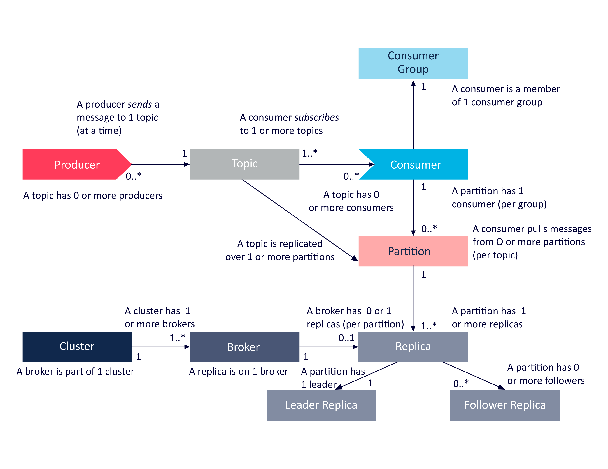
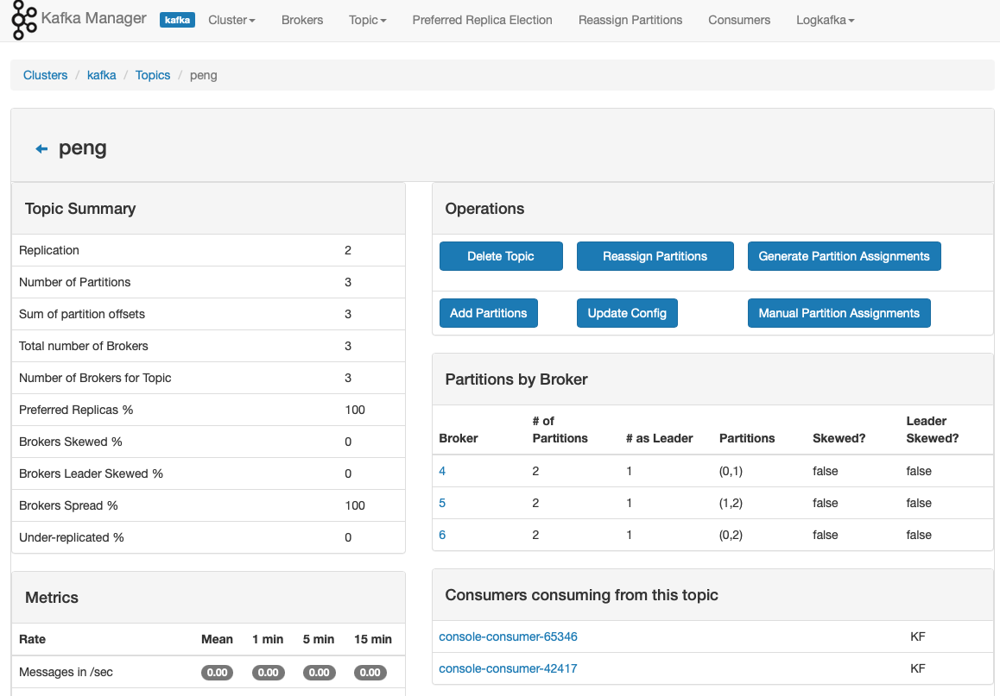

```
{
    "url": "kafka",
    "time": "2021/04/12 19:00",
    "tag": "Kafka",
    "toc": "yes"
}
```

# 一、概述



## 1.1 安装ZooKeeper

参考[分布式协调服务 - Zookeeper](/zookeeper.html)

## 1.2 安装Kafka

**1. 通过官网下载Kafka安装包**

Kafka2.8.0的版本内置了集群管理，去掉了ZooKeeper依赖。这之前的版本需要安装ZooKeeper。

**2. 调整配置文件kafka/server.properties**

```
broker.id=1
port=8080
host.name=192.168.1.100
log.dirs=/opt/kafka/data

...
```

**3. 启动kafka集群**

在各个节点启动Kafka服务。

```
/opt/kafka/bin/kafka-server-start.sh /opt/kafka/config/server.properties
```

# 二、基本用法

## 2.1 创建Topic

```
$ ./kafka-topics.sh --create --zookeeper 192.168.1.100:2181 --topic peng --partitions 3 --replication-factor 2
Created topic "peng".
```

## 2.2 删除Topic

```
$ ./kafka-topics.sh --delete --zookeeper 192.168.1.100:2181 --topic peng
```

## 2.3 Topic列表

列出所有的topic列表

```
$ ./kafka-topics.sh --list --zookeeper 192.168.1.100:2181
peng
```

## 2.4 查看Topic

```
$ ./kafka-topics.sh --describe --zookeeper 192.168.1.100:2181 --topic peng 
Topic:peng	PartitionCount:3	ReplicationFactor:2	Configs:
	Topic: peng	Partition: 0	Leader: none	Replicas: 4,2	Isr:
	Topic: peng	Partition: 1	Leader: none	Replicas: 5,3	Isr:
	Topic: peng	Partition: 2	Leader: none	Replicas: 6,4	Isr:
```

## 2.5 发消息

```
$ ./kafka-console-producer.sh --broker-list 192.168.1.100:8080 --topic peng
```

或者

```
$ ./kafka-console-producer.sh --bootstrap-server 192.168.1.100:8080 --topic peng
```

用`--broker-list` 或者 `--bootstrap-server`和版本有一定关系。执行后等待输入消息。

## 2.6 接消息

```
$ ./kafka-console-consumer.sh --bootstrap-server 192.168.1.100:8080 --topic peng --from-beginning 
```

# 三、日常管理

## 3.1 数据迁移

在运行后可能需要新增节点或者下线节点，这时需要对Topic的数据进行重新分区。

**1. 创建迁移列表**

```
$ ./kafka-topics.sh --list --zookeeper 192.168.1.100:2181
```

通过该命令可以查看Topic列表，将需要迁移的topic写入文件。切到kafka的bin目录创建待迁移的Topic列表，内容示例：

```
$ cat topics-to-move.json
{
    "topics": [
        {
            "topic": "peng"
        },
    ],
    "version": 1
}
```

**2. 生成迁移配置**

比如，将1、2、3三个节点的数据全部迁移到4、5、6，则可以进行如下操作：

```
$ ./kafka-reassign-partitions.sh --zookeeper 192.168.1.100:2181 --topics-to-move-json-file topics-to-move.json --broker-list "4,5,6" --generate
```

该命令会返回当前的分区情况，也会返回调整后的分区情况，需要创建新的文件：topics-to-move-propose.json，将目标配置信息写入到文件，并执行重新分配任务

**3. 执行迁移**

指定前面的文件并开始执行重新分配。

```
$ ./kafka-reassign-partitions.sh --zookeeper 192.168.1.100:2181 --reassignment-json-file topics-to-move-propose.json --execute
```

查看任务进度：

```
$ ./kafka-reassign-partitions.sh --zookeeper 192.168.1.100:2181 --reassignment-json-file topics-to-move-propose.json --verify
```

对于一些常规的操作也可以通过Kafka-manager管理工具来进行操作。

## 3.2 调整分区数

```
$ ./kafka-topics.sh --zookeeper 192.168.1.100:2181 --alter --topic peng --partitions 5
```

## 3.3 调整副本数

**第一步，生成文件，参考Stack Overflow上的脚本** 

```
#!/bin/bash

brokerids="0,1,2"
#topics=`./kafka-topics.sh --list --zookeeper zookeeper-kafka:2181`
topics="peng"
while read -r line; do lines+=("$line"); done <<<"$topics"
echo '{"version":1,
  "partitions":['
for t in $topics; do
    sep=","
    pcount=$(./kafka-topics.sh --describe --zookeeper zookeeper-kafka:2181 --topic $t | awk '{print $2}' | uniq -c |awk 'NR==2{print $1}')
    for i in $(seq 0 $[pcount - 1]); do
        if [ "${t}" == "${lines[-1]}" ] && [ "$[pcount - 1]" == "$i" ]; then sep=""; fi
        randombrokers=$(echo "$brokerids" | sed -r 's/,/ /g' | tr " " "\n" | shuf | tr  "\n" "," | head -c -1)
        echo "    {\"topic\":\"${t}\",\"partition\":${i},\"replicas\":[${randombrokers}]}$sep"
    done
done

echo '  ]
}'
```

**第二步，执行调整**

```
./kafka-reassign-partitions.sh --zookeeper zookeeper-kafka:2181 --reassignment-json-file tmp.json --execute
```

# 四、Kafka-manager

> CMAK (Cluster Manager for Apache Kafka, previously known as Kafka Manager)




---

- [1] [Apache Kafka](http://kafka.apache.org/)
- [2] [Kafka-Manager](https://github.com/yahoo/CMAK/)
- [3] [How to change the number of replicas of a Kafka topic?](https://stackoverflow.com/questions/37960767/how-to-change-the-number-of-replicas-of-a-kafka-topic)
