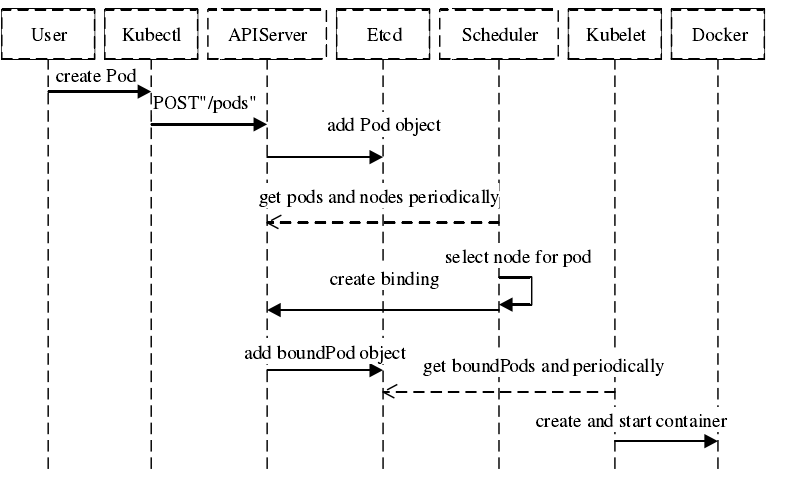

```
{
    "url": "k8s-scheduler",
    "time": "2020/10/30 17:46",
    "tag": "Kubernetes,容器化",
    "toc": "yes"
}
```

# 一、概述

k8s集群后面的资源是一个由许多Node节点组成的大的资源池，每个Node的硬件配置可能不完全相同，比如有些Node内存大，有些CPU多，有些是SSD等等。而Pod则会运行在这样一个资源池里，但每个Pod对资源的要求是不一样的，怎么样合理的分配资源池的资源则是一个很重要的问题。调度器解决的正是Pod该运行在哪一个Node里的问题。

> In Kubernetes, scheduling refers to making sure that Pods are matched to Nodes so that Kubelet can run them.

## 1.1 流程说明




这个网上找的一个创建Pod的基本流程，调度器会为Pod选择合适的Node然后告诉给APIServer，如果找不到则处于Pending状态，直到遇到合适的资源。

## 1.2 调度目标

- 公平性：在调度Pod时需要公平的决策，每个节点都有被分配的机会，调度器需要针对不同节点作出平衡决策。
- 资源高效：最大化提升所有可调度资源的利用率，使有限的CPU、内存等资源服务尽可能更多的Pod。
- 性能：能快速的完成对大规模Pod的调度工作，在集群规模扩增的情况下，依然能确保调度的性能。
- 灵活性：在实际生产中，用户希望Pod的调度策略是可扩展的，从而可以定制化调度算法以处理复杂的实际问题。因此平台要允许多种调度器并行工作，并支持自定义调度器。

## 1.3 调度步骤

为了给Pod找到合适的Node对象，可以分为2个步骤：

- 预选（Filtering）：预选就是从所有的节点里先排除掉硬性条件都不满足的节点，比如Cpu、内存有硬性要求，如果一个都没找到则Pod不会被调度。
- 优选（Scoring）：留下的Node都是可用的，但还会有一些相对合适点，调度器会根据一系列维度进行评分，然后将Pod分配给分数排名最高的节点，如果还有多个则随机选一个。

有点找对象的意思，房子、车子是硬性要求，还得善良、大方、长得漂亮。为了实现满足这些，k8s实现了一系列的具体调度策略。

# 二、调度策略

## 2.1 预选策略


## 2.2 优选策略


---

- [1] [k8s调度器kube-scheduler](https://www.cnblogs.com/kcxg/p/11119679.html)

