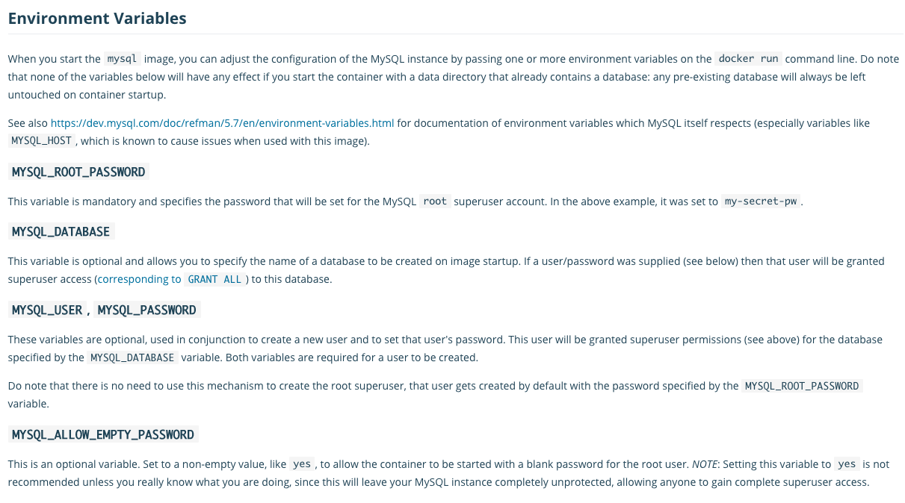

```
{
    "url": "mysql-in-k8s",
    "time": "2021/06/30 06:30",
    "tag": "Mysql,Kubernetes,容器化"
}
```

可以先通过Docker来运行Mysql镜像，正常情况下执行下列命令就会在容器里启动一个Mysql了。

```
$ docker pull mysql:5.6
$ docker run --name mysql \
-e MYSQL_ROOT_PASSWORD=123456 \
-d mysql:5.6
```

进入容器后可以看到一些配置目录，

```
$ docker ps
CONTAINER ID   IMAGE       COMMAND                  CREATED      STATUS          PORTS                 NAMES
e6944558d3f9   mysql:5.6   "docker-entrypoint.s…"   5 days ago   Up 28 seconds   3306/tcp, 33060/tcp   mysql

$ docker exec -it e6944558d3f9 /bin/bash
root@e6944558d3f9:/# cat /etc/mysql/mysql.conf.d/mysqld.cnf  | grep -v ^# | grep -v ^$
[mysqld]
pid-file	= /var/run/mysqld/mysqld.pid
socket		= /var/run/mysqld/mysqld.sock
datadir		= /var/lib/mysql
symbolic-links=0


root@e6944558d3f9:/# mysql -uroot -p
Enter password:
Welcome to the MySQL monitor.  Commands end with ; or \g.
Your MySQL connection id is 6386
Server version: 5.6.51-log MySQL Community Server (GPL)

Copyright (c) 2000, 2021, Oracle and/or its affiliates. All rights reserved.

Oracle is a registered trademark of Oracle Corporation and/or its
affiliates. Other names may be trademarks of their respective
owners.

Type 'help;' or '\h' for help. Type '\c' to clear the current input statement.

mysql> show variables like '%datadir%';
+---------------+-----------------+
| Variable_name | Value           |
+---------------+-----------------+
| datadir       | /var/lib/mysql/ |
+---------------+-----------------+
1 row in set (0.00 sec)
```

同时在DockerHub上也可以有一些常量可以设置：



接下来就是怎么将Mysql配置在Kubernetes中。

**第一步，创建pv/pvc**，这里使用的是阿里云的云盘，减少延迟。和NAS不同，一个云盘只能同时被一个Pod挂载，且只能运行在与云盘同一个可用区的ECS节点才能挂载。这里以静态的方式创建pv/pvc。

```
apiVersion: v1
kind: PersistentVolume
metadata:
  name: mysql-test-pv
  labels:
    project: mysql-test-pv
spec:
  capacity:
    storage: 500Gi
  accessModes:
    - ReadWriteOnce
  persistentVolumeReclaimPolicy: Retain
  csi:
    driver: diskplugin.csi.alibabacloud.com
    volumeHandle: yourdiskid
  nodeAffinity:
    required:
      nodeSelectorTerms:
      - matchExpressions:
        - key: topology.diskplugin.csi.alibabacloud.com/zone
          operator: In
          values:
          - "cn-hangzhou-h"

---

kind: PersistentVolumeClaim
apiVersion: v1
metadata:
  name: mysql-test-pvc
spec:
  accessModes:
    - ReadWriteOnce
  resources:
    requests:
      storage: 500Gi
  selector:
    matchLabels:
      project: mysql-test-pv

```

**第二步，配置文件**，将配置文件以ConfigMap的方式挂到容器里，根据要求调整数据库配置文件。忽略`lost+found`是因为挂载云盘时会自动创建这个目录。

```
apiVersion: v1
kind: ConfigMap
metadata:
  name: mysql-test-config
  namespace: default
data:
  my.cnf: |
    [mysqld]
    port = 3306
    bind-address = 0.0.0.0
    datadir = /var/lib/mysql
    socket = /var/run/mysqld/mysqld.sock

    max_connections = 128
    max_allowed_packet = 10M
    character-set-server = utf8 
    collation-server = utf8_general_ci

    symbolic-links = 0
    skip-name-resolve
    explicit_defaults_for_timestamp = true
    sql_mode = NO_ENGINE_SUBSTITUTION
    ignore-db-dir = lost+found

    init_connect = 'SET NAMES utf8;'
    key_buffer_size = 64M
    innodb_file_per_table = 1
    innodb_lock_wait_timeout = 30
    innodb_buffer_pool_size = 512M

    slow_query_log = on
    long_query_time = 10
    slow_query_log_file = /var/log/mysql/mysql-slow.log
    log-error = /var/log/mysql/error.log
    binlog_format = mixed
    log-bin = mysql-bin
    expire_logs_days = 3

    [client]
    default-character-set = utf8

    [mysql]
    default-character-set = utf8

```

**第三步：编写StatefulSet**，映射了数据目录和配置文件。

```
apiVersion: apps/v1
kind: StatefulSet
metadata:
  name: mysql-test
  namespace: default
  labels:
    project: mysql-test
spec:
  serviceName: mysql-test
  replicas: 1
  selector:
    matchLabels:
      project: mysql-test
  template:
    metadata:
      labels:
        project: mysql-test
    spec:
      restartPolicy: Always
      containers:
      - name: mysql
        image: mysql:5.6
        imagePullPolicy: IfNotPresent
        ports:
        - containerPort: 3306
        env:
        - name: MYSQL_ROOT_PASSWORD
          value: 123456
        volumeMounts:
        - name: mysql-test-pv
          mountPath: /var/lib/mysql
        - name: mysql-test-config
          mountPath: /etc/mysql/my.cnf
          subPath: my.cnf
      volumes:
      - name: mysql-test-config
        configMap:
          name: mysql-test-config
      - name: mysql-test-pv
        persistentVolumeClaim:
          claimName: mysql-test-pvc

```

**第四步：编写Service**

```
apiVersion: v1
kind: Service
metadata:
  name: mysql-test
  namespace: default
  labels:
    project: mysql-test
spec:
  selector:
    project: mysql-test
  ports:
  - name: mysql
    port: 3306
    protocol: TCP
  clusterIP: None
```

运行上面编写的Yaml文件即可，正常一个单节点的Mysql就应该创建好了。

