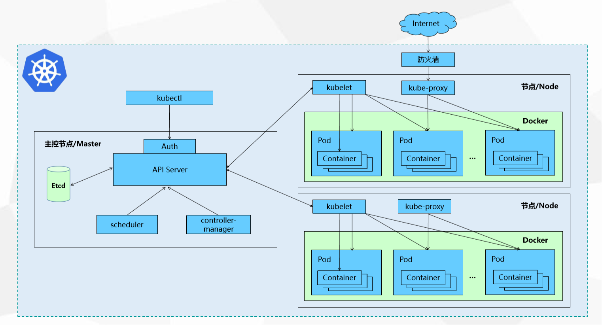
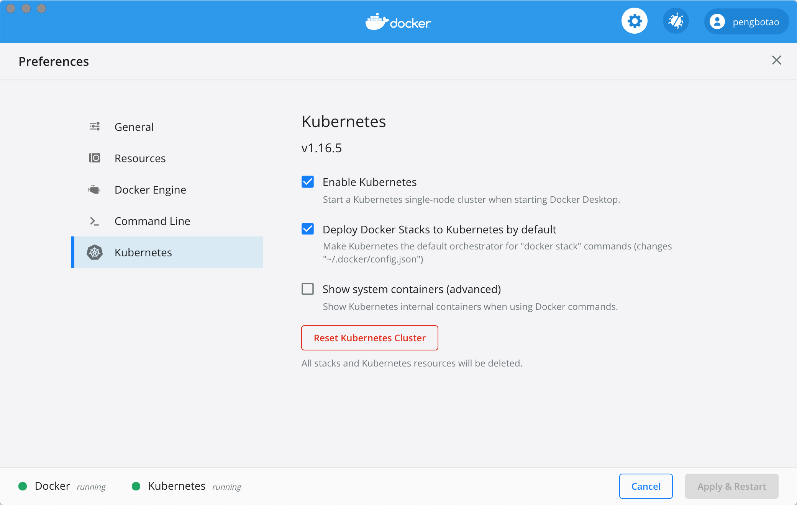

```
{
    "url": "k8s-mac-install",
    "time": "2020/08/28 19:06",
    "tag": "Kubernetes"
}
```

# 一、概述

`Kubernetes`集群包含有节点代理`kubelet`和`Master`组件(APIs, scheduler, etc)，一切都基于分布式的存储系统。下面这张图是`Kubernetes`的架构图 [<sup>1</sup>](#refer)。



在这张系统架构图中，我们把服务分为运行在工作节点上的服务和组成集群级别控制板的服务。`Kubernetes`节点有运行应用容器必备的服务，而这些都是受`Master`的控制。每个节点上当然都要运行`Docker`。`Docker`来负责所有具体的映像下载和容器运行。

`Kubernetes`主要由以下几个核心组件组成：

  - `etcd`：保存了整个集群的状态；
  - `apiserver`：提供了资源操作的唯一入口，并提供认证、授权、访问控制、API注册和发现等机制；
  - `controller manager`：负责维护集群的状态，比如故障检测、自动扩展、滚动更新等；
  - `scheduler`：负责资源的调度，按照预定的调度策略将`Pod`调度到相应的机器上；
  - `kubelet`：负责维护容器的生命周期，同时也负责`Volume（CVI）`和网络（`CNI`）的管理；
  - `Container runtime`：负责镜像管理以及Pod和容器的真正运行（`CRI`）；
  - `kube-proxy`：负责为`Service`提供`cluster`内部的服务发现和负载均衡；

除了核心组件，还有一些推荐的`Add-ons`：

  - `kube-dns`：负责为整个集群提供DNS服务
  - `Ingress Controller`：为服务提供外网入口
  - `Heapster`：提供资源监控
  - `Dashboard`：提供GUI
  - `Federation`：提供跨可用区的集群
  - `Fluentd-elasticsearch`：提供集群日志采集、存储与查询

# 二、安装K8s

打开已搭建好的`Docker Dashboard`界面，设置里有个`Kubernetes`，默认是没有勾选的，但这里直接勾选应用后卡死了，大概是因为墙的原因，有些镜像无法下载。

## 2.1 下载依赖镜像

参考 `gotok8s`[<sup>2</sup>](#refer) 的安装方法：

```
$ git clone git@github.com:gotok8s/k8s-docker-desktop-for-mac.git
$ ./load_images.sh
```

脚本比较简单，用后面的镜像替换前面的镜像，替换完成之后重新打TAG还原。

```
$ cat image_list
k8s.gcr.io/kube-proxy:v1.16.5=gotok8s/kube-proxy:v1.16.5
k8s.gcr.io/kube-controller-manager:v1.16.5=gotok8s/kube-controller-manager:v1.16.5
k8s.gcr.io/kube-scheduler:v1.16.5=gotok8s/kube-scheduler:v1.16.5
k8s.gcr.io/kube-apiserver:v1.16.5=gotok8s/kube-apiserver:v1.16.5
k8s.gcr.io/coredns:1.6.2=gotok8s/coredns:1.6.2
k8s.gcr.io/pause:3.1=gotok8s/pause:3.1
k8s.gcr.io/etcd:3.3.15-0=gotok8s/etcd:3.3.15-0
k8s.gcr.io/kubernetes-dashboard-amd64=gotok8s/kubernetes-dashboard-amd64:v1.10.1
```

## 2.2 启用Kuberenetes

打开Docker，启用`Kubernetes`，应用后若正常则可以看到左下角有2个`running`状态。



命令行敲`kubectl`就可以输出信息了。

## 2.3 安装Dashboard

`Dashboard`是可选组件，部署 Kubernetes Dashboard：

```
$ kubectl apply -f https://raw.githubusercontent.com/kubernetes/dashboard/master/aio/deploy/recommended.yaml

# 开启本机访问代理
$ kubectl proxy
```

创建Dashboard管理员用户并用token登陆

```
# 创建 ServiceAccount kubernetes-dashboard-admin 并绑定集群管理员权限
$ kubectl apply -f https://raw.githubusercontent.com/gotok8s/gotok8s/master/dashboard-admin.yaml

# 获取登陆 token
$ kubectl -n kubernetes-dashboard describe secret $(kubectl -n kubernetes-dashboard get secret | grep kubernetes-dashboard-admin | awk '{print $1}')
```

通过下面的连接访问`Dashboard`: `http://localhost:8001/api/v1/namespaces/kubernetes-dashboard/services/https:kubernetes-dashboard:/proxy/`

输入上一步获取的`token`, 验证并登陆。

# 三、尝试部署镜像

一般可以通过`YAML`进行创建，这里先尝试走通流程，类似`docker run`的用法让容器先跑起来。

## 3.1 创建deployment

```
$ kubectl run itopic --image=pengbotao/itopic.go:alpine --replicas=3 --port=8001
```

使用的是我们前面用`docker`构建的镜像，容器使用的是8001端口，启动3个副本。操作`run`之后就创建好了`deployment`、`pod`，可以查看相关信息：

**查看节点**：只有一个主节点

```
$ kubectl get node
NAME             STATUS   ROLES    AGE     VERSION
docker-desktop   Ready    master   2d21h   v1.16.6-beta.0
```

**查看deployment和pod**

```
$ kubectl get deployment
NAME     READY   UP-TO-DATE   AVAILABLE   AGE
itopic   3/3     3            3           16s


$ kubectl get pod
NAME                      READY   STATUS    RESTARTS   AGE
itopic-6f9dd4f4cd-2q2xp   1/1     Running   0          23s
itopic-6f9dd4f4cd-7pj8f   1/1     Running   0          23s
itopic-6f9dd4f4cd-vfdx9   1/1     Running   0          23s
```

**查看pod详情**

```
$ kubectl describe pod itopic-6f9dd4f4cd-2q2xp
Name:         itopic-6f9dd4f4cd-2q2xp
Namespace:    default
Priority:     0
Node:         docker-desktop/192.168.65.3
Start Time:   Thu, 27 Aug 2020 13:57:42 +0800
Labels:       pod-template-hash=6f9dd4f4cd
              run=itopic
Annotations:  <none>
Status:       Running
IP:           10.1.0.16
IPs:
  IP:           10.1.0.16
Controlled By:  ReplicaSet/itopic-6f9dd4f4cd
Containers:
  itopic:
    Container ID:   docker://3896614a1b1f3f2d11f709cfad56a2579769c51fb212eb2402e0dea668d95584
    Image:          pengbotao/itopic.go:alpine
    Image ID:       docker-pullable://pengbotao/itopic.go@sha256:1a1a98ffe435e34da61956be22eb61382eb5732120c4e216922f90ace0ad504b
    Port:           8001/TCP
    Host Port:      0/TCP
    State:          Running
      Started:      Thu, 27 Aug 2020 13:57:43 +0800
    Ready:          True
    Restart Count:  0
    Environment:    <none>
    Mounts:
      /var/run/secrets/kubernetes.io/serviceaccount from default-token-lmjrh (ro)
Conditions:
  Type              Status
  Initialized       True
  Ready             True
  ContainersReady   True
  PodScheduled      True
Volumes:
  default-token-lmjrh:
    Type:        Secret (a volume populated by a Secret)
    SecretName:  default-token-lmjrh
    Optional:    false
QoS Class:       BestEffort
Node-Selectors:  <none>
Tolerations:     node.kubernetes.io/not-ready:NoExecute for 300s
                 node.kubernetes.io/unreachable:NoExecute for 300s
Events:          <none>
```

**进入容器**

```
$ kubectl exec -it itopic-6f9dd4f4cd-2q2xp /bin/sh
/www/itopic.go #
```

## 3.2 创建service

到这里容器已经建好了，但是还无法从外部访问。

```
kubectl expose deployment itopic --type=LoadBalancer --port=38001 --target-port=8001 
```

**查看service**

```
$ kubectl get service
NAME         TYPE           CLUSTER-IP       EXTERNAL-IP   PORT(S)           AGE
itopic       LoadBalancer   10.100.230.169   localhost     38001:31234/TCP   26s
kubernetes   ClusterIP      10.96.0.1        <none>        443/TCP           2d20h


$ kubectl describe service itopic
Name:                     itopic
Namespace:                default
Labels:                   run=itopic
Annotations:              <none>
Selector:                 run=itopic
Type:                     LoadBalancer
IP:                       10.100.230.169
LoadBalancer Ingress:     localhost
Port:                     <unset>  38001/TCP
TargetPort:               8001/TCP
NodePort:                 <unset>  31234/TCP
Endpoints:                10.1.0.15:8001,10.1.0.16:8001,10.1.0.17:8001
Session Affinity:         None
External Traffic Policy:  Cluster
Events:                   <none>
```

这个时候就可以通过`http://localhost:38001`访问了。


## 3.3 扩容 / 缩容

通过调整副本数量可以进行扩容与缩容。

```
$ kubectl scale --replicas=3 deploy/itopic

$ kubectl get pods
NAME                      READY   STATUS    RESTARTS   AGE
itopic-6f9dd4f4cd-2q2xp   1/1     Running   0          38m
itopic-6f9dd4f4cd-7pj8f   1/1     Running   0          38m
itopic-6f9dd4f4cd-k56dl   1/1     Running   0          35m
itopic-6f9dd4f4cd-lnzpq   1/1     Running   0          35m
itopic-6f9dd4f4cd-vfdx9   1/1     Running   0          38m
```

如果要删除`deployment`和`service`:

```
kubectl delete deployment,service itopic
```

到这里一个简单的镜像通过K8s来部署就部署好了，来看看`Dashboard`的展示情况：


# 四、概念说明


---
<div id="refer"></div>

- [1] [Kubernetes设计架构](https://www.kubernetes.org.cn/kubernetes%e8%ae%be%e8%ae%a1%e6%9e%b6%e6%9e%84)
- [2] [Docker Desktop for Mac 开启并使用 Kubernetes](https://github.com/gotok8s/k8s-docker-desktop-for-mac)