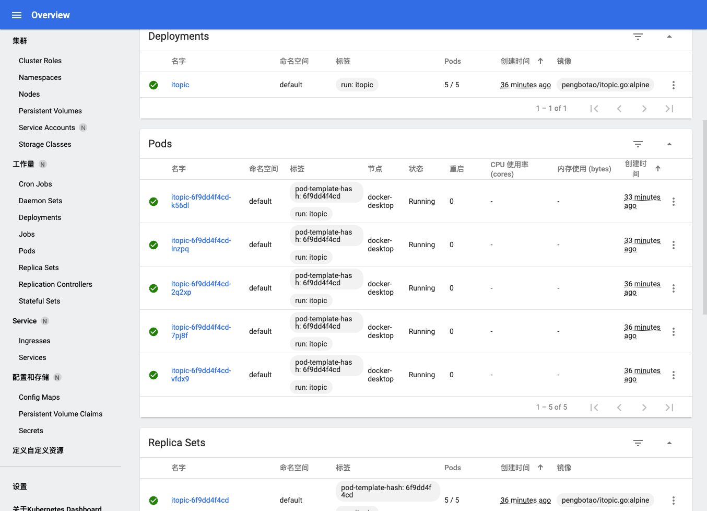

```
{
    "url": "k8s-mac-install",
    "time": "2020/08/28 19:06",
    "tag": "Kubernetes"
}
```

# 一、概述

## 1.1 Kubernetes是什么？

`Kubernetes`的名字来自希腊语，意思是“舵手” 或 “领航员”。`K8s`是将8个字母`ubernete`替换为`8`的缩写，也就是仅保留了头尾2个字母（`k`和`s`），中间的8个字母都去掉了，用`8`代替。

`Kubernetes`是容器集群管理系统，是一个开源的平台，可以实现容器集群的自动化部署、自动扩缩容、维护等功能。

通过`Kubernetes`你可以：

- 快速部署应用
- 快速扩展应用
- 无缝对接新的应用功能
- 节省资源，优化硬件资源的使用

**Kubernetes 特点**：

- **可移植**: 支持公有云，私有云，混合云，多重云（multi-cloud）
- **可扩展**: 模块化, 插件化, 可挂载, 可组合
- **自动化**: 自动部署，自动重启，自动复制，自动伸缩/扩展

`Kubernetes`是`Google`2014年创建管理的，是`Google`10多年大规模容器管理技术`Borg`的开源版本。

## 1.2 Kubernetes设计架构

`Kubernetes`集群包含有节点代理`kubelet`和`Master`组件(`APIs`, `scheduler`, `etc`)，一切都基于分布式的存储系统。下面这张图是`Kubernetes`的架构图 [<sup>[1]</sup>](#refer)。


在这张系统架构图中，我们把服务分为运行在工作节点上的服务和组成集群级别控制板的服务。`Kubernetes`节点有运行应用容器必备的服务，而这些都是受`Master`的控制。每个节点上当然都要运行`Docker`。`Docker`来负责所有具体的映像下载和容器运行。

`Kubernetes`主要由以下几个核心组件组成：

  - `etcd`：保存了整个集群的状态；
  - `apiserver`：提供了资源操作的唯一入口，并提供认证、授权、访问控制、API注册和发现等机制；
  - `controller manager`：负责维护集群的状态，比如故障检测、自动扩展、滚动更新等；
  - `scheduler`：负责资源的调度，按照预定的调度策略将`Pod`调度到相应的机器上；
  - `kubelet`：负责维护容器的生命周期，同时也负责`Volume（CVI）`和网络（`CNI`）的管理；
  - `Container runtime`：负责镜像管理以及Pod和容器的真正运行（`CRI`）；
  - `kube-proxy`：负责为`Service`提供`cluster`内部的服务发现和负载均衡；

除了核心组件，还有一些推荐的`Add-ons`：

  - `kube-dns`：负责为整个集群提供DNS服务
  - `Ingress Controller`：为服务提供外网入口
  - `Heapster`：提供资源监控
  - `Dashboard`：提供GUI
  - `Federation`：提供跨可用区的集群
  - `Fluentd-elasticsearch`：提供集群日志采集、存储与查询

了解到这里后可能就开始懵圈了，好多文章里还会看到`Deployment`、`Service`、`ReplicaSets/Replication Controller`等，一堆概念容易混淆。所以接下来我们先忽略概念，看怎么在Mac电脑上部署个k8s环境，操作一遍之后再来梳理概念和交互。

# 二、安装K8s

通过`Docker`方式部署比较简单，打开已搭建好的`Docker Dashboard`界面，设置里有个`Kubernetes`，默认是没有勾选的，但这里直接勾选应用后卡死了，大概是因为墙的原因，有些镜像无法下载，所以在点击之前需要先手动下载镜像。

## 2.1 下载依赖镜像

参考 `gotok8s` [<sup>[2]</sup>](#refer) 的安装方法：

```
$ git clone git@github.com:gotok8s/k8s-docker-desktop-for-mac.git
$ ./load_images.sh
```

脚本比较简单，用后面的镜像替换前面的镜像，替换完成之后重新打TAG还原。

```
$ cat image_list
k8s.gcr.io/kube-proxy:v1.16.5=gotok8s/kube-proxy:v1.16.5
k8s.gcr.io/kube-controller-manager:v1.16.5=gotok8s/kube-controller-manager:v1.16.5
k8s.gcr.io/kube-scheduler:v1.16.5=gotok8s/kube-scheduler:v1.16.5
k8s.gcr.io/kube-apiserver:v1.16.5=gotok8s/kube-apiserver:v1.16.5
k8s.gcr.io/coredns:1.6.2=gotok8s/coredns:1.6.2
k8s.gcr.io/pause:3.1=gotok8s/pause:3.1
k8s.gcr.io/etcd:3.3.15-0=gotok8s/etcd:3.3.15-0
k8s.gcr.io/kubernetes-dashboard-amd64=gotok8s/kubernetes-dashboard-amd64:v1.10.1
```

## 2.2 启用Kuberenetes

打开Docker，启用`Kubernetes`，应用后若正常则可以看到左下角有2个`running`状态。


命令行敲`kubectl`就可以输出信息了。

## 2.3 安装Dashboard

`Dashboard`是可选组件，部署` Kubernetes Dashboard`：

```
$ kubectl apply -f https://raw.githubusercontent.com/kubernetes/dashboard/master/aio/deploy/recommended.yaml

# 开启本机访问代理
$ kubectl proxy
```

创建`Dashboard`管理员用户并用`token`登陆

```
# 创建 ServiceAccount kubernetes-dashboard-admin 并绑定集群管理员权限
$ kubectl apply -f https://raw.githubusercontent.com/gotok8s/gotok8s/master/dashboard-admin.yaml

# 获取登陆 token
$ kubectl -n kubernetes-dashboard describe secret $(kubectl -n kubernetes-dashboard get secret | grep kubernetes-dashboard-admin | awk '{print $1}')
```

通过下面的连接访问`Dashboard`: `http://localhost:8001/api/v1/namespaces/kubernetes-dashboard/services/https:kubernetes-dashboard:/proxy/`

输入上一步获取的`token`, 验证并登陆。到这里环境就装好了。

# 三、尝试部署镜像

一般可以通过`YAML`进行部署，这里先尝试走通流程，类似`docker run`的用法让容器先跑起来。整个过程只需要执行2条命令即可。

## 3.1 创建deployment

首先，执行第一条命令：

```
$ kubectl run itopic --image=pengbotao/itopic.go:alpine --replicas=3 --port=8001
```

说明：使用的是我们前面用`docker`构建的镜像，容器使用的是8001端口，启动3个副本。操作`run`之后就创建好了`deployment`、`rs`和`pod`，可以查看相关信息：

**查看Node**：

```
$ kubectl get node
NAME             STATUS   ROLES    AGE     VERSION
docker-desktop   Ready    master   2d21h   v1.16.6-beta.0
```

**查看deployment、rs和pod**

```
$ kubectl get deployment
NAME     READY   UP-TO-DATE   AVAILABLE   AGE
itopic   3/3     3            3           16s

$ kubectl get rs
NAME                DESIRED   CURRENT   READY   AGE
itopic-6f9dd4f4cd   3         3         3       21s

$ kubectl get pod
NAME                      READY   STATUS    RESTARTS   AGE
itopic-6f9dd4f4cd-2q2xp   1/1     Running   0          23s
itopic-6f9dd4f4cd-7pj8f   1/1     Running   0          23s
itopic-6f9dd4f4cd-vfdx9   1/1     Running   0          23s
```

**查看pod详情**

```
$ kubectl describe pod itopic-6f9dd4f4cd-2q2xp
Name:         itopic-6f9dd4f4cd-2q2xp
Namespace:    default
Priority:     0
Node:         docker-desktop/192.168.65.3
Start Time:   Thu, 27 Aug 2020 13:57:42 +0800
Labels:       pod-template-hash=6f9dd4f4cd
              run=itopic
Annotations:  <none>
Status:       Running
IP:           10.1.0.16
IPs:
  IP:           10.1.0.16
Controlled By:  ReplicaSet/itopic-6f9dd4f4cd
Containers:
  itopic:
    Container ID:   docker://3896614a1b1f3f2d11f709cfad56a2579769c51fb212eb2402e0dea668d95584
    Image:          pengbotao/itopic.go:alpine
    Image ID:       docker-pullable://pengbotao/itopic.go@sha256:1a1a98ffe435e34da61956be22eb61382eb5732120c4e216922f90ace0ad504b
    Port:           8001/TCP
    Host Port:      0/TCP
    State:          Running
      Started:      Thu, 27 Aug 2020 13:57:43 +0800
    Ready:          True
    Restart Count:  0
    Environment:    <none>
    Mounts:
      /var/run/secrets/kubernetes.io/serviceaccount from default-token-lmjrh (ro)
Conditions:
  Type              Status
  Initialized       True
  Ready             True
  ContainersReady   True
  PodScheduled      True
Volumes:
  default-token-lmjrh:
    Type:        Secret (a volume populated by a Secret)
    SecretName:  default-token-lmjrh
    Optional:    false
QoS Class:       BestEffort
Node-Selectors:  <none>
Tolerations:     node.kubernetes.io/not-ready:NoExecute for 300s
                 node.kubernetes.io/unreachable:NoExecute for 300s
Events:          <none>
```

**也可以进入容器**

```
$ kubectl exec -it itopic-6f9dd4f4cd-2q2xp /bin/sh
/www/itopic.go #
```

## 3.2 创建service

到这里容器已经建好了，但是还无法从外部访问。接下来，执行第二条命令：

```
$ kubectl expose deployment itopic --type=LoadBalancer --port=38001 --target-port=8001 
```

**查看service**

```
$ kubectl get service
NAME         TYPE           CLUSTER-IP       EXTERNAL-IP   PORT(S)           AGE
itopic       LoadBalancer   10.100.230.169   localhost     38001:31234/TCP   26s
kubernetes   ClusterIP      10.96.0.1        <none>        443/TCP           2d20h


$ kubectl describe service itopic
Name:                     itopic
Namespace:                default
Labels:                   run=itopic
Annotations:              <none>
Selector:                 run=itopic
Type:                     LoadBalancer
IP:                       10.100.230.169
LoadBalancer Ingress:     localhost
Port:                     <unset>  38001/TCP
TargetPort:               8001/TCP
NodePort:                 <unset>  31234/TCP
Endpoints:                10.1.0.15:8001,10.1.0.16:8001,10.1.0.17:8001
Session Affinity:         None
External Traffic Policy:  Cluster
Events:                   <none>
```

这个时候就可以通过`http://localhost:38001`访问了。


## 3.3 扩容 / 缩容

通过调整副本数量可以进行扩容与缩容。

```
$ kubectl scale --replicas=3 deploy/itopic

$ kubectl get pods
NAME                      READY   STATUS    RESTARTS   AGE
itopic-6f9dd4f4cd-2q2xp   1/1     Running   0          38m
itopic-6f9dd4f4cd-7pj8f   1/1     Running   0          38m
itopic-6f9dd4f4cd-k56dl   1/1     Running   0          35m
itopic-6f9dd4f4cd-lnzpq   1/1     Running   0          35m
itopic-6f9dd4f4cd-vfdx9   1/1     Running   0          38m
```

如果要删除`deployment`和`service`:

```
$ kubectl delete deployment,service itopic
```

到这里一个简单的镜像通过2条`k8s`命令就部署好了，来看看`Dashboard`的展示情况：



# 四、节点说明

## 4.1 Master

集群的控制节点，负责整个集群的管理和控制，`kubernetes`的所有的命令基本都是发给`Master`，由它来负责具体的执行过程。

**Master**的组件：

- `kube-apiserver`：资源增删改查的入口
- `kube-controller-manager`：资源对象的大总管
- `kube-scheduler`：负责资源调度（Pod调度）
- `etcd Server`：`kubernetes`的所有的资源对象的数据保存在`etcd`中。

## 4.2 Node

`Node`是集群的工作负载节点，默认情况`kubelet`会向`Master`注册自己，一旦`Node`被纳入集群管理范围，`kubelet`会定时向`Master`汇报自身的情报，包括操作系统，`Docker`版本，机器资源情况等。

如果`Node`超过指定时间不上报信息，会被`Master`判断为“失联”，标记为`Not Ready`，随后`Master`会触发`Pod`转移。

**Node**的组件：

- `kubelet`：`Pod`的管家，与`Master`通信
- `kube-proxy`：实现`kubernetes Service`的通信与负载均衡机制的重要组件
- `Docker`：容器

## 4.3 Pod

`Pod`是`Kubernetes`中操作的基本单元。每个`Pod`中有个根容器(`Pause容器`)，`Pause`容器的状态代表整个容器组的状态，其他业务容器共享`Pause`的`IP`，即`Pod IP`，共享`Pause`挂载的`Volume`，这样简化了同个Pod中不同容器之间的网络问题和文件共享问题。

1. `Kubernetes`集群中，同宿主机的或不同宿主机的`Pod`之间要求能够TCP/IP直接通信，因此采用虚拟二层网络技术来实现，例如`Flannel`，`Openvswitch(OVS)`等，这样在同个集群中，不同的宿主机的Pod IP为不同IP段的IP，集群中的所有Pod IP都是唯一的，**不同Pod之间可以直接通信**。
2. Pod有两种类型：`普通Pod`和`静态Pod`。`静态Pod`即不通过`K8S`调度和创建，直接在某个具体的Node机器上通过具体的文件来启动。`普通Pod`则是由`K8S`创建、调度，同时数据存放在`ETCD`中。
3. Pod IP和具体的容器端口（`ContainnerPort`）组成一个具体的通信地址，即`Endpoint`。一个`Pod`中可以存在多个容器，可以有多个端口，`Pod IP`一样，即有多个`Endpoint`。
4. `Pod Volume`是定义在`Pod`之上，被各个容器挂载到自己的文件系统中，可以用分布式文件系统实现后端存储功能。
5. Pod中的Event事件可以用来排查问题，可以通过`kubectl describe pod xxx`来查看对应的事件。
6. 每个`Pod`可以对其能使用的服务器上的计算资源设置限额，一般为`CPU`和`Memory`。`K8S`中一般将千分之一个的`CPU`配置作为最小单位，用`m`表示，是一个绝对值，即`100m`对于一个Core的机器还是48个`Core`的机器都是一样的大小。`Memory`配额也是个绝对值，单位为内存字节数。
7. 资源配额的两个参数
   - `Requests`：该资源的最小申请量，系统必须满足要求。
   - `Limits`：该资源最大允许使用量，当超过该量，K8S会kill并重启Pod。

这几个概念应该还比较好理解。

- 通过Master控制各Node节点
- 操作Node节点实现节点上Pod的创建与管理
- 客户访问Node节点上Pod提供的服务

# 五、概念说明 - Master

## 5.1 apiserver

k8s API Server提供了k8s各类资源对象（pod,RC,Service等）的增删改查及watch等HTTP Rest接口，是整个系统的数据总线和数据中心。kubernetes API Server的功能： [<sup>[4]</sup>](#refer)

1. 提供了集群管理的REST API接口(包括认证授权、数据校验以及集群状态变更)；
2. 提供其他模块之间的数据交互和通信的枢纽（其他模块通过API Server查询或修改数据，只有API Server才直接操作etcd）;
3. 是资源配额控制的入口；
4. 拥有完备的集群安全机制.

## 5.2 kube-controller-manager

| 编号 | 控制器                                | 说明                                                         | 应用场景   |
| ---- | ------------------------------------- | ------------------------------------------------------------ | ---------- |
| 1    | Deployment                            | 部署无状态应用                                               | Web应用    |
| 2    | StatefulSet                           | 部署有状态应用                                               | 数据库     |
| 3    | DaemonSet                             | 在每一个Node上面运行一个Pod；新加入的Node也同样会自动运行一个Pod | Agent      |
| 4    | Job/CronJob                           | 一次性任务/周期任务                                          | 脚本、备份 |
| 5    | ReplicaSet<br />ReplicationController | 控制容器应用的副本数量                                       |            |
| 6    | HPA                                   | Pod水平自动缩放                                              |            |

**5.2.1. 关于无状态与有状态的说明：**

- 无状态服务
  - 是指该服务运行的实例不会在本地存储需要持久化的数据，并且多个实例对于同一个请求响应的结果是完全一致的。
  - 多个实例可以共享相同的持久化数据。例如：nginx实例，tomcat实例等
  - 相关的k8s资源有：ReplicaSet、ReplicationController、Deployment等，由于是无状态服务，所以这些控制器创建的pod序号都是随机值。并且在缩容的时候并不会明确缩容某一个pod，而是随机的，因为所有实例得到的返回值都是一样，所以缩容任何一个pod都可以。
- 有状态服务
  - 需要数据存储功能的服务、或者指多线程类型的服务，队列等。（mysql数据库、kafka、zookeeper等）
  - 每个实例都需要有自己独立的持久化存储，并且在k8s中是通过申明模板来进行定义。
  - 相关的k8s资源为：StatefulSet，由于是有状态的服务，所以每个pod都有特定的名称和网络标识。比如pod名是由statefulSet名+有序的数字组成（0、1、2..）
  - 在进行缩容操作的时候，可以明确知道会缩容哪一个pod，从数字最大的开始。并且Statefulset 在有实例不健康的情况下是不允许做缩容操作的。

**5.2.2 Deployment**

`Deployment`为`Pod`和`ReplicaSet`提供了一个声明式定义方法发，用来替代以前的`ReplicationController`来方便的管理应用。典型的应用场景包含：

- 定义`Deployment`来创建`Pod`和`ReplicaSet`
- 滚动升级和回滚应用
- 扩容和缩容
- 暂停和继续`Deployment`

**5.2.3 ReplicationController 和 ReplicaSet**

在新版的`Kubernetes`中建议使用`ReplicaSet (RS)`来取代`ReplicationController(RC)`。`ReplicaSet`跟`ReplicationController`没有本质的不同，只是名字不一样，但`ReplicaSet`支持集合式`selector`。

虽然`ReplicaSet`可以独立使用，但如今它主要被`Deployment`用作协调`Pod`的创建、删除和更新的机制。当使用`Deployment`时，你不必担心还要管理它们创建的`ReplicaSet`，`Deployment`会拥有并管理它们的`ReplicaSet`。

**5.2.4 DaemonSet**

`DaemonSet`确保全局（或者一些）Node上运行一个Pod的副本。当有Node加入集群时，也会为他们新增一个Pod。当有Node从集群移除时，这些Pod也会被回收。删除DaemonSet将会删除他创建的所有Pod。

DaemonSet的一些典型用法：

- 运行集群存储daemon，例如在每个Node上运行glusterd、ceph
- 在每个Node上运行日志手机daemon，例如fluentd、logstash
- 在每个Node上运行监控daemon，例如Prometheus、collected、Datadog代理、New Relic代理 或Ganglia

**5.2.5 Job/CronJob**

- Job负责批处理任务，即仅执行一次的任务，它保证批处理任务的一个或多个Pod成功结束。

- CronJob管理基于时间的Job，即：
  - 在给定时间只运行一次
  - 周期性的给定时间运行

**5.2.6 HPA - Horizontal Pod Autoscaling**

应用的资源使用率通常都有高峰和骶骨的时候，如何削峰填谷提供集群的整体资源利用率，让service的pod个数自动调整呢？这就依赖于HPA了，顾名思义，使Pod水平自动缩放。

## 5.3 kube-schedule

kube-scheduler是Kubernetes中的关键模块，扮演管家的角色遵从一套机制为Pod提供调度服务，例如基于资源的公平调度、调度Pod到指定节点、或者通信频繁的Pod调度到同一节点等。容器调度本身是一件比较复杂的事，因为要确保以下几个目标：

1. 公平性：在调度Pod时需要公平的进行决策，每个节点都有被分配资源的机会，调度器需要对不同节点的使用作出平衡决策。
2. 资源高效利用：最大化群集所有资源的利用率，使有限的CPU、内存等资源服务尽可能更多的Pod。
3. 效率问题：能快速的完成对大批量Pod的调度工作，在集群规模扩增的情况下，依然保证调度过程的性能。
4. 灵活性：在实际运作中，用户往往希望Pod的调度策略是可控的，从而处理大量复杂的实际问题。因此平台要允许多个调度器并行工作，同时支持自定义调度器。

为达到上述目标，kube-scheduler通过结合Node资源、负载情况、数据位置等各种因素进行调度判断，确保在满足场景需求的同时将Pod分配到最优节点。显然，kube-scheduler影响着Kubernetes集群的可用性与性能，Pod数量越多集群的调度能力越重要，尤其达到了数千级节点数时，优秀的调度能力将显著提升容器平台性能。

**到这里我们可以对Pod的整个启动流程进行总结：** [<sup>[6]</sup>](#refer)

1. 资源管控中心Controller Manager创建新的Pod，将该Pod加入待调度的Pod列表。
2. kube-scheduler通过API Server提供的接口监听Pods，获取待调度pod，经过预选和优选两个阶段对各个Node节点打分排序，为待调度Pod列表中每个对象选择一个最优的Node。
3. kube-scheduler将Pod与Node的绑定写入etcd（元数据管理服务）。
4. 节点代理服务kubelet通过API Server监听到kube-scheduler产生的绑定信息，获得Pod列表，下载Image并启动容器，然后由kubelet负责拉起Pod。

## 5.4 etcd server

Etcd是Kubernetes集群中的一个十分重要的组件，用于保存集群所有的网络配置和对象的状态信息。 [<sup>[7]</sup>](#refer)

# 六、概念说明 - Node

## 6.1 kubelet

在kubernetes集群中，每个Node节点都会启动kubelet进程，用来处理Master节点下发到本节点的任务，管理Pod和其中的容器。kubelet会在API Server上注册节点信息，定期向Master汇报节点资源使用情况，并通过cAdvisor监控容器和节点资源。可以把kubelet理解成【Server-Agent】架构中的agent，是Node上的pod管家。 [<sup>[8]</sup>](#refer)

## 6.2 kube-proxy

kube-proxy是Kubernetes的核心组件，部署在每个Node节点上，它是实现Kubernetes Service的通信与负载均衡机制的重要组件; kube-proxy负责为Pod创建代理服务，从apiserver获取所有server信息，并根据server信息创建代理服务，实现server到Pod的请求路由和转发，从而实现K8s层级的虚拟转发网络。

在k8s中，提供相同服务的一组pod可以抽象成一个service，通过service提供的统一入口对外提供服务，每个service都有一个虚拟IP地址（VIP）和端口号供客户端访问。

**简单来说:** [<sup>[9]</sup>](#refer)

- kube-proxy其实就是管理service的访问入口，包括集群内Pod到Service的访问和集群外访问service。
- kube-proxy管理sevice的Endpoints，该service对外暴露一个Virtual IP，也成为Cluster IP, 集群内通过访问这个Cluster IP:Port就能访问到集群内对应的serivce下的Pod。
- service是通过Selector选择的一组Pods的服务抽象，其实就是一个微服务，提供了服务的LB和反向代理的能力，而kube-proxy的主要作用就是负责service的实现。
- service另外一个重要作用是，一个服务后端的Pods可能会随着生存灭亡而发生IP的改变，service的出现，给服务提供了一个固定的IP，而无视后端Endpoint的变化。

这两章中的概念就比较多了，其中的概念与交互流程需要再慢慢吸收下。

# 七、小结

回过头来看一下我们之前的操作 [<sup>[10]</sup>](#refer)

```
$ kubectl run itopic --image=pengbotao/itopic.go:alpine --replicas=3 --port=8001
```

- 通过`kubectl run`时，客户端会将请求发送给`kube-apiserver`。

- `kube-apiserver`经过一些列验证之后将`Deployment`记录存储到`Etcd`并初始化。

- `Deployment Controller`检测到`Deployment`记录的更改。
  - 当所有的`Controller`正常运行后，`Etcd`中就会保存一个`Deployment`、一个`ReplicaSet`和三个`Pod`资源记录，并且可以通过 `Kube-Apiserver`查看。然而，这些`Pod`资源现在还处于`Pending`状态，因为它们还没有被调度到集群中合适的`Node`上运行。这个问题最终要靠调度器`Scheduler`来解决。

- `Scheduler`将待调度的`Pod`按照特定的算法和调度策略绑定到集群中某个合适的`Node`上，并将绑定信息写入`Etcd`中。

- 一旦`Scheduler`将`Pod`调度到某个节点上，该节点的`Kubelet`就会接管该`Pod`并开始部署。
  - 在`Kubernetes`集群中，每个`Node`节点上都会启动一个`Kubelet`服务进程，该进程用于处理`Scheduler`下发到本节点的任务，管理`Pod`的生命周期，包括挂载卷、容器日志记录、垃圾回收以及其他与`Pod`相关的事件。

```
$ kubectl expose deployment itopic --type=LoadBalancer --port=38001 --target-port=8001 
```

- 为`Pod`创建代理服务，从`apiserver`获取所有`server`信息，并根据`server`信息创建代理服务，实现`server`到`Pod`的请求路由和转发，从而实现`K8s`层级的虚拟转发网络，实现外部访问的访问。


最后，本文档是一个边学习边整理的过程，也并未直接就上多台机器，先通过比较简单的一个环境熟悉起来，了解其中的概念、模块及交互，所以仅当一个入门知识介绍。


---
<div id="refer"></div>

- [1] [Kubernetes设计架构](https://www.kubernetes.org.cn/kubernetes%E8%AE%BE%E8%AE%A1%E6%9E%B6%E6%9E%84)
- [2] [Docker Desktop for Mac 开启并使用 Kubernetes](https://github.com/gotok8s/k8s-docker-desktop-for-mac)
- [3] [Kubernetes基本概念（二）之k8s常用对象说明](https://blog.csdn.net/huwh_/article/details/77017281)
- [4] [k8s 组件介绍-API Server](https://www.cnblogs.com/Su-per-man/p/10942783.html)
- [5] [在k8s中的controller简介](https://tinychen.com/190722-k8s-controller/)
- [6] [k8s调度器kube-scheduler](https://www.cnblogs.com/kcxg/p/11119679.html)
- [7] [Etcd在kubernetes集群中的作用](https://blog.csdn.net/bbwangj/article/details/82866927)
- [8] [K8s核心原理（四）kubelet](https://www.jianshu.com/p/77d1b06ce798)
- [9] [kubernetes核心组件kube-proxy](https://www.cnblogs.com/fuyuteng/p/11598768.html)
- [10] [深度解读：输入 kubectl run 后，到底发生了什么？](https://zhuanlan.zhihu.com/p/79774851)