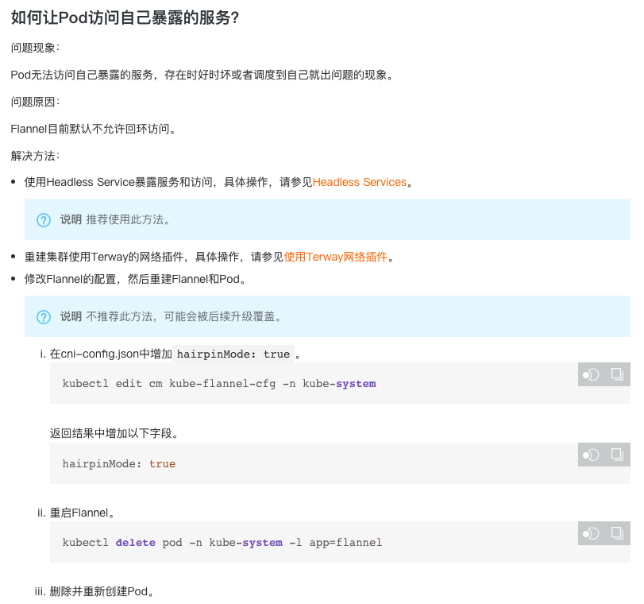

```
{
    "url": "ack-network-issue",
    "time": "2021/02/25 21:18",
    "tag": "Kubernetes,容器化"
}
```

安装的ACK集群已经解决了VPC内的网络通信，安装好的k8s集群网络概况如下：

- 每个pod都有独立的IP地址，不同pod可以监听相同的端口，该规则也适用svc
- 同vpc内k8s集群与非k8s集群之间ECS网络是互通的
- k8s集群内pod内的网络的互通的
- k8s集群内pod可以访问vpc内的所有ECS，但集群外的ECS无法访问到pod，集群内的ECS可以正常访问pod

但向容器迁移时还是会有一些兼容性的问题，比如有一些内部服务先迁移到容器，k8s集群外vpc内的项目需要访问到；有一些服务有端口，要考虑兼容性的话需要按指定端口暴露出去。针对这些整理一下服务迁移到k8s集群可能面对的网络兼容问题。

# 1. Pod无法访问自己暴露出去的服务

**问题说明：**

> 正常创建Pod和Service，Service以默认方式生成ClusterIP，在容器内部访问该ClusterIP时可能时好时坏，访问其他服务暴露的ClusterIP没有问题，但如果是自己对应的Service并且Endpoint调度到自己的时候就失败（注意是从容器内部访问）。

过程如下，查看Pod对应列表

```
$ kubectl get pod -o wide | grep k8s-go-demo
k8s-go-demo-deploy-66cdbcd8d9-fxrql           1/1     Running     0          28d     10.1.0.141   192.168.0.43
k8s-go-demo-deploy-66cdbcd8d9-x88b8           1/1     Running     0          28d     10.1.0.218   192.168.0.45
```

进入k8s-go-demo-deploy-66cdbcd8d9-fxrql，当前节点所在的机器IP是:192.168.0.43，访问当前服务的ClusterIP，可以看到访问者IP是10.1.0.141，服务的IP是10.1.0.218，他们处于不同的节点。

```
$ curl 10.2.212.203
{
    "ClientIP": "10.1.0.141",
    "Host": "k8s-go-demo-deploy-66cdbcd8d9-x88b8",
    "ServerIP": "10.1.0.218",
    "Time": "2021-02-25 21:13:00",
    "Version": "latest"
}
```

但多刷几次会发现好一次坏一次，不是每次都能成功，但每次拿到的ServerIP都是10.1.0.218。但倘若替换ClusterIP的服务为Headness方式则可以。


```
apiVersion: v1
kind: Service
metadata:
  name: k8s-go-demo-svc-headless
  labels:
    project: k8s-go-demo-svc-headless
spec:
  selector:
    app: k8s-go-demo
  ports:
  - port: 80
    targetPort: 38001
    protocol: TCP
  clusterIP: None
```

还是进入前面的容器访问：

```
/ # curl k8s-go-demo-svc-headless:38001
{
    "ClientIP": "10.1.0.141",
    "Host": "k8s-go-demo-deploy-66cdbcd8d9-x88b8",
    "ServerIP": "10.1.0.218",
    "Time": "2021-02-25 21:21:05",
    "Version": "latest"
}

/ # curl k8s-go-demo-svc-headless:38001
{
    "ClientIP": "10.1.0.141",
    "Host": "k8s-go-demo-deploy-66cdbcd8d9-fxrql",
    "ServerIP": "10.1.0.141",
    "Time": "2021-02-25 21:21:07",
    "Version": "latest"
}
```

**原因说明：Flannel目前默认设置不允许回环访问**



参考：[容器网络FAQ](https://help.aliyun.com/knowledge_detail/197320.html)

# 2. CoreDNS定义域名解析

可能需要针对性的对某些域名配置hosts，常见的比如内部服务绑定SLBIP，内部在通过配置hosts的方式定义好域名，程序就可以直接通过域名来访问了。K8s集群内的DNS解析使用的是CoreDNS，可以通过修改他的configmap来实现对某些域名的解析：

```
$ kubectl get configmap coredns -n kube-system -o yaml
apiVersion: v1
kind: ConfigMap
metadata:
  name: coredns
  namespace: kube-system
data:
  Corefile: |
    .:53 {
        errors
        health {
           lameduck 5s
        }
        ready

        kubernetes cluster.local in-addr.arpa ip6.arpa {

          pods verified
          upstream
          fallthrough in-addr.arpa ip6.arpa
          ttl 30
        }
        autopath @kubernetes
        prometheus :9153
        forward . /etc/resolv.conf
        cache 30
        loop
        reload
        loadbalance
    }
```

添加Hosts配置，保存后稍等就会生效。这样子容器内部就可以直接访问demo.api.com了。

```
$ kubectl edit configmap coredns -n kube-system
        autopath @kubernetes
        hosts {
            192.168.1.100     demo.api.com
            192.168.1.200     uat.api.com
            fallthrough
        }
        prometheus :9153
```


# 3. 创建多套Ingress
**场景说明：**

> 迁移项目到Kubernetes集群，但无法一步到位，新建k8s集群和原有机器节点在同一个vpc下。那迁移到集群的项目有内网项目和公网项目，而初始化集群创建的SLB如果是私网，那公网项目的Ingress就无法对外（vpc外部）；如果是公网，则内部服务通过Ingress就暴露出去了，只是可能没有在DNS中指定Ingress对应的域名解析，但实际绑hosts到公网IP后内网服务就暴露了。

vpc网络内kubernetes集群外的节点对容器来说也是外部访问，可以通过Ingress来暴露，但从业务角度来说，认为它还是内部服务，不能对vpc之外。所以如果有两套SLB就可以解决了，一套针对的是vpc内部，一套针对的是公网。

创建方式可以参考：[部署多个Ingress Controller](https://help.aliyun.com/document_detail/151524.html)

需要注意的**ingressClass**，用来确定Ingress表示，会在Ingress的Yaml文件中关联。注意的是这个组件会自动创建SLB，不需要手动指定，后续想要对SLB扩容直接在SLB控制台上操作即可，修改或删除Worker节点也不需要手动修改SLB监听和配置。

后续Ingress想要绑定到新建的SLB上，可以如下配置：

```
apiVersion: extensions/v1beta1
kind: Ingress
metadata:
  name: nginx
  annotations:
    #注意这里要设置为您前面配置的INGRESS_CLASS。
    kubernetes.io/ingress.class: "<YOUR_INGRESS_CLASS>"
spec:
  rules:
  - host: foo.bar.com
    http:
      paths:
      - path: /
        backend:
          serviceName: nginx
          servicePort: 80
```

# 4. 通过SLB来暴露服务

Service有几种类型，默认是ClusterIP，只能集群内部访问；还有一种是LoadBalancer，在阿里云ACK内，如果Service的类型设置为Type=LoadBalancer，则容器服务ACK的CCM(Cloud Controller Manager)组件会为该Service创建或配置阿里云的SLB。

前一步中已经通过Ingress实现了内外网的SLB分离，但还是有个问题，如果原有服务带非80端口，则Ingress是不方便处理的。这个时候我们可以通过LoadBalancer来暴露服务。

**第一步，**手动创建一个SLB，也可以不设置自动创建，问题是自动创建出来的slb不支持复用，关于区别可以看下面参考文档。

**第二步，**创建Service并指定类型为LoadBalancer

```
apiVersion: v1
kind: Service
metadata:
  name: k8s-go-demo-slb
  annotations:
    service.beta.kubernetes.io/alibaba-cloud-loadbalancer-id: ${YOUR_LB_ID}
    service.beta.kubernetes.io/alicloud-loadbalancer-force-override-listeners: 'true'
  labels:
    project: k8s-go-demo-slb
spec:
  selector:
    app: k8s-go-demo
  ports:
  - port: 38001
    targetPort: 38001
    protocol: TCP
  type: LoadBalancer
```

该操作会自动创建SLB的端口监听、虚拟服务器组，然后通过SLB的IP加服务端口在外部就可以访问了。

参考文档：

- [通过使用已有SLB的服务公开应用](https://help.aliyun.com/document_detail/181518.html)
- [Service的负载均衡配置注意事项](https://help.aliyun.com/document_detail/181517.html)
- [通过Annotation配置负载均衡]( https://help.aliyun.com/document_detail/86531.html)

# 5. Pod内访问SLB不通

Service中有一个参数spec.externalTrafficPolicy，可定义为Local或者Cluster，默认通过阿里云SLB出去的配置为Local。这种类型的SLB地址只有在Node中部署了对应的后端Pod才能呗访问，所以前面的Ingress、Service通过SLB暴露服务时需要注意下内部访问情况。

```
$ kubectl get svc nginx-ingress-lb -n kube-system -o yaml | grep externalTrafficPolicy

  externalTrafficPolicy: Local
```

也就是Local模式下，只能从Service的Endpoints对应的Node或者Node里的Pod访问到，其他就会出现网络不通的情况。SLB本身也是提供集群外访问，不是集群内访问。可以通过修改为Cluster但**会丢失源IP**，其他方法见下面参考文档。

参考文档：[Kubernetes集群中访问LoadBalancer暴露出去的SLB地址不通](https://help.aliyun.com/knowledge_detail/171437.html)


