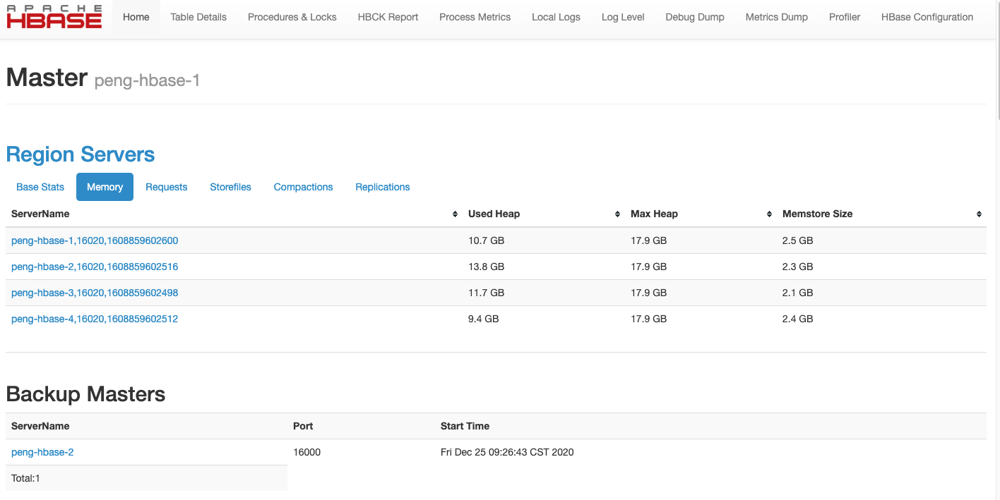

```
{
    "url": "hbase",
    "time": "2021/01/01 16:00",
    "tag": "Hbase"
}
```

# 一、关于Hbase

HBase是一个分布式，版本化，面向列的开源数据库，构建在 Apache Hadoop和 Apache ZooKeeper之上，基于谷歌三篇论文中的BigTable而实现。

# 二、准备工作

## 2.1 安装jdk

安装JDK并配置环境变量

```
$ vi /etc/profile
HADOOP_HOME=/hadoop-2.8.5
HBASE_HOME=/hbase-2.1.8
JAVA_HOME=/usr/local/jdk
PATH=$PATH:$JAVA_HOME/bin:$HADOOP_HOME/bin:$HADOOP_HOME/sbin:$HBASE_HOME/bin
CLASSPATH=$JAVA_HOME/jre/lib/ext:$JAVA_HOME/lib/tools.jar
export PATH JAVA_HOME CLASSPATH HADOOP_HOME HBASE_HOME
$ source /etc/profile
```

## 2.2 配置SSH免登陆

首先给每台机器配置Hosts，

```
192.168.0.100 peng-hbase-1
192.168.0.101 peng-hbase-2
192.168.0.102 peng-hbase-3
192.168.0.103 peng-hbase-4
```

每台机器运行`Hbase`的账号`~/.ssh/authorized_keys`增加授权`KEY`，确保每台机器都可以登录

```
$ ssh peng-hbase-1
$ ssh peng-hbase-2
$ ssh peng-hbase-3
$ ssh peng-hbase-4
```

## 2.3 同步时间

```
$ ntpdate time.windows.com
```

## 2.4 配置ZooKeeper集群

参考[ZooKeeper配置](https://itopic.org/zookeeper.html)

# 二、安装HDFS

下载hadoop安装文件，配置文件目录：`{hadooppath}/etc/hadoop/`，调整配置文件。

```
-rw-r--r-- 1 hadoop hadoop 4.7K 12月 24 15:57 hadoop-env.sh
-rw-r--r-- 1 hadoop hadoop 2.8K 12月 24 14:52 hdfs-site.xml
-rw-r--r-- 1 hadoop hadoop 1.1K 12月 24 14:49 core-site.xml
-rw-r--r-- 1 hadoop hadoop   80 12月 24 14:48 slaves
```

同步配置文件到各台机器，`Master`机器上执行格式化`namenode`，否则可能出现`NameNode`未启动的情况。

```
$ hadoop namenode -format
```

启动`HDFS`:

```
$ sh /hadoop-2.8.5/sbin/start-dfs.sh
```

只需要在`Master`机器上启动即可，如果要停止可以执行`stop-dfs.sh`脚本，正常启动成功之后可以看到：

```
$ jps -l
17873 org.apache.zookeeper.server.quorum.QuorumPeerMain
22635 org.apache.hadoop.hdfs.server.datanode.DataNode
22429 org.apache.hadoop.hdfs.server.namenode.NameNode
23789 sun.tools.jps.Jps
```

`Master`机器上存在`NameNode` + `DataNode`进程，备用机存在`SenondaryNameNode` + `DataNode`，其它只有`DataNode`。然后就可以访问`Master`机器上的`http://peng-hbase-1:50070`，就可以看到


# 三、安装Hbase

下载对应的hbase安装文件，配置文件目录`{hbasepath}/conf`，调整配置文件：

```
-rw-r--r-- 1 hadoop hadoop 7.7K 12月 24 17:46 hbase-env.sh
-rw-r--r-- 1 hadoop hadoop 3.2K 12月 24 15:45 hbase-site.xml
-rw-r--r-- 1 hadoop hadoop   81 12月 24 15:03 regionservers
-rw-rw-r-- 1 hadoop hadoop   20 12月 24 15:01 backup-masters
```

同步配置文件到各台机器，启动Hbase：

```
$ sh /hbase-2.1.8/bin/start-hbase.sh
```

只需要在Master机器上启动即可，如果要停止可以执行`stop-hbase.sh`脚本，正常启动成功之后可以看到：

```
$ jps -l
27571 sun.tools.jps.Jps
17873 org.apache.zookeeper.server.quorum.QuorumPeerMain
23114 org.apache.hadoop.hbase.master.HMaster
23229 org.apache.hadoop.hbase.regionserver.HRegionServer
22429 org.apache.hadoop.hdfs.server.namenode.NameNode
22635 org.apache.hadoop.hdfs.server.datanode.DataNode
```

访问`http://peng-hbase-1:60010`可以看到



**如果通过thrift连接可以启动thrift服务，**在`Master`机器执行：

```
$ sh /hbase-2.1.8/bin/hbase-daemons.sh start thrift
```

注意`hbase-daemons.sh` 中 `daemon`后面有个`s`，不带`s`的脚本只会启动当前机器的thrift，带`s`会在所有节点启动`thrift`。最后Master机器上的进程有：

```
$ jps -l
17873 org.apache.zookeeper.server.quorum.QuorumPeerMain
29202 sun.tools.jps.Jps
23114 org.apache.hadoop.hbase.master.HMaster
22635 org.apache.hadoop.hdfs.server.datanode.DataNode
23900 org.apache.hadoop.hbase.thrift.ThriftServer
23229 org.apache.hadoop.hbase.regionserver.HRegionServer
22429 org.apache.hadoop.hdfs.server.namenode.NameNode
```

注：整个配置方式配置了Hosts文件，调用的机器上也需要配置对应的Hosts才能访问。

# 四、数据迁移

## 4.1 购买BDS

通过阿里云的`BDS`做数据迁移，在`Hbase`控制台创建`BDS`集群。

## 4.2 配置数据源

本地数据源配置方式如下，`Hosts`信息拷贝上面信息即可。

```
{
  "clusterKey":"192.168.0.100,192.168.0.101,192.168.0.101:2181:/hbase,
  "hbaseDir":"/hbase",
  "hdfsUri":"hdfs://peng-hbase-1:9000"
}
```

如果是阿里云的`HBase`则直接在`BDS`中的关联数据库中关联即可。

## 4.3 账号授权

迁移之前在`Master`机器创建`.copytmp`目录并给`hadoop`账号授权

```
$ hadoop fs -mkdir /.copytmp
$ hadoop fs -chown hadoop /.copytmp
```

## 4.4 创建迁移任务

在`BDS`后台创建迁移任务即可。

