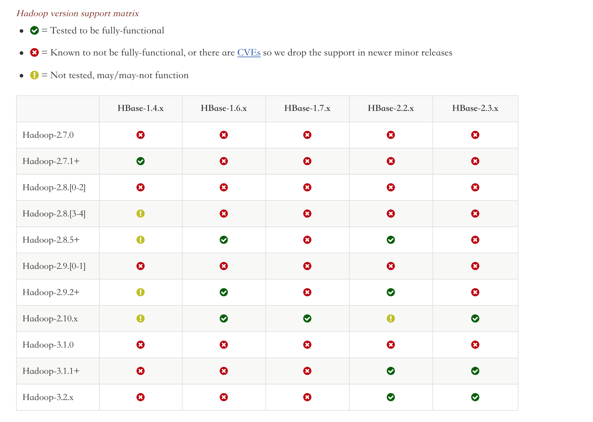
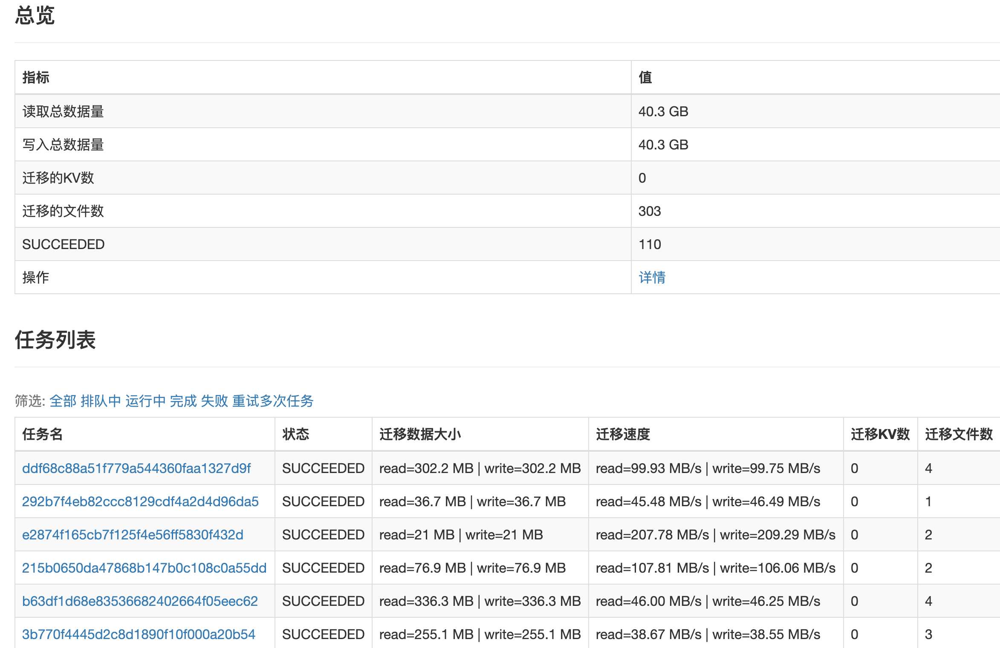

```
{
    "url": "hbase",
    "time": "2021/01/01 16:00",
    "tag": "Hbase",
    "toc": "yes"
}
```

# 一、关于Hbase

HBase是一个分布式，版本化，面向列的开源数据库，构建在 Apache Hadoop和 Apache ZooKeeper之上，基于谷歌三篇论文中的BigTable而实现。

项目从Mongo、Codis切换到Hbase也是看中到他的存储能力，相较于Codis的内存而言，SSD还是廉价很多，借助HDFS的分布式存储能力，在存储这块没有太多担心的，但毕竟是磁盘存储、分部署存储，读的性能上还是差很多，Hbase比较适合写多读少的场景。 

使用Hbase两年多来也出现过两次事故，一次是阿里云运维程序触发Major Compaction导致磁盘写满，触发Hbase2.0.3版本meta表Bug，导致集群不可用，当时通过购买新集群解决，但后续做数据迁移的时候导致hbase开始分裂，短时间磁盘写满，集群被锁住，所以对于Hbase的磁盘空间可以预留50%以上的空间。还有一次是配合阿里云做优化，两个集群的数据压缩算法不一致，导致thrift连接打满，类似这些事故导致集群不可用对核心业务的影响还是比较致命的。

兜兜转转下还是决定自己搭建Hbase集群。

# 二、准备工作

Hbase下载地址：http://hbase.apache.org/downloads.html

Hadoop下载地址：https://hadoop.apache.org/releases.html

Hbase与Hadoop对应关系：http://hbase.apache.org/book.html#hadoop



## 2.1 安装jdk

安装JDK并配置环境变量

```
$ vi /etc/profile
HADOOP_HOME=/hadoop-2.8.5
HBASE_HOME=/hbase-2.1.8
JAVA_HOME=/usr/local/jdk
PATH=$PATH:$JAVA_HOME/bin:$HADOOP_HOME/bin:$HADOOP_HOME/sbin:$HBASE_HOME/bin
CLASSPATH=$JAVA_HOME/jre/lib/ext:$JAVA_HOME/lib/tools.jar
export PATH JAVA_HOME CLASSPATH HADOOP_HOME HBASE_HOME
$ source /etc/profile
```

## 2.2 配置SSH免登陆

首先给每台机器配置Hosts

```
192.168.0.100 peng-hbase-1
192.168.0.101 peng-hbase-2
192.168.0.102 peng-hbase-3
192.168.0.103 peng-hbase-4
```

每台机器运行`Hbase`的账号`~/.ssh/authorized_keys`增加授权`KEY`，确保每台机器都可以登录

```
$ ssh peng-hbase-1
$ ssh peng-hbase-2
$ ssh peng-hbase-3
$ ssh peng-hbase-4
```

## 2.3 同步时间

```
$ ntpdate time.windows.com
```

## 2.4 配置ZooKeeper集群

参考[ZooKeeper配置](https://itopic.org/zookeeper.html)

# 二、安装HDFS

下载hadoop安装文件，配置文件目录：`{hadooppath}/etc/hadoop/`，调整配置文件。

```
-rw-r--r-- 1 hadoop hadoop 4.7K 12月 24 15:57 hadoop-env.sh
-rw-r--r-- 1 hadoop hadoop 2.8K 12月 24 14:52 hdfs-site.xml
-rw-r--r-- 1 hadoop hadoop 1.1K 12月 24 14:49 core-site.xml
-rw-r--r-- 1 hadoop hadoop   80 12月 24 14:48 slaves
```

**core-site.xml**

````
<value>hdfs://peng-hbase-1:9000</value>
````

**slaves**

```
peng-hbase-1
peng-hbase-2
peng-hbase-3
peng-hbase-4
```

同步配置文件到各台机器，`Master`机器上执行格式化`namenode`，否则可能出现`NameNode`未启动的情况。(用前面配置授权KEY的账号)

```
$ hadoop namenode -format
```

**启动`HDFS`:**

```
$ sh /hadoop-2.8.5/sbin/start-dfs.sh
```

只需要在`Master`机器上启动即可，如果要停止可以执行`stop-dfs.sh`脚本，正常启动成功之后可以看到：

```
$ jps -l
17873 org.apache.zookeeper.server.quorum.QuorumPeerMain
22635 org.apache.hadoop.hdfs.server.datanode.DataNode
22429 org.apache.hadoop.hdfs.server.namenode.NameNode
23789 sun.tools.jps.Jps
```

`Master`机器上存在`NameNode` + `DataNode`进程，备用机存在`SenondaryNameNode` + `DataNode`，其它只有`DataNode`。然后就可以访问`Master`机器上的`http://peng-hbase-1:50070`，就可以看到


**测试hdfs是否安装成功**，查看文件列表，命令和文件操作的命令类似：

```
$ hadoop fs -ls /
Found 1 items
drwxr-xr-x   - hadoop supergroup          0 2020-12-29 23:56 /hbase
```

创建目录

```
$ hadoop fs -mkdir /peng
```

上传文件

```
$ hadoop fs -put README.md /peng
```

下载文件

```
$ hadoop fs -get /peng/README.md
```

查看文件内容

```
$ hadoop fs -cat /peng/README.md
Hello HDFS
```

删除文件

```
$ hadoop fs -rm /peng/README.md
```

删除目录

```
$ hadoop fs -rm -r /peng
```

查看Hbase存储占用

```
$ hadoop fs -du -h /hbase/data
```

# 三、安装Hbase

下载对应的hbase安装文件，配置文件目录`{hbasepath}/conf`，调整配置文件：

```
-rw-r--r-- 1 hadoop hadoop 7.7K 12月 24 17:46 hbase-env.sh
-rw-r--r-- 1 hadoop hadoop 3.2K 12月 24 15:45 hbase-site.xml
-rw-r--r-- 1 hadoop hadoop   81 12月 24 15:03 regionservers
-rw-rw-r-- 1 hadoop hadoop   20 12月 24 15:01 backup-masters
```

**regionservers**

```
peng-hbase-1
peng-hbase-2
peng-hbase-3
peng-hbase-4
```

**backup-masters**

```
peng-hbase-4
```

**hbase-site.xml**

```
<property>
    <!-- hbase存放数据目录 -->
    <name>hbase.rootdir</name>
    <!-- 端口要和Hadoop的fs.defaultFS端口一致-->
    <value>hdfs://peng-hbase-1:9000/hbase</value>
</property>
    
<property>
    <!-- list of  zookooper -->
    <name>hbase.zookeeper.quorum</name>
    <value>192.168.0.100:2181,192.168.0.101:2181,192.168.0.102:2181</value>
</property>
```

**同步配置文件到各台机器，启动Hbase：**

```
$ sh /hbase-2.1.8/bin/start-hbase.sh
```

只需要在Master机器上启动即可，如果要停止可以执行`stop-hbase.sh`脚本，正常启动成功之后可以看到：

```
$ jps -l
27571 sun.tools.jps.Jps
17873 org.apache.zookeeper.server.quorum.QuorumPeerMain
23114 org.apache.hadoop.hbase.master.HMaster
23229 org.apache.hadoop.hbase.regionserver.HRegionServer
22429 org.apache.hadoop.hdfs.server.namenode.NameNode
22635 org.apache.hadoop.hdfs.server.datanode.DataNode
```

访问`http://peng-hbase-1:60010`可以看到


**如果通过thrift连接可以启动thrift服务，**在`Master`机器执行：

```
$ sh /hbase-2.1.8/bin/hbase-daemons.sh start thrift
```

注意`hbase-daemons.sh` 中 `daemon`后面有个`s`，不带`s`的脚本只会启动当前机器的thrift，带`s`会在所有节点启动`thrift`。最后Master机器上的进程有：

```
$ jps -l
17873 org.apache.zookeeper.server.quorum.QuorumPeerMain
29202 sun.tools.jps.Jps
23114 org.apache.hadoop.hbase.master.HMaster
22635 org.apache.hadoop.hdfs.server.datanode.DataNode
23900 org.apache.hadoop.hbase.thrift.ThriftServer
23229 org.apache.hadoop.hbase.regionserver.HRegionServer
22429 org.apache.hadoop.hdfs.server.namenode.NameNode
```

注：整个配置方式配置了Hosts文件，调用的机器上也需要配置对应的Hosts才能访问。接下来测试Hbase是否安装成功：

登录hbase命令行

```
$ hbase shell
HBase Shell
Use "help" to get list of supported commands.
Use "exit" to quit this interactive shell.
For Reference, please visit: http://hbase.apache.org/2.0/book.html#shell
Version 2.1.8, rd8333e556c8ed739cf39dab58ddc6b43a50c0965, Tue Nov 19 15:29:04 UTC 2019
Took 0.0024 seconds
hbase(main):001:0> list
TABLE
0 row(s)
Took 0.3120 seconds
=> []
```

创建名称空间

```
> create_namespace 'demo'
Took 1.1799 seconds

> list_namespace
NAMESPACE
demo
1 row(s)
Took 0.6149 seconds
```

创建数据表

```
> create 'demo:peng', { NAME => 'info', TTL => 86400, VERSIONS => 3 } , { NAME => 'exp' , TTL => 3600}
Created table demo:peng
Took 1.2183 seconds
=> Hbase::Table - demo:peng

> describe 'demo:peng'
{
    NAME => 'exp', 
    VERSIONS => '1', 
    EVICT_BLOCKS_ON_CLOSE => 'false', 
    NEW_VERSION_BEHAVIOR => 'false', 
    KEEP_DELETED_CELLS => 'FALSE', 
    CACHE_DATA_ON_WRITE => 'false', 
    DATA_BLOCK_ENCODING => 'NONE', 
    TTL => '3600 SECONDS (1 HOUR)', 
    MIN_VERSIONS => '0', 
    REPLICATION_SCOPE => '0', 
    BLOOMFILTER => 'ROW', 
    CACHE_INDEX_ON_WRITE => 'false', 
    IN_MEMORY => 'false', 
    CACHE_BLOOMS_ON_WRITE => 'false', 
    PREFETCH_BLOCKS_ON_OPEN => 'false', 
    COMPRESSION => 'NONE', 
    BLOCKCACHE => 'true', 
    BLOCKSIZE => '65536'
},
{
    NAME => 'info', 
    VERSIONS => '3', 
    EVICT_BLOCKS_ON_CLOSE => 'false', 
    NEW_VERSION_BEHAVIOR => 'false', 
    KEEP_DELETED_CELLS => 'FALSE', 
    CACHE_DATA_ON_WRITE => 'false', 
    DATA_BLOCK_ENCODING => 'NONE', 
    TTL => '86400 SECONDS (1 DAY)', 
    MIN_VERSIONS => '0', 
    REPLICATION_SCOPE => '0', 
    BLOOMFILTER => 'ROW', 
    CACHE_INDEX_ON_WRITE => 'false', 
    IN_MEMORY => 'false', 
    CACHE_BLOOMS_ON_WRITE => 'false', 
    PREFETCH_BLOCKS_ON_OPEN => 'false', 
    COMPRESSION => 'NONE', 
    BLOCKCACHE => 'true', 
    BLOCKSIZE => '65536'
}
```

写入数据

```
> put 'demo:peng', 'peng','info:name','peng'
> put 'demo:peng', 'peng','info:age','18'
```

遍历表

```
> scan 'demo:peng'
ROW                            COLUMN+CELL
 Lion                          column=info:age, timestamp=1609293900382, value=5
 peng                          column=info:age, timestamp=1609293815916, value=18
 peng                          column=info:name, timestamp=1609293806251, value=peng

> scan 'demo:peng', {'LIMIT' => 1}
ROW                            COLUMN+CELL
 Lion                          column=info:age, timestamp=1609293900382, value=5
```

查看单条记录

```
> get 'demo:peng', 'peng'
COLUMN                         CELL
 info:age                      timestamp=1609293815916, value=18
 info:name                     timestamp=1609293806251, value=peng
```

多版本测试，表定义中info中定义VERSIONS = 3，多次更新时会保留最后的3个版本。

```
> put 'demo:peng', 'peng','info:age','30'
> put 'demo:peng', 'peng','info:age','32'
> put 'demo:peng', 'peng','info:age','36'
> get 'demo:peng', 'peng'
COLUMN                         CELL
 info:age                      timestamp=1609306879659, value=36
 info:name                     timestamp=1609306782683, value=peng
 
> get 'demo:peng','peng',{COLUMN=>'info:age',VERSIONS=>3}
COLUMN                         CELL
 info:age                      timestamp=1609306879659, value=36
 info:age                      timestamp=1609306877282, value=32
 info:age                      timestamp=1609306864690, value=30
1 row(s)
```

删除表，删除之前需要先禁用表

```
> disable 'demo:peng'
> drop 'demo:peng'
```

# 四、数据迁移

## 4.1 购买BDS

通过阿里云的`BDS`做数据迁移，在`Hbase`控制台创建`BDS`集群，支持从一个Hbase迁移到另一个Hbase集群。

## 4.2 配置数据源

本地数据源配置方式如下，`Hosts`信息拷贝上面信息即可。

```
{
  "clusterKey":"192.168.0.100,192.168.0.101,192.168.0.101:2181:/hbase,
  "hbaseDir":"/hbase",
  "hdfsUri":"hdfs://peng-hbase-1:9000"
}
```

如果是阿里云的`HBase`则直接在`BDS`中的关联数据库中关联即可。

## 4.3 账号授权

迁移之前在`Master`机器创建`.copytmp`目录并给`hadoop`账号授权。

```
$ hadoop fs -mkdir /.copytmp
$ hadoop fs -chown hadoop /.copytmp
```

未授权时出现的错误为：

```
err=org.apache.hadoop.security.AccessControlException: Permission denied: user=hadoop, access=WRITE
```

## 4.4 创建迁移任务

在`BDS`后台创建迁移任务即可。



# 五、Hbase管理

## 5.1 Region均衡

用来均衡多个RegionServer之间的Region数量（Num.Regions），在RegionServer扩容或者缩容过程中都会引起Region的重新分配。可以通过`balancer_enabled`查看开关。

```
$ hbase shell
hbase(main):001:0> balancer_enabled
true
Took 0.3317 seconds
=> true
```

也可以手动设置关闭

```
hbase(main):003:0> balance_switch false
Previous balancer state : true
Took 0.0428 seconds
=> "true"
```

当关闭后会提示

```
The Load Balancer is not enabled which will eventually cause performance degradation in HBase 
as Regions will not be distributed across all RegionServers. 
The balancer is only expected to be disabled during rolling upgrade scenarios.
```

## 5.2 滚动重启

有个`./rolling-restart.sh`可以操作滚动重启，但在重启过程中集群会出现不可用。理论上配置文件的修改、节点上下线都可以通过该操作完成。

> 操作的是重启，如果要下线可以先停掉指定节点，然后执行重启。

## 5.3 添加节点

和前面配置相同，需要添加Host、配置SSH登录、添加regionservers。然后在添加的节点执行：

```
./hbase-daemon.sh start regionserver
```

启动之后Regions会重新分配，在执行均衡的过程中可能出现某些region不可用的情况。

```
3 region(s) in transition. 0 region(s) in transition for more than 60000 milliseconds.
```

## 5.4 停止节点

通过`graceful_stop.sh`脚本执行节点下线

```
$ ./graceful_stop.sh peng-hbase-4
2021-01-07T15:12:34 Disabling load balancer
2021-01-07T15:12:39 Previous balancer state was false
2021-01-07T15:12:39 Unloading peng-hbase-4 region(s)
...
2021-01-07T15:13:21 Unloaded peng-hbase-4 region(s)
2021-01-07T15:13:21 Stopping regionserver on peng-hbase-4
2021-01-07T15:22:23 Restoring balancer state to true
```

通过日志看到停止过程中有停止负载均衡，迁移`region`然后停掉`regionserver`再次打开`Region`均衡开关。

## 5.5 重启

重启`master`

```
$ ./hbase-daemon.sh stop master
$ ./hbase-daemon.sh start master
```

重启`regionserver`

```
$ ./graceful_stop.sh --restart peng-hbase-4
```

也可以通过`rolling`脚本启动所有`master`或`regionserver`

```
$ ./rolling-restart.sh --master-only
$ ./rolling-restart.sh --rs-only
```

启停集群

```
$ ./hbase-2.1.8/bin/start-hbase.sh
$ ./hbase-2.1.8/bin/stop-hbase.sh
```

# 六、HDFS管理

## 6.1 下线节点

`hdfs-site.xml`文件配置黑名单，增加需要下线的节点

```
    <property>
        <name>dfs.hosts.exclude</name>
        <value>/hadoop-2.8.5/etc/hadoop/excludes</value>
    </property>
```

主NameNode上刷新节点，会做数据迁移

```
$ hdfs dfsadmin -refreshNodes
```

查看节点状态为Decommission in progress

```
$ hdfs dfsadmin -report
Name: 192.168.0.103:50010 (peng-hbase-4)
Hostname: peng-hbase-4
Decommission Status : Decommission in progress
Configured Capacity: 802297069568 (747.20 GB)
DFS Used: 56288714752 (52.42 GB)
Non DFS Used: 0 (0 B)
DFS Remaining: 702790262950 (654.52 GB)
DFS Used%: 7.02%
DFS Remaining%: 87.60%
Configured Cache Capacity: 0 (0 B)
Cache Used: 0 (0 B)
Cache Remaining: 0 (0 B)
Cache Used%: 100.00%
Cache Remaining%: 0.00%
Xceivers: 5
Last contact: Thu Jan 07 17:55:07 CST 2021
```

待状态变为Decommissioned后在对应节点停止datanode

```
$ hadoop-daemon.sh stop datanode 
```

调整slaves文件并清空excludes数据，重新刷新节点，这个过程需要等待一定时间后会被认定为节点已死。

## 6.2 新增节点

修改slaves文件增加新节点，然后执行刷新节点

```
$ hdfs dfsadmin -refreshNodes
```

启动DataNode

```
$ hadoop-daemon.sh start datanode 
```

重新平衡

```
$ ./sbin/start-balancer.sh
```

## 6.3 增加磁盘

调整hadoop中hdfs-site.xml文件并重启

```
<property>
    <name>dfs.namenode.name.dir</name>
    <value>/data/hdfs/name,/data1/hdfs/name</value>
    <description>表示NameNode需要存储数据的地方</description>
</property>
<property>
    <name>dfs.datanode.data.dir</name>
    <value>/data/hdfs/data,/data1/hdfs/data</value>
    <description>DataNode存放数据的地方</description>
</property>
```

## 6.4 重启

操作指定节点后查看Datanode Information管理页面就可以看到新增的存储空间了。我这里数据有多份，逐一重启datanode后扩容成功。

```
$ ./hadoop-daemon.sh stop datanode 
$ ./hadoop-daemon.sh start datanode 
```

直接启停整个集群可使用

```
$ ./start-dfs.sh
$ ./stop-dfs.sh
```

