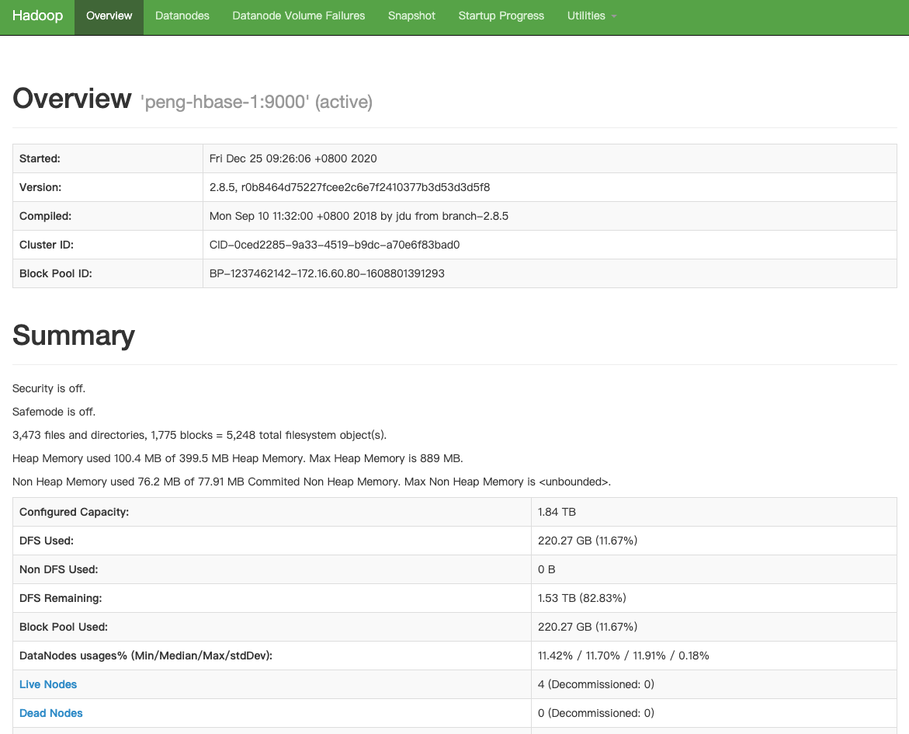

```
{
    "url": "hbase",
    "time": "2021/01/01 16:00",
    "tag": "Hbase"
}
```

# 一、关于Hbase

HBase是一个分布式，版本化，面向列的开源数据库，构建在 Apache Hadoop和 Apache ZooKeeper之上，基于谷歌三篇论文中的BigTable而实现。

项目从Mongo、Codis切换到Hbase也是看中到他的存储能力，相较于Codis的内存而言，SSD还是廉价很多，借助HDFS的分布式存储能力，在存储这块没有太多担心的，但毕竟是磁盘存储、分部署存储，读的性能上还是差很多，Hbase比较适合写多读少的场景。 

使用Hbase两年多来也出现过两次事故，一次是阿里云运维程序处罚Major Compaction导致磁盘写满，触发Hbase2.0.3版本meta表Bug，导致集群不可用，当时通过购买新集群解决，但后续做数据迁移的时候导致hbase开始分裂，短时间磁盘写满，集群被锁住，所以对于Hbase的磁盘空间可以预留50%以上的空间。还有一次是配合阿里云做优化，两个集群的数据压缩算法不一致，导致thrift连接打满，类似这些事故导致集群不可用对核心业务的影响还是比较致命的。

兜兜转转下还是决定自己搭建Hbase集群。

# 二、准备工作

Hbase下载地址：http://hbase.apache.org/downloads.html

Hadoop下载地址：https://hadoop.apache.org/releases.html

Hbase与Hadoop对应关系：http://hbase.apache.org/book.html#hadoop


## 2.1 安装jdk

安装JDK并配置环境变量

```
$ vi /etc/profile
HADOOP_HOME=/hadoop-2.8.5
HBASE_HOME=/hbase-2.1.8
JAVA_HOME=/usr/local/jdk
PATH=$PATH:$JAVA_HOME/bin:$HADOOP_HOME/bin:$HADOOP_HOME/sbin:$HBASE_HOME/bin
CLASSPATH=$JAVA_HOME/jre/lib/ext:$JAVA_HOME/lib/tools.jar
export PATH JAVA_HOME CLASSPATH HADOOP_HOME HBASE_HOME
$ source /etc/profile
```

## 2.2 配置SSH免登陆

首先给每台机器配置Hosts，

```
192.168.0.100 peng-hbase-1
192.168.0.101 peng-hbase-2
192.168.0.102 peng-hbase-3
192.168.0.103 peng-hbase-4
```

每台机器运行`Hbase`的账号`~/.ssh/authorized_keys`增加授权`KEY`，确保每台机器都可以登录

```
$ ssh peng-hbase-1
$ ssh peng-hbase-2
$ ssh peng-hbase-3
$ ssh peng-hbase-4
```

## 2.3 同步时间

```
$ ntpdate time.windows.com
```

## 2.4 配置ZooKeeper集群

参考[ZooKeeper配置](https://itopic.org/zookeeper.html)

# 二、安装HDFS

下载hadoop安装文件，配置文件目录：`{hadooppath}/etc/hadoop/`，调整配置文件。

```
-rw-r--r-- 1 hadoop hadoop 4.7K 12月 24 15:57 hadoop-env.sh
-rw-r--r-- 1 hadoop hadoop 2.8K 12月 24 14:52 hdfs-site.xml
-rw-r--r-- 1 hadoop hadoop 1.1K 12月 24 14:49 core-site.xml
-rw-r--r-- 1 hadoop hadoop   80 12月 24 14:48 slaves
```

**core-site.xml**

````
<value>hdfs://peng-hbase-1:9000</value>
````

**slaves**

```
peng-hbase-1
peng-hbase-2
peng-hbase-3
peng-hbase-4
```

同步配置文件到各台机器，`Master`机器上执行格式化`namenode`，否则可能出现`NameNode`未启动的情况。(用前面配置授权KEY的账号)

```
$ hadoop namenode -format
```

启动`HDFS`:

```
$ sh /hadoop-2.8.5/sbin/start-dfs.sh
```

只需要在`Master`机器上启动即可，如果要停止可以执行`stop-dfs.sh`脚本，正常启动成功之后可以看到：

```
$ jps -l
17873 org.apache.zookeeper.server.quorum.QuorumPeerMain
22635 org.apache.hadoop.hdfs.server.datanode.DataNode
22429 org.apache.hadoop.hdfs.server.namenode.NameNode
23789 sun.tools.jps.Jps
```

`Master`机器上存在`NameNode` + `DataNode`进程，备用机存在`SenondaryNameNode` + `DataNode`，其它只有`DataNode`。然后就可以访问`Master`机器上的`http://peng-hbase-1:50070`，就可以看到



**测试hdfs是否安装成功**，查看文件列表，命令和文件操作的命令类似：

```
$ hadoop fs -ls /
Found 1 items
drwxr-xr-x   - hadoop supergroup          0 2020-12-29 23:56 /hbase
```

创建目录

```
$ hadoop fs -mkdir /peng
```

上传文件

```
$ hadoop fs -put README.md /peng
```

下载文件

```
hadoop fs -get /peng/README.md
```

查看文件内容

```
$ hadoop fs -cat /peng/README.md
Hello HDFS
```

删除文件

```
$ hadoop fs -rm /peng/README.md
```

删除目录

```
$ hadoop fs -rm -r /peng
```

# 三、安装Hbase

下载对应的hbase安装文件，配置文件目录`{hbasepath}/conf`，调整配置文件：

```
-rw-r--r-- 1 hadoop hadoop 7.7K 12月 24 17:46 hbase-env.sh
-rw-r--r-- 1 hadoop hadoop 3.2K 12月 24 15:45 hbase-site.xml
-rw-r--r-- 1 hadoop hadoop   81 12月 24 15:03 regionservers
-rw-rw-r-- 1 hadoop hadoop   20 12月 24 15:01 backup-masters
```

**regionservers**

```
peng-hbase-1
peng-hbase-2
peng-hbase-3
peng-hbase-4
```

**backup-masters**

```
peng-hbase-4
```

**hbase-site.xml**

```
<property>
    <!-- hbase存放数据目录 -->
    <name>hbase.rootdir</name>
    <!-- 端口要和Hadoop的fs.defaultFS端口一致-->
    <value>hdfs://peng-hbase-1:9000/hbase</value>
</property>
    
<property>
    <!-- list of  zookooper -->
    <name>hbase.zookeeper.quorum</name>
    <value>192.168.0.100:2181,192.168.0.101:2181,192.168.0.102:2181</value>
</property>
```

同步配置文件到各台机器，启动Hbase：

```
$ sh /hbase-2.1.8/bin/start-hbase.sh
```

只需要在Master机器上启动即可，如果要停止可以执行`stop-hbase.sh`脚本，正常启动成功之后可以看到：

```
$ jps -l
27571 sun.tools.jps.Jps
17873 org.apache.zookeeper.server.quorum.QuorumPeerMain
23114 org.apache.hadoop.hbase.master.HMaster
23229 org.apache.hadoop.hbase.regionserver.HRegionServer
22429 org.apache.hadoop.hdfs.server.namenode.NameNode
22635 org.apache.hadoop.hdfs.server.datanode.DataNode
```

访问`http://peng-hbase-1:60010`可以看到


**如果通过thrift连接可以启动thrift服务，**在`Master`机器执行：

```
$ sh /hbase-2.1.8/bin/hbase-daemons.sh start thrift
```

注意`hbase-daemons.sh` 中 `daemon`后面有个`s`，不带`s`的脚本只会启动当前机器的thrift，带`s`会在所有节点启动`thrift`。最后Master机器上的进程有：

```
$ jps -l
17873 org.apache.zookeeper.server.quorum.QuorumPeerMain
29202 sun.tools.jps.Jps
23114 org.apache.hadoop.hbase.master.HMaster
22635 org.apache.hadoop.hdfs.server.datanode.DataNode
23900 org.apache.hadoop.hbase.thrift.ThriftServer
23229 org.apache.hadoop.hbase.regionserver.HRegionServer
22429 org.apache.hadoop.hdfs.server.namenode.NameNode
```

注：整个配置方式配置了Hosts文件，调用的机器上也需要配置对应的Hosts才能访问。接下来测试Hbase是否安装成功：

登录hbase命令行

```
$ hbase shell
HBase Shell
Use "help" to get list of supported commands.
Use "exit" to quit this interactive shell.
For Reference, please visit: http://hbase.apache.org/2.0/book.html#shell
Version 2.1.8, rd8333e556c8ed739cf39dab58ddc6b43a50c0965, Tue Nov 19 15:29:04 UTC 2019
Took 0.0024 seconds
hbase(main):001:0> list
TABLE
0 row(s)
Took 0.3120 seconds
=> []
```

创建名称空间

```
> create_namespace 'demo'
Took 1.1799 seconds
```

创建数据表

```
> create 'demo:peng', { NAME => 'info', TTL => 86400, VERSIONS => 3 } , { NAME => 'exp' , TTL => 3600}
Created table demo:peng
Took 1.2183 seconds
=> Hbase::Table - demo:peng

> describe 'demo:peng'
{
    NAME => 'exp', 
    VERSIONS => '1', 
    EVICT_BLOCKS_ON_CLOSE => 'false', 
    NEW_VERSION_BEHAVIOR => 'false', 
    KEEP_DELETED_CELLS => 'FALSE', 
    CACHE_DATA_ON_WRITE => 'false', 
    DATA_BLOCK_ENCODING => 'NONE', 
    TTL => '3600 SECONDS (1 HOUR)', 
    MIN_VERSIONS => '0', 
    REPLICATION_SCOPE => '0', 
    BLOOMFILTER => 'ROW', 
    CACHE_INDEX_ON_WRITE => 'false', 
    IN_MEMORY => 'false', 
    CACHE_BLOOMS_ON_WRITE => 'false', 
    PREFETCH_BLOCKS_ON_OPEN => 'false', 
    COMPRESSION => 'NONE', 
    BLOCKCACHE => 'true', 
    BLOCKSIZE => '65536'
},
{
    NAME => 'info', 
    VERSIONS => '3', 
    EVICT_BLOCKS_ON_CLOSE => 'false', 
    NEW_VERSION_BEHAVIOR => 'false', 
    KEEP_DELETED_CELLS => 'FALSE', 
    CACHE_DATA_ON_WRITE => 'false', 
    DATA_BLOCK_ENCODING => 'NONE', 
    TTL => '86400 SECONDS (1 DAY)', 
    MIN_VERSIONS => '0', 
    REPLICATION_SCOPE => '0', 
    BLOOMFILTER => 'ROW', 
    CACHE_INDEX_ON_WRITE => 'false', 
    IN_MEMORY => 'false', 
    CACHE_BLOOMS_ON_WRITE => 'false', 
    PREFETCH_BLOCKS_ON_OPEN => 'false', 
    COMPRESSION => 'NONE', 
    BLOCKCACHE => 'true', 
    BLOCKSIZE => '65536'
}
```

写入数据

```
> put 'demo:peng', 'peng','info:name','peng'
> put 'demo:peng', 'peng','info:age','18'
```

遍历表

```
> scan 'demo:peng'
ROW                            COLUMN+CELL
 Lion                          column=info:age, timestamp=1609293900382, value=5
 peng                          column=info:age, timestamp=1609293815916, value=18
 peng                          column=info:name, timestamp=1609293806251, value=peng

> scan 'demo:peng', {'LIMIT' => 1}
ROW                            COLUMN+CELL
 Lion                          column=info:age, timestamp=1609293900382, value=5
```

查看单条记录

```
> get 'demo:peng', 'peng'
COLUMN                         CELL
 info:age                      timestamp=1609293815916, value=18
 info:name                     timestamp=1609293806251, value=peng
```

多版本测试，表定义中info中定义VERSIONS = 3，多次更新时会保留最后的3个版本。

```
> put 'demo:peng', 'peng','info:age','30'
> put 'demo:peng', 'peng','info:age','32'
> put 'demo:peng', 'peng','info:age','36'
> get 'demo:peng', 'peng'
COLUMN                         CELL
 info:age                      timestamp=1609306879659, value=36
 info:name                     timestamp=1609306782683, value=peng
 
> get 'demo:peng','peng',{COLUMN=>'info:age',VERSIONS=>3}
COLUMN                         CELL
 info:age                      timestamp=1609306879659, value=36
 info:age                      timestamp=1609306877282, value=32
 info:age                      timestamp=1609306864690, value=30
1 row(s)
```

删除表，删除之前需要先禁用表

```
> disable 'demo:peng'
> drop 'demo:peng'
```

# 四、数据迁移

## 4.1 购买BDS

通过阿里云的`BDS`做数据迁移，在`Hbase`控制台创建`BDS`集群。

## 4.2 配置数据源

本地数据源配置方式如下，`Hosts`信息拷贝上面信息即可。

```
{
  "clusterKey":"192.168.0.100,192.168.0.101,192.168.0.101:2181:/hbase,
  "hbaseDir":"/hbase",
  "hdfsUri":"hdfs://peng-hbase-1:9000"
}
```

如果是阿里云的`HBase`则直接在`BDS`中的关联数据库中关联即可。

## 4.3 账号授权

迁移之前在`Master`机器创建`.copytmp`目录并给`hadoop`账号授权。

```
$ hadoop fs -mkdir /.copytmp
$ hadoop fs -chown hadoop /.copytmp
```

未授权时出现的错误为：

```
err=org.apache.hadoop.security.AccessControlException: Permission denied: user=hadoop, access=WRITE
```

## 4.4 创建迁移任务

在`BDS`后台创建迁移任务即可。

