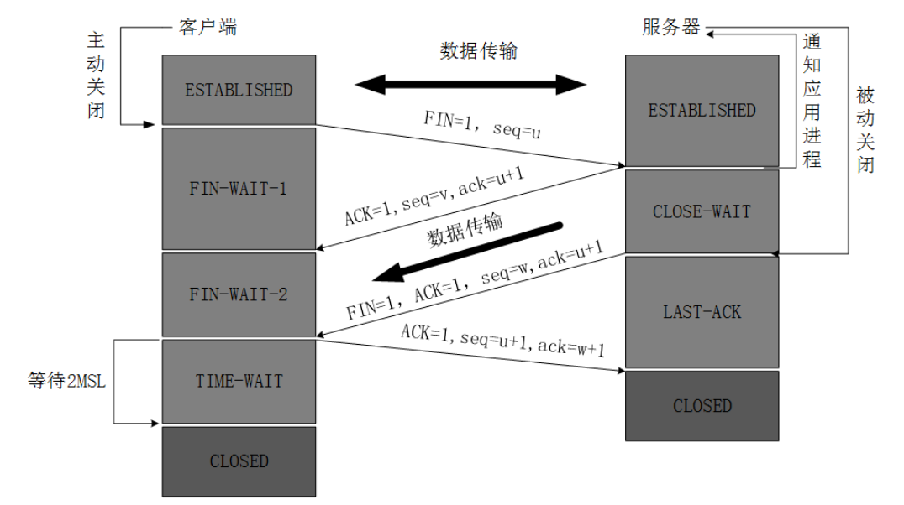

```
{
    "url": "linux-sysctl",
    "time": "2017/12/24 19:30",
    "tag": "运维,CentOS"
}
```

# 一、文件句柄数限制

`Linux`系统对单用户`单个进程`可打开的文件数量有限制，每一个`TCP`连接都需要创建一个`Socket`句柄，每个`Socket`句柄同时也是一个文件句柄，这个设置会直接影响到系统可支撑的最大连接数。

默认单个进程最大可打开`1024`个文件，通过`ulimit -n`可以查看打开的最大文件数限制：

```
$ ulimit -n
1024
```

限制分为软限制和硬限制，`ulimit -n`显示的是软限制的数量，用户可以设置自己的限制数量，但受限于最大硬限制设置的值。

```
[peng@peng-master-1 ~]$ ulimit -SHn 1000
[peng@peng-master-1 ~]$ ulimit -SHn 10000
-bash: ulimit: open files: 无法修改 limit 值: 不允许的操作
```

> 注：ulimit命令只影响当前Shell环境

如果要永久生效，可以通过调整文件`/etc/security/limits.conf`

```
$ cat /etc/security/limits.conf
* soft nofile 65536
* hard nofile 65536
```

其中类型的值可以为`hard`，`soft`或者`-`，其中`-`相当于同时配置了`hard`和`soft`两行。

软限制(`soft nofile`)是指`Linux`在当前系统能够承受的范围内进一步限制用户同时打开的文件数；硬限制(`hard nofile`)则是根据系统硬件资源状况(主要是系统内存)计算出来的系统最多可同时打开的文件数量。通常软限制小于或等于硬限制。

修改后重新登录即可生效。同时系统层面也有可打开的文件数量限制，根据系统的资源情况计算出来的。

**系统层面限制**

查看与临时修改系统打开文件总数限制：

```
$ cat /proc/sys/fs/file-max
95079
$ echo 1620826 > /proc/sys/fs/file-max
```

永久修改系统打开文件最大值限制：

```
$ sysctl -a | grep file-max
fs.file-max = 1620826

$ vi /etc/sysctl.conf
fs.file-max = 1000000

# 立即生效：
$ sysctl -p
```

**查看进程资源限制与打开的文件**

```
$ cat /proc/2309/limits
Limit                     Soft Limit           Hard Limit           Units
Max cpu time              unlimited            unlimited            seconds
Max file size             unlimited            unlimited            bytes
Max data size             unlimited            unlimited            bytes
Max stack size            10485760             unlimited            bytes
Max core file size        0                    unlimited            bytes
Max resident set          unlimited            unlimited            bytes
Max processes             63691                63691                processes
Max open files            1024                 4096                 files
Max locked memory         65536                65536                bytes
Max address space         unlimited            unlimited            bytes
Max file locks            unlimited            unlimited            locks
Max pending signals       63691                63691                signals
Max msgqueue size         819200               819200               bytes
Max nice priority         0                    0
Max realtime priority     0                    0
Max realtime timeout      unlimited            unlimited            us

$ lsof -p 2309
COMMAND    PID   USER   FD   TYPE             DEVICE SIZE/OFF    NODE NAME
zabbix_se 2309 zabbix  cwd    DIR              252,1     4096       2 /
zabbix_se 2309 zabbix  rtd    DIR              252,1     4096       2 /
zabbix_se 2309 zabbix  txt    REG              252,1  3506157 1050689 /usr/local/zabbix/sbin/zabbix_server
zabbix_se 2309 zabbix  mem    REG              252,1   803410  267760 /lib64/ld-2.18.so
zabbix_se 2309 zabbix  mem    REG              252,1 10114254  269365 /lib64/libc-2.18.so
zabbix_se 2309 zabbix  mem    REG              252,1   858324  269378 /lib64/libpthread-2.18.so
zabbix_se 2309 zabbix  mem    REG              252,1   102750  269377 /lib64/libdl-2.18.so
zabbix_se 2309 zabbix  mem    REG              252,1  2452986  269371 /lib64/libm-2.18.so
zabbix_se 2309 zabbix  mem    REG              252,1    91096  269369 /lib64/libz.so.1.2.3
zabbix_se 2309 zabbix  mem    REG              252,1   172659  269388 /lib64/librt-2.18.so
zabbix_se 2309 zabbix  mem    REG              252,1   340018  269509 /lib64/libresolv-2.18.so
zabbix_se 2309 zabbix  mem    REG              252,1   528075  269246 /lib64/libnsl-2.18.so
```

# 二、内核参数优化

`/etc/sysctl.conf`配置内核参数，修改之后生效需执行：`sysctl -p`

## 2.1 TCP参数优化


（图一：Three-Way Handshake）



（图二：Four-Way Wavehand）

**1. net.ipv4.tcp_syncookies**

```
net.ipv4.tcp_syncookies = 1
net.ipv4.tcp_synack_retries = 2
net.ipv4.tcp_max_syn_backlog = 8192
net.core.somaxconn = 65535
```

对于一个`TCP`连接，`Server`与`Client`需要通过三次握手来建立网络连接.当三次握手成功后,我们可以看到端口的状态由`LISTEN`转变为`ESTABLISHED`,接着这条链路上就可以开始传送数据了。

对于服务器而言，一个完整的连接建立过程，服务器会经历 2 种 TCP 状态：`SYN_REVD`, `ESTABELLISHED`。对应也会维护两个队列：

1. 一个存放`SYN`的队列（半连接队列）
2. 一个存放已经完成连接的队列（全连接队列）

 当一个连接的状态是`SYN RECEIVED`时，它会被放在`SYN`队列中。当它的状态变为`ESTABLISHED`时，它会被转移到另一个队列。所以后端的应用程序只从已完成的连接的队列中获取请求。如果一个服务器要处理大量网络连接，且并发性比较高，那么这两个队列长度就非常重要了。因为，即使服务器的硬件配置非常高，服务器端程序性能很好，但是这两个队列非常小，那么经常会出现客户端连接不上的现象，因为这两个队列一旦满了后，很容易丢包，或者连接被复位。所以，如果服务器并发访问量非常高，那么这两个队列的设置就非常重要了。

`net.ipv4.tcp_max_syn_backlog`：是指定所能接受`SYN`同步包的最大客户端数量，即半连接上限，默认值是128,即SYN_REVD状态的连接数。

`net.core.somaxconn`：是Linux中的一个kernel参数，指的是服务端所能accept即处理数据的最大客户端数量，即完成连接上限，默认值是128.

如果客户端发出`SYNC`包后不回应`ACK`包，则可能造成半连接队列满。客户端可以用此发起`SYN FLOOD`攻击。而`SYN Cookie`技术可以让服务器在收到客户端的`SYN`报文时，不分配资源保存客户端信息，而是将这些信息保存在`SYN+ACK`的初始序号和时间戳中。对正常的连接，这些信息会随着`ACK`报文被带回来。上面配置开启了`net.ipv4.tcp_syncookies`参数。另外也可以配置：

- `net.ipv4.tcp_synack_retries`：TCP失败重传次数，默认是15，可减少重传次数
- `net.ipv4.tcp_max_syn_backlo`：调整半连接队列大小

**2. net.ipv4.tcp_tw_recycle**

查看当前系统的`TCP`连接情况，可以看到`TIME_WAIT`的数量比较多。在主动关闭的一方发出最后的`ACK`后状态变为`TIME_WAIT`，但这个时候会等待`2MSL`的时间，如果这个时间内没有收到被动关闭方的重传的`FIN`包，则结束`TCP`连接，主要是为了防止最后的`ACK`包发送后对方没有收到而重传`FIN`包。

但过多的`TIME_WAIT`会占用掉一部分端口，`TCP/IP`协议中端口号的范围是0-65535，也就是只有65536端口，而下面示例就占用了接近2万个。

```
$ netstat -tn | awk '$1=="tcp"{print $NF}' | sort | uniq -c | sort -nr
  19622 TIME_WAIT
    166 ESTABLISHED
     12 SYN_SENT
      9 LAST_ACK
      8 FIN_WAIT2
      3 CLOSING
```

**这个接近2w的数值是怎么来的？**从`sysctl.conf`中看到配置：

```
net.ipv4.tcp_max_tw_buckets = 20000
```

这个参数表示系统保持`TIME_WAIT`的最大值，默认为180000。设为较小数值此项参数可以控制`TIME_WAIT`套接字的最大数量，避免服务器被大量的`TIME_WAIT`套接字拖死。

网上看到的优化`TIME_WAIT`方案基本是开启`net.ipv4.tcp_tw_recycle`，用于`TIME_WAIT`的快速回收。这个开关需要和`net.ipv4.tcp_timestamps`配合使用（默认开启），如：

```
net.ipv4.tcp_tw_recycle = 1
net.ipv4.tcp_timestamps = 1
```

但貌似这个参数打开后问题比较多，所以目前线上系统并未开启这个配置。

- [tcp_tw_recycle参数引发的系统问题](https://blog.csdn.net/zhuyiquan/article/details/68925707)
- [调整 net.ipv4.tcp_tw_recycle 造成的故障](https://witee.github.io/2019/01/24/%E8%B0%83%E6%95%B4net.ipv4.tcp_tw_recycle%E9%80%A0%E6%88%90%E7%9A%84%E6%95%85%E9%9A%9C/)
- [血淋淋教训，生产环境不要乱修改net.ipv4.tcp_tw_recycle](https://www.iyunw.cn/archives/xie-lin-lin-jiao-xun-sheng-cheng-huan-jing-bu-yao-luan-xiu-gai-net-ipv4-tcp-tw-recycle/)

与`TIME_WAIT`对应的是`COSE_WAIT`，被动关闭方收到关闭请求后置为`CLOSE_WAIT`状态，但没有在主动发包，通常是程序里对资源没有调用`Close Socket`操作。

**3. net.ipv4.tcp_tw_reuse**

```
net.ipv4.tcp_tw_reuse = 1
net.ipv4.tcp_timestamps = 1
```

开启`TCP`连接重用，允许将`TIME_WAIT`的连接用于新的TCP连接，默认为0，表示关闭。

**4. net.ipv4.tcp_fin_timeout**

```
net.ipv4.tcp_fin_timeout = 30
```

设置`FIN-WAIT-2`超时时间，当主动关闭的一方处于该状态，但一直收不到对方的`FIN`包时，超过设定的时间就直接`CLOSE`掉了。

**5. net.ipv4.tcp_keepalive_time**

```
net.ipv4.tcp_keepalive_time = 1200
net.ipv4.tcp_keepalive_intvl = 2
net.ipv4.tcp_keepalive_probes = 2
```

默认是2个小时。`tcp_keepalive_intvl`表示探测包发送的时间间隔，默认75s。`tcp_keepalive_probes`对方不予应答发送探测包的次数，默认是9次。

**6. net.ipv4.ip_local_reserved_ports**

```
net.ipv4.ip_local_port_range = 1024 65000
net.ipv4.ip_local_reserved_ports = 9001,30001
```

有时候重启服务的时候发现某个端口被占用导致服务无法启动，可以设置此参数，`TCP`建立连接时从`ip_local_port_range`中选取端口，同时会排除`ip_local_reserved_ports中`设定的端口。

## 2.2 Swap分区

```
vm.swappiness = 0
```

内核参数`vm.swappiness`控制换出运行时内存的相对权重，参数值大小对如何使用swap分区有很大联系。值越大，表示越积极使用swap分区，越小表示越积极使用物理内存。默认值swappiness=60，表示内存使用率超过100-60=40%时开始使用交换分区。

`swappiness=0`的时候表示最大限度使用物理内存，然后才是 swap空间；swappiness＝100的时候表示积极使用swap分区，并把内存上的数据及时搬运到swap空间。

（网上有的说，对于3.5以后的内核和RedHat 2.6.32之后的内核，设置为0会禁止使用swap，从而引发out of memory，这种情况可以设置为1。）

**如果需要，可打开，然后设置Swap分区**：

```
dd if=/dev/zero of=/mnt/swap bs=block_size count=number_of_block
注：block_size、number_of_block 大小可以自定义，比如bs=1M count=1024 代表设置1G大小swap分区

$ dd if=/dev/zero of=/data/swap bs=10M count=2048
记录了2048+0 的读入
记录了2048+0 的写出
21474836480字节(21 GB)已复制，13.5878 秒，1.6 GB/秒

$ mkswap /mnt/swap
$ swapon /mnt/swap
$ echo "/mnt/swap swap swap defaults 0 0" >> /etc/fstab
$ free -m
             total       used       free     shared    buffers     cached
Mem:        127162      63028      64133          1        142      51670
-/+ buffers/cache:      11215     115946
Swap:        20479          0      20479
```

## 2.3 内存分配策略

```
vm.overcommit_memory = 1
```

它是 内存分配策略，可选值：0、1、2。

- 0， 表示内核将检查是否有足够的可用内存供应用进程使用；如果有足够的可用内存，内存申请允许；否则，内存申请失败，并把错误返回给应用进程。
- 1， 表示内核允许分配所有的物理内存，而不管当前的内存状态如何。
- 2， 表示内核允许分配超过所有物理内存和交换空间总和的内存。

---

## 完整示例

```
vm.swappiness = 0
net.ipv4.tcp_syncookies = 1
net.ipv4.tcp_synack_retries = 2
net.ipv4.tcp_tw_reuse = 1
net.ipv4.tcp_keepalive_time = 1200
net.ipv4.tcp_fin_timeout = 30
net.ipv4.ip_local_port_range = 1024 65000
net.ipv4.ip_local_reserved_ports = 9001,30001
net.ipv4.tcp_max_syn_backlog = 8192
net.ipv4.tcp_max_tw_buckets = 20000
net.core.somaxconn = 65535
```


---

- [深入浅出TCP中的SYN-Cookies](https://segmentfault.com/a/1190000019292140)