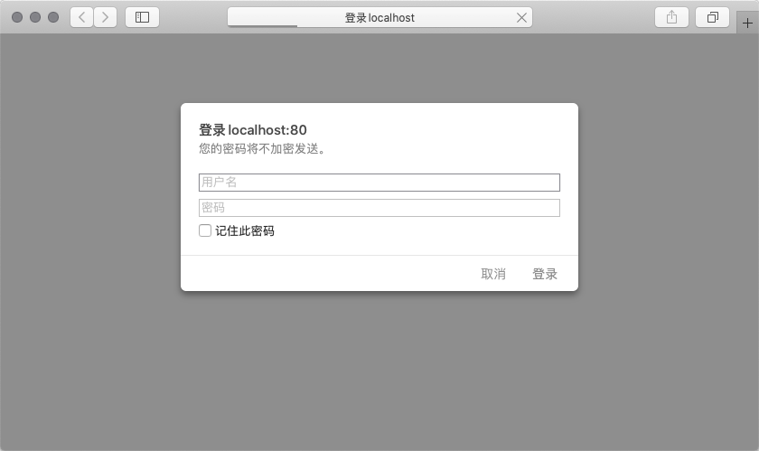

```
{
    "url": "nginx-module",
    "time": "2018/06/06 17:54",
    "tag": "Nginx,运维",
    "toc": "yes"
}
```


# 一、增加HTTP验证

1、 配置`auth_basic`和`auth_basic_user_file`，文件可以先指定，下一步会用`htpasswd`生成。

```
server {
    listen       80;
    server_name  localhost;

    auth_basic "Welcome to Localhost";
    auth_basic_user_file /usr/local/server/nginx1.10.3/conf/vhost/auth_user_list;

    #charset koi8-r;

    #access_log  logs/host.access.log  main;

    location / {
        root   html;
        index  index.html index.htm;
    }
```

2、 配置密码文件，多个账号换行分隔。

```
pengbotao:conf peng$ sudo htpasswd -c /usr/local/server/nginx1.10.3/conf/vhost/auth_user_list peng
New password:
Re-type new password:
Adding password for user peng

pengbotao:conf peng$ more /usr/local/server/nginx1.10.3/conf/vhost/auth_user_list
peng:$apr1$ySsxdCSf$W5YxzVzSQ2rbNiipwYpT5/
```

3、 重启Nginx即可看到效果。



# 二、访问限流

Nginx的limit模块可以从不同维度进行流量限制，也可以组合使用多个。

## 2.1 限制请求量

```
http {
    limit_req_log_level warn;
    limit_req_zone $binary_remote_addr zone=foo:10m rate=5r/s;
    
    server {
        limit_req zone=foo burst=15 delay=10;
    }
}
```

说明：

- `foo`为名称，`10m`为10m的内存空间，`rate`为请求频率，超过请求频率返回503。
- `limit_req_zone`定义在http块内，`limit_req`可以定义在`server`或者`location`块内，比如静态文件不限定则可以只放在指定的`location`内。
- `server`块内zone名称和上面对应，burst为QPS上限。

上面的定义表示每秒限定10个请求，10到15个请求会有delay，超过15个的丢弃，从使用过程中观察到不设置delay时貌似默认为1，超过1个Nginx日志就记录Delaying日志。

另外，如果想设置超过的部分直接503，则可以这么设置：

```
limit_req zone=foo burst=15 nodelay;
```

## 2.2 限制连接数

```
http {
    limit_conn_log_level warn
    limit_conn_zone $binary_remote_addr zone=addr:10m;
    
    server {
            limit_conn addr 10;
    }
}
```

和前面类似，`limit_conn_zone`可定义在 `http`、`server`、`location`块内，同一个`IP`的最大连接数为10个。

`$binary_remote_addr`相当于定义的级别，按IP层级来定义；比如按`$server_name`也可以定义。

## 2.3 限制带宽流量

```
server {

    location /download/ {
            limit_rate 500k;
            limit_rate_after 1m;
    }
}

```

限定下载的带宽，从1m之后开始限定为500k没秒。

# 三、GeoIP2进行地域转发

**1. 安装libmaxminddb**

API库：https://github.com/maxmind/libmaxminddb/releases

```
$ tar xzf libmaxminddb-1.5.2.tar.gz
$ cd libmaxminddb-1.5.2
$ ./configure && make && make install
$ echo /usr/local/lib  >> /etc/ld.so.conf.d/local.conf && ldconfig
```

**2. Nginx安装时增加geoip2_module**

下载geoip2: https://github.com/leev/ngx_http_geoip2_module/releases

```
./configure --add-dynamic-module=/path/to/ngx_http_geoip2_module
make
make install
```

**3. 下载DB**

下载国家城市DB：https://github.com/P3TERX/GeoLite.mmdb

```
GeoLite2-Country.mmdb
GeoLite2-City.mmdb
```

**4. 配置文件**

```
http {
    map $http_x_forwarded_for $client_real_ip {
      "" $remote_addr;
      ~^(?P<firstAddr>[0-9\.]+),?.*$ $firstAddr;
    }

    geoip2 /data/GeoLite2-Country.mmdb {
        auto_reload 7d;
        $geoip2_metadata_country_build metadata build_epoch;
        $geoip2_data_country_code default=CN source=$client_real_ip country iso_code;
    }
    
    
    server {
        if ($geoip2_data_country_code != "CN") {
            rewrite ^/(.*)$ https://s.com/$1 permanent;
        }
    }
}
```

参考：https://blog.csdn.net/zdmoon/article/details/109514541

# 四、IP黑名单

```
server {
    listen 80;
    allow 192.168.0.100;
    allow 127.0.0.0/24;
    deny all;
```

# 五、打印客户端IP

```
location /ipaddr {
    add_header 'Content-Type' 'application/json; charset=utf-8';
    return 200 '{"Host": "$host", "X-Real-IP": "$remote_addr", "X-Forwarded-For": "$proxy_add_x_forwarded_for"}';
}
```
