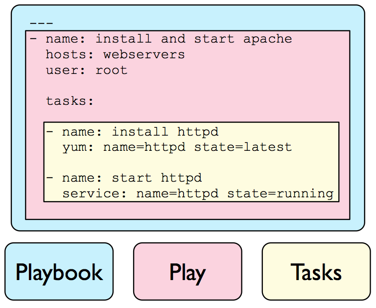

```
{
    "url": "ansible-2",
    "time": "2021/09/19 08:50",
    "tag": "运维",
    "toc": "yes"
}
```

# 一、概述

前面一章简单对Ansible做了个介绍，借助强大的模块可以进行一些日常操作，但操作方式相对零碎，需要更系统化的管理方式。它提供的Playbooks、Roles就可以帮我们来做系统化的管理。


# 二、剧本 - Playbooks

PlayBook可以通过Yaml的定义方式来告诉Ansible需要调用的模块、将这些调用组合起来就形成了一个PlayBook。针对Playbook、Play、Tasks的概念可以看下图。



先来看一个示例：

## 1.1 剧本示例

- 示例场景：安装Nginx服务并从本地模板拷贝个配置文件过去。
- 操作步骤：首先创建`main.yaml`文件和模板文件`./templates/test.conf.j2`

```
$ cat main.yaml
- name: Playbook Test
  hosts: test
  remote_user: root
  vars:
  - listen_port: 81
  tasks:
  - name: Install Nginx
    yum: name=nginx state=present
  - name: Copy Nginx Config File
    template:
      src: test.conf.j2
      dest: /etc/nginx/conf.d/test.conf
      owner: nginx
      group: nginx
    notify: 
    - restart nginx
  - name: Start Nginx
    service: name=nginx enabled=yes state=started
  handlers:
  - name: restart nginx
    service: name=nginx state=restarted

$ cat templates/test.conf.j2
server {
    listen {{listen_port}};
    server_name _;
    root /usr/share/nginx/html;
}
```

测试运行和查看输出：

```
$ ansible-playbook main.yaml

PLAY [Playbook Test] ********************************************************************************
TASK [Gathering Facts] ******************************************************************************
ok: [192.168.88.200]

TASK [Install Nginx] ********************************************************************************
ok: [192.168.88.200]

TASK [Copy Nginx Config File] ***********************************************************************
changed: [192.168.88.200]

TASK [Start Nginx] **********************************************************************************
ok: [192.168.88.200]

RUNNING HANDLER [restart nginx] *********************************************************************
changed: [192.168.88.200]

PLAY RECAP ******************************************************************************************
192.168.88.200: ok=5    changed=2    unreachable=0    failed=0    skipped=0    rescued=0    ignored=0
```

## 1.2 示例解读

- 定义了一个`PlayBook`，名字是`Playbook Test`，作用于分类为`test`的主机群组。
- 通过`vars`来定义了变量，用于传递给配置文件。这里的作用不明显，应该考虑加载变量文件`vars_files`，这样模块文件里能更充分发挥模板的作用。
- tasks定义了3个任务，分别是安装Nginx、通过模板`template`将配置文件传递到远端机器、启动Nginx
- handlers和notify对应，配置方式和Task一致，用于做回调处理，上面用于更新配置后重启Nginx。

剧本的基本用法如上，指定需要执行的主机、调用一组模块来实现功能，可以将模块的组合调用作用发挥出来。

# 二、角色 - Roles

角色的理解更像是可以单独使用的组件，独立于主机之上，可以将Nginx、Mysql这些组件都以角色的方式来编排，实现公用。

Roles有一套自定义的结构，按照结构来定义可以免去维护文件之间的调用关系。


---

[1] [Ansible-playbook 运维笔记](https://www.cnblogs.com/kevingrace/p/5569648.html)