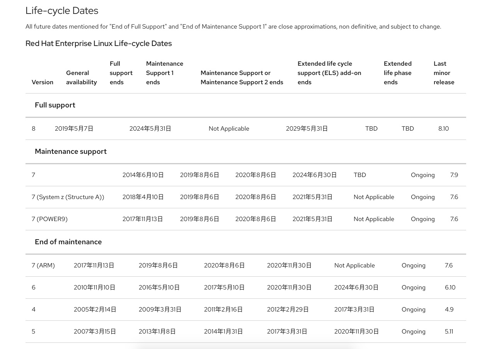

```
{
    "url": "centos-8-eos",
    "time": "2020/12/09 21:30",
    "tag": "阅读,CentOS"
}
```

12 月 8 日，CentOS 项目[宣布](https://lists.centos.org/pipermail/centos-announce/2020-December/048208.html)，`CentOS 8` 将于 2021 年底结束，而 `CentOS 7` 将在其生命周期结束后停止维护。

**换言之，“免费”的 RHEL 以后没有了。**

一直以来，CentOS 就是以“免费的 RHEL 版本”而深得开源社区和运维工程师们的喜爱。[RHEL](https://www.redhat.com/en/technologies/linux-platforms/enterprise-linux)（ **红帽企业 Linux(Red Hat Enterprise Linux)**）是红帽公司推出的企业版 Linux ，向以稳定、可靠和高性能著称。但是，RHEL 是红帽公司的商业产品，用户需[订阅](https://access.redhat.com/subscription-value/)红帽公司的商业支持服务才可以使用。而 CentOS 是基于红帽按照开源许可证发布的 RHEL 源代码，并去除了商标等商业信息后重构的版本。从产品特性和使用上来说，CentOS 和 RHEL 几无二致，当然，CentOS 的用户得不到红帽公司的商业支持。

除此以外，CentOS 的发行也比 RHEL 的发行晚得多。除了 CentOS 之外，还有一些也是基于 RHEL 衍生的 Linux 发行版，如 Oracle Linux。

**可以说，在中国有大量的 CentOS 用户和装机量，这和 CentOS 的免费不无关系。**

CentOS 项目本来是一个社区项目，但是后来红帽公司收购了 CentOS 之后，其地位就有些尴尬。红帽公司旗下有着三个主要的 Linux 发行版产品线：一个是 Fedora，作为先行实验版本，会在快速迭代的同时实验各种新的 Linux 功能和特性，稳定成熟后，这些特性会发布到 RHEL 上；另一个是红帽 Linux ，即 RHEL，它是红帽公司的主要 Linux 发行版，相对来说，在特性和新软件包的添加和更新方面更加保守；最后就是 CentOS，就是 RHEL 的自由开源构建版本，但是在 CentOS 被纳入红帽怀抱之后，其只是作为 RHEL 的一个“免费”版本发布，似乎在红帽公司内的定位也一直模糊。

而在去年，CentOS 团队[宣布](https://linux.cn/article-11412-1.html)和红帽合作推出了一个新的滚动版 Linux：`CentOS Stream`。是的，你没看错，是滚动版。按照红帽的说法，这是一个“中游”的发行版，位于 Fedora 和 RHEL 之间。主要的目标是为了形成一个可循环的“彭罗斯三角”，以使社群对 CentOS 的改进可以流回到 RHEL 当中。

或许，从那一刻开始，就注定了 CentOS Linux 终将落幕吧。

在本次公告中，`CentOS`项目宣布，“在接下来的一年里，我们将把重点从 CentOS Linux 转移到 `CentOS Stream` 上。CentOS Linux 8 作为 RHEL 8 的重构版，将在 2021 年底结束。”而尚在计划维护期的 `CentOS 7` 系列，也将在 2024 年维护期限到达之后停止维护。所以，还在使用 CentOS 作为生产服务环境的运维工程师们，要么考虑购买 RHEL 商业订阅；要么考虑自行根据 RHEL 源代码构建吧——或许也会有一群人重新接过这个重构的工作，发行新的 Linux 发行版吧。

目前使用 CentOS 的服务器，还可以继续在 RHEL 的[计划维护期](https://access.redhat.com/support/policy/updates/errata/#Life_Cycle_Dates)得到支持，见下表：



而 “`CentOS Stream` 将在该日期之后继续，作为 RHEL 的上游（开发）分支。”也就是说，以后，Fedora 依然是第一个上游，但是在 RHEL 发布新版本之后，`CentOS Stream` 会在它的基础上滚动更新，并将成熟的更新反哺到 RHEL 当中。

此外，`CentOS Stream` 也将成为 CentOS 特别兴趣小组（SIG）之间合作的核心，这可以让 CentOS 贡献者社区对 RHEL 的未来有很大的影响力。红帽认为，“将我们的全部投资转移到 `CentOS Stream` 是进一步推动 Linux 创新的最佳方式。”

当然，在 CentOS Linux 8 结束时，你可以考虑迁移到 `CentOS Stream 8`，它会像传统的 CentOS Linux 版本一样定期更新。但是，切记，这是一个作为 RHEL 中游的**滚动发行版**，并不太建议你在生产环境中使用。关于这个变化，你还可以参考这个 [FAQ](https://centos.org/distro-faq/)。

不过，像 Facebook 这样的有足够技术力量的大型 IT 公司，已经将其运行着的数百万台服务器迁移（或正在迁移）到一个他们从 `CentOS Stream` 衍生而出的操作系统上了。红帽也鼓励所有合作伙伴和开发人员不仅仅参与 `CentOS Stream`，而是开始建立自己的分支。

此外，除了 `CentOS Stream` 之外，红帽也提供了一系列平台来支持不同的需求：

- `Fedora` 项目：是 Fedora 操作系统的基础，用于那些希望贡献操作系统创新前沿的人。
- `Red Hat Universal Base Image`：是一个免费的、可再发行的、面向开发人员的镜像，用于创建容器化的、云原生企业应用。有了它，开发人员可以更轻松地在 RHEL 上和红帽的开放混合云产品组合（包括红帽 OpenShift）中创建经认证的应用。
- `RHEL` 开发者订阅：是一个免费的、自助支持的开发者订阅，它为应用的开发提供了一个开发/测试环境，在 RHEL 的稳定、更安全和高性能的基础上部署到生产中。

好了，你对这件事怎么看？

---

- 作者：Wxy
- 链接：https://zhuanlan.zhihu.com/p/335056255