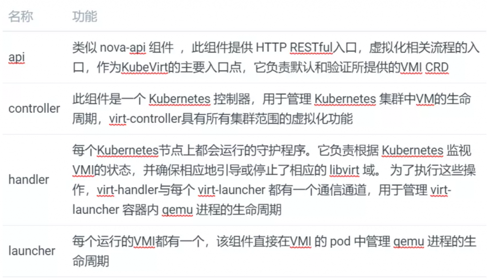
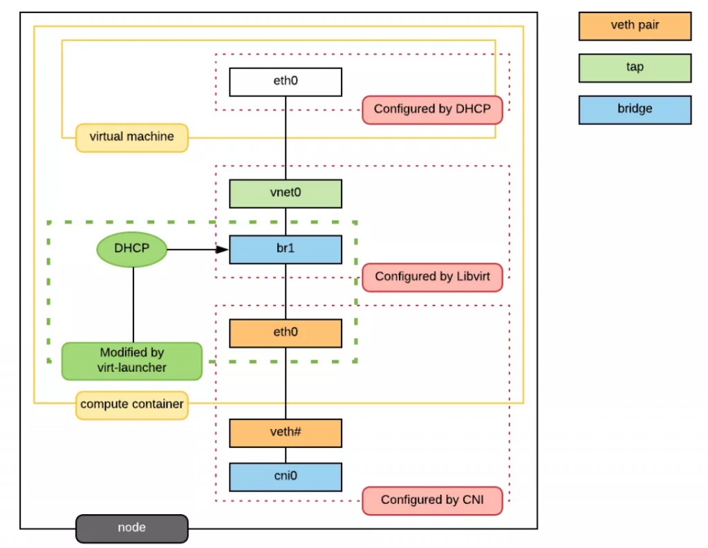
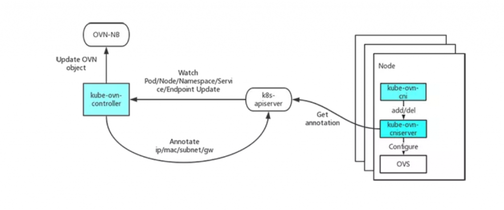
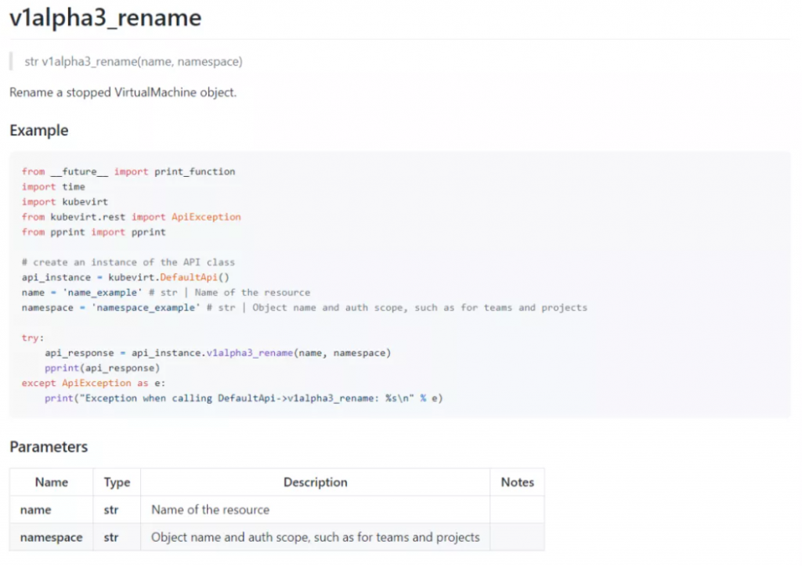
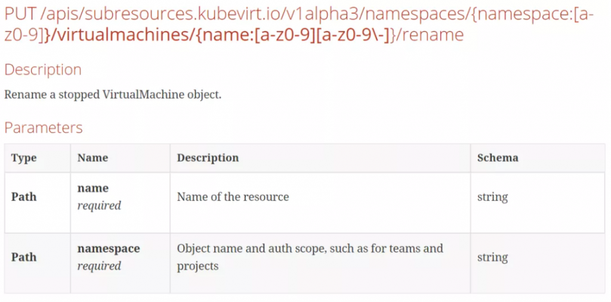
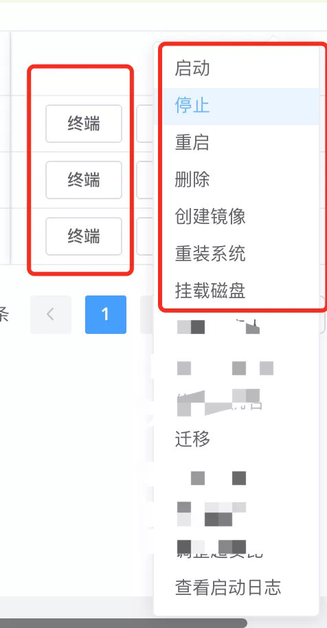

```
{
    "url": "360-kubevirt-explore",
    "time": "2021/08/15 21:02",
    "tag": "阅读",
    "toc": "yes"
}
```

KubeVirt是一个Kubernetes插件，在调度容器之余也可以调度传统的虚拟机。它通过使用自定义资源（CRD）和其它 Kubernetes 功能来无缝扩展现有的集群，以提供一组可用于管理虚拟机的虚拟化的API。本文作者经过长时间对Kubevirt的调研和实践，总结了Kubevirt的一些关键技术和使用经验，现在就跟随作者一起探讨下吧。

# 背景简介

当前公司的虚拟化存在两套调度平台，裸金属和vm由openstack调度，容器肯定是k8s调度。两套两班人马，人力和资源都存在着一定的重叠和浪费。当前vm和pod的比例在1：1，同时随着业务的全面上云，大部分web无状态业务都开始容器化，所以未来k8s+容器肯定是业务发布的主流选择，业界也基本成型。

而vm的使用场景会被压缩，但是vm作为一个常用的运行时，未来也会长期存在较长时间，最后和容器达成一个三七开的比例。同时裸金属物理机，由于部分业务的特性独占需求，也会在未来长期存在。

# OpenStack转型K8S

所以未来可能会长期存在openstack+k8s两种虚拟化运行时调度系统，这个增加了团队的维护和学习成本，再加上现在openstack社区整体趋于平稳和下滑，外加上openstack本身复杂和臃肿的调度架构，和python在大项目管理和维护方面天生的劣势，造成了相关的人员招聘难度较大，大家的学习和维护热情也降低。

与此相对的是k8s调度系统的全面优越，简洁和更好的可扩展性，go语言的大项目和易部署维护的天然优势，业界不少公司都在考虑是否可以由k8s来接管vm和裸金属等，因为本质上vm底层干活的是libvirt，qemu-kvm等，裸金属底层是物理机的ipmi，我们是否可以利用k8s的可扩展性，实现一些新的operator来接管vm和裸金属。

基于上述考虑，最终的目标是用k8s来管一切虚拟化运行时，包含裸金属，vm，kata，容器，一套调度，多种运行时，用户按需选择。

# 技术选型

有了以上想法以后，就开始调研，发现业界在从openstack转型k8s的过程中涌现了这么一部分比较好的项目，例如，kubevirt，virtlet，rancher/vm等，但是社区活跃度最高，设计最好的还是kubevirt。

https://kubevirt.io/2017/technology-comparison.html

文章核心谈了几个点：

> 1、kubevirt是不是一个vm管理平台的替代品，和OpenStack还有ovirt等虚拟化管理平台的区别。

简单来说：kubevirt只是用k8s管vm，其中会复用k8s的cni和csi，所以只是用operator的方式来操作vm，他不去管网络和存储等。所以和OpenStack中包含nova，neutron，cinder等不一样，可以理解成kubevirt是一个k8s框架下的，用go写的nova vm管理组件。

> 2、kubevirt和kata的区别。

简单来说：kata是有着vm的安全性和隔离性，以容器的方式运行，有着容器的速度和特点，但不是一个真正的vm，而kubevirt是借用k8s的扩展性来管vm，你用到的是一个真正的vm。

> 3、kubevirt和virtlet的区别。

简单来说：virtlet是把vm当成一个cri来跑了，是按pod api来定义一个vm，所以vm的很多功能比如热迁移等，virtlet是没法满足vm的全部特性的，算是一个70%功能的vm。

> 4、为啥要用k8s管vm，而不是用OpenStack管容器。

简单来说：k8s+容器是未来的主流方向，但是由于历史和业务需要，vm也会存在很长时间，所以我们一套支持vm的容器管理平台k8s，而不是需要一套支持容器的vm管理平台例如OpenStack管容器Magnum这种类似项目。

# 选型插曲

有个插曲：在验证kubevirt的这段时间，正好看到rancher也发布了基于 kubevirt 和 k8s 的超融合基础架构软件 Harvester，从侧面说明，这个方向是有共性的。所有上了年纪的公司，都有OpenStack和k8s的包袱，而rancher的老总也是cloudstack的创始人，以前和OpenStack竞争的时候落于下风，现在基于k8s和kubevirt又回到了iaas的地带，所有技术圈好多也是轮回啊。

所以kubevirt这种项目也是在很多从iaas OpenStack转型paas k8s的人群中有更多共鸣，年轻k8s原住民可能对这个项目没有太多感知。因为kubevirt的发起方redhat，和核心开发者以前也是OpenStack社区的项目owner等。所以kubevirt的一些测试公司和用户也都是有此类共同转型背景的人和公司。

基于如上考虑，最终技术选型确定了kubevirt，接下来对kubevirt的一些概念和逻辑架构，还有在360的测试和验证之路做一个简单介绍。

# 1、Kubevirt 是什么

Kubevirt 是 Redhat 开源一套以容器方式运行虚拟机的项目，通过 kubernetes 云原生来管理虚拟机生命周期。

# 2、Kubevirt CRD

在介绍kubevirt 前我们先了解一下CRD，在kubernetes里面有一个核心思想既一切都是资源，如同Puppet里面一切都是资源思想。CRD 是kubernetes 1.7之后添加的自定义资源二次开发来扩展kubernetes API，通过CRD 可以向API 中添加资源类型，该功能提升了 Kubernetes 的扩展能力，那么kubevirt有哪些需要我们理解的CRD资源，这些资源会在我们的学习和理解过程中都是需要注意的，大概简介绍如下几种：


# 3、Kubevirt 组件介绍

与OpenStack 类似， kubevirt 每个组件负责不同的功能，不同点是资源调度策略由k8s 去管理，其中主要组件如下: virt-api，virt-controller，virt-handler，virt-launcher。



# 4、Kubevirt 常见操作

```
type DomainManager interface {
     //SyncVMI 为创建虚拟机
    SyncVMI(*v1.VirtualMachineInstance, bool, *cmdv1.VirtualMachineOptions) (*api.DomainSpec, error)
    //暂停VMI
    PauseVMI(*v1.VirtualMachineInstance) error
    //恢复暂停的VMI
    UnpauseVMI(*v1.VirtualMachineInstance) error
    KillVMI(*v1.VirtualMachineInstance) error
    //删除VMI
    DeleteVMI(*v1.VirtualMachineInstance) error
    SignalShutdownVMI(*v1.VirtualMachineInstance) error
    MarkGracefulShutdownVMI(*v1.VirtualMachineInstance) error
    ListAllDomains() ([]*api.Domain, error)
    //迁移VMI
    MigrateVMI(*v1.VirtualMachineInstance, *cmdclient.MigrationOptions) error
    PrepareMigrationTarget(*v1.VirtualMachineInstance, bool) error
    GetDomainStats() ([]*stats.DomainStats, error)
    //取消迁移
    CancelVMIMigration(*v1.VirtualMachineInstance) error
    //如下需要启用Qemu guest agent，没启用会包VMI does not have guest agent connected
    GetGuestInfo() (v1.VirtualMachineInstanceGuestAgentInfo, error)
    GetUsers() ([]v1.VirtualMachineInstanceGuestOSUser, error)
    GetFilesystems() ([]v1.VirtualMachineInstanceFileSystem, error)
    SetGuestTime(*v1.VirtualMachineInstance) error
}
```

# 5、kubevirt 虚机VMI

```
[root@openstack825 ~]# kubectl get vmi -o wide
NAME                          AGE     PHASE     IP             NODENAME        LIVE-MIGRATABLE
test100.foo.demo.example.com     8d   Running   192.168.10.30  10.10.67.244   True
test200.foo.demo.example.com     8d   Running   192.168.10.31  10.10.67.245   True
```

```
获取已安装的kubevirt pod
[root@openstack825 ~]# kubectl  -n kubevirt get pod
NAME                               READY   STATUS    RESTARTS   AGE
virt-api-68c958dd-6sx4n            1/1     Running   0          14d
virt-api-68c958dd-sldgr            1/1     Running   0          14d
virt-controller-647d666bd5-gsnzf   1/1     Running   1          14d
virt-controller-647d666bd5-hshnz   1/1     Running   1          14d
virt-handler-4g7ck                 1/1     Running   3          14d
virt-handler-kzv86                 1/1     Running   0          14d
virt-handler-m2ppb                 1/1     Running   0          14d
virt-handler-v6fgt                 1/1     Running   0          14d
virt-operator-65ccf74f56-b82kz     1/1     Running   0          14d
virt-operator-65ccf74f56-zs2xq     1/1     Running   0          14d
virtvnc-947874d99-hn7k5            1/1     Running   0          6d19h
```

总结：同时我们在调研过程遇到一些问题，比如重启数据丢失、VMI 重启和热迁移后IP 改变、镜像导入数据缓慢、VMI 启动调度缓慢、热迁移网络与存储支持等等。Kubevirt 通过CRD 方式将 VM 管理接口接入到k8s集群，而 POD 使用 libvirtd 管理VMI，如容器一样去管理VMI，最后通过标准化插件方式管理调度网络和存储资源对象，将其整合在一起形成一套 具有 K8s 管理虚拟化的技术栈。

# 6、kubevirt 存储

虚拟机镜像（磁盘）是启动虚拟机必不可少的部分，目前 KubeVirt 中提供多种方式的虚拟机磁盘。

- cloudInitNoCloud/cloudInitConfigDrive:用于提供 cloud-init 初始化所需要的 user-data，使用 configmap 作为数据源，此时VMI内部将出现第二块大约为356KB的第二块硬盘。

```
  devices:
         disks:
         - disk:
             bus: virtio
           name: cloudinit
    - cloudInitNoCloud:
         userData: |
           #cloud-config
           password: kubevirt
 [centos@xxxv ~]$ lsblk
NAME   MAJ:MIN RM  SIZE RO TYPE MOUNTPOINT
vda    253:0    0   47G  0 disk
└─vda1 253:1    0   47G  0 part /
vdb    253:16   0  366K  0 disk
```

- dataVolume:虚拟机启动流程中自动将虚拟机磁盘导入 pvc 的功能，在不使用 DataVolume 的情况下，用户必须先准备带有磁盘映像的 PVC，然后再将其分配给 VM 或 VMI。dataVolume 拉取镜像的来源可以是HTTP、PVC。

```
 spec:
     pvc:
       accessModes:
       - ReadWriteMany
       volumeMode: Block
       resources:
         requests:
           storage: 55G
       storageClassName:  csi-rbd-sc
     source:
       http:
         url: http://127.0.0.1:8081/CentOS7.4_AMD64_2.1
```

- PersistentVolumeClaim: PVC 做为后端存储，适用于数据持久化，即在虚拟机重启或关机后数据依然存在。PV 类型可以是 block 和 filesystem，为 filesystem 时，将使用 PVC 上的 disk.img，格式为 RAW 格式的文件作为硬盘。block 模式时，使用 block volume 直接作为原始块设备提供给虚拟机。缺点在于仅支持RAW格式镜像，若镜像较大CDI 导入镜像会比较慢（如果是QCW2 CDI 内部机制qemu.go 会将其进行格式转换为RAW并导入PVC中），因此降低快速创建 VMI 体验感。当然社区目前支持一种较smart-clone 方式导入，目前笔者还没进行测试。

```
 spec:
 pvc:
   accessModes:
   - ReadWriteMany
   volumeMode: Block
   resources:
     requests:
       storage: 55G
   storageClassName:  csi-rbd-sc
 source:
   pvc:
     namespace: "default"
     name: "q18989v.cloud.bjyt.qihoo.net"
```

ephemeral、containerDisk: 数据是无法持久化，故在存储选型上，我们采用 CEPH 作为后端存储，通过调用Ceph CSI 插件创建 PVC 卷方式管理虚机磁盘设备。Ceph CSI 插件实现了容器存储编排与Ceph集群交互的接口，它可以为容器应用分配 存储集群中的存储空间，同时在选择 Ceph-CSI 版本需要考虑到当前 K8S 版本、及 CEPH 版本号。

当前支持的版本列表：


Dynamically provision, de-provision Block mode RWX volume

支持RBD 块 RWX 的模式，使用此模式主要涉及到Kubevirt 热迁移场景，虚拟机调用 VirtualMachineInstanceMigration CRD 资源，热迁移时会检测Volume 模式，此时块设备必须 RWX 模式，代码如下：

位置：pkg/vm-handler/vm.go

```
//主要通过调用磁盘、网络相关函数，来判断当前VMI是否适合迁移
func (d *VirtualMachineController) calculateLiveMigrationCondition(vmi *v1.VirtualMachineInstance, hasHotplug bool) (*v1.VirtualMachineInstanceCondition, bool) {
	liveMigrationCondition := v1.VirtualMachineInstanceCondition{
		Type:   v1.VirtualMachineInstanceIsMigratable,
		Status: k8sv1.ConditionTrue,
	}
	//调用 checkvolume 方法
	isBlockMigration, err := d.checkVolumesForMigration(vmi)
	if err != nil {
		//如果返回错误信息则会限制迁移
		liveMigrationCondition.Status = k8sv1.ConditionFalse
		liveMigrationCondition.Message = err.Error()
		liveMigrationCondition.Reason = v1.VirtualMachineInstanceReasonDisksNotMigratable
		return &liveMigrationCondition, isBlockMigration
	}
	//调用网络模式检查方法
	err = d.checkNetworkInterfacesForMigration(vmi)
	if err != nil {
		liveMigrationCondition = v1.VirtualMachineInstanceCondition{
			Type:    v1.VirtualMachineInstanceIsMigratable,
			Status:  k8sv1.ConditionFalse,
			Message: err.Error(),
			Reason:  v1.VirtualMachineInstanceReasonInterfaceNotMigratable,
		}
		return &liveMigrationCondition, isBlockMigration
	}
	if hasHotplug {
		liveMigrationCondition = v1.VirtualMachineInstanceCondition{
			Type:    v1.VirtualMachineInstanceIsMigratable,
			Status:  k8sv1.ConditionFalse,
			Message: "VMI has hotplugged disks",
			Reason:  v1.VirtualMachineInstanceReasonHotplugNotMigratable,
		}
		return &liveMigrationCondition, isBlockMigration
	}
	return &liveMigrationCondition, isBlockMigration
}
```

```
//checkvolume 定义
//检查所有VMI卷共享可以在源和实时迁移的目的地之间热迁移
//当所有卷均已共享且VMI没有本地磁盘时，blockMigrate才返回True
//某些磁盘组合使VMI不适合实时迁移， 在这种情况下，将返回相关错误
func (d *VirtualMachineController) checkVolumesForMigration(vmi *v1.VirtualMachineInstance) (blockMigrate bool, err error) {
	for _, volume := range vmi.Spec.Volumes {
		volSrc := volume.VolumeSource
		if volSrc.PersistentVolumeClaim != nil || volSrc.DataVolume != nil {
			var volName string
			if volSrc.PersistentVolumeClaim != nil {
				volName = volSrc.PersistentVolumeClaim.ClaimName
			} else {
				volName = volSrc.DataVolume.Name
			}
			//pvcutils.IsSharedPVCFromClient
			_, shared, err := pvcutils.IsSharedPVCFromClient(d.clientset, vmi.Namespace, volName)
			if errors.IsNotFound(err) {
				return blockMigrate, fmt.Errorf("persistentvolumeclaim %v not found", volName)
			} else if err != nil {
				return blockMigrate, err
			}
			if !shared {
				return true, fmt.Errorf("cannot migrate VMI with non-shared PVCs")
			}
		} else if volSrc.HostDisk != nil {
			shared := volSrc.HostDisk.Shared != nil && *volSrc.HostDisk.Shared
			if !shared {
				return true, fmt.Errorf("cannot migrate VMI with non-shared HostDisk")
			}
		} else {
			blockMigrate = true
		}
	}
	return
}
func IsSharedPVCFromClient(client kubecli.KubevirtClient, namespace string, claimName string) (pvc *k8sv1.PersistentVolumeClaim, isShared bool, err error) {
	pvc, err = client.CoreV1().PersistentVolumeClaims(namespace).Get(claimName, v1.GetOptions{})
	if err == nil {
		//IsPVCShared
		isShared = IsPVCShared(pvc)
	}
	return
}
//IsPVCShared Shared 判断，函数返回bool 类型，成功则返回true
func IsPVCShared(pvc *k8sv1.PersistentVolumeClaim) bool {
	//循环PVC的accessModes
	for _, accessMode := range pvc.Spec.AccessModes {
		if accessMode == k8sv1.ReadWriteMany {
			return true
		}
	}
	return false
}
```

Ceph CSi 启动的POD 进程

```
[root@kubevirt01 ~]# kubectl get pod
NAME                                               READY   STATUS    RESTARTS   AGE
csi-rbdplugin-7bprd                                3/3     Running   0          14d
csi-rbdplugin-fl5c9                                3/3     Running   0          14d
csi-rbdplugin-ggj9q                                3/3     Running   0          14d
csi-rbdplugin-provisioner-84bb9bdd56-7qtnh         6/6     Running   0          14d
csi-rbdplugin-provisioner-84bb9bdd56-sdscf         6/6     Running   0          14d
csi-rbdplugin-provisioner-84bb9bdd56-xjz2r         6/6     Running   0          14d
```

已创建的VMI 对应的 PVC卷

```
 ---
apiVersion: v1
kind: PersistentVolumeClaim
metadata:
 name: testzhangsanlisi
spec:
 accessModes:
   - ReadWriteMany
 volumeMode: Block
 resources:
   requests:
     storage: 10Gi
 storageClassName: csi-rbd-sc
kubectl apply -f pvc-test.yaml
[root@kubevirt01 ~]# kubectl get pvc
NAME                  STATUS   VOLUME                                     CAPACITY   ACCESS MODES   STORAGECLASS   AGE
testzhangsanlisi       Bound    pvc-2c98391d-a2eb-4dd1-a1f0-2a8ef27d4ca3   10Gi       RWX            csi-rbd-sc     3s
```

CEPH 架构相关，使用三副本策略，不同交换机下及高容量 SATA 盘 作为 OSD 数据载体，保证数据的可用性。

```
(ceph-mon)[root@example100 /]# ceph -s
 cluster:
   id:     d8ab2087-f55c-4b8f-913d-fc60d6fc455d
   health: HEALTH_OK
 services:
   mon: 3 daemons, quorum 192.168.10.100 192.168.20.100 192.168.30.100 (age 4d)
   mgr: ceph100(active, since 4d), standbys: ceph200， ceph300
   osd: 27 osds: 27 up (since 2w), 27 in (since 2w)
 data:
   pools:   1 pools, 1024 pgs
   objects: 55.91k objects, 218 GiB
   usage:   682 GiB used, 98 TiB / 98 TiB avail
   pgs:     1024 active+clean
 io:
   client:   2.2 KiB/s wr, 0 op/s rd, 0 op/s wr
(ceph-mon)[root@example100 /]# ceph df
RAW STORAGE:
   CLASS     SIZE       AVAIL      USED        RAW USED     %RAW USED
   hdd       98 TiB     98 TiB     655 GiB      682 GiB          0.68
   TOTAL     98 TiB     98 TiB     655 GiB      682 GiB          0.68
```

# 7、kubevirt 网络



Kubernetes是Kubevirt 底座，提供了管理容器和虚拟机的混合部署的方式，存储和网络也是通过集成到kubernetes中， VMI 使用了POD进行通信。为了实现该目标，KubeVirt 的对网络做了特殊实现。虚拟机具体的网络如图所示， virt-launcher Pod 网络的网卡不再挂有 Pod IP，而是作为虚拟机的虚拟网卡的与外部网络通信的交接物理网卡。

在当前的场景我们使用经典的大二层网络模型，用户在一个地址空间下，VM 使用固定IP，在OpenStack社区，虚拟网络方案成熟，OVS 基本已经成为网络虚拟化的标准。所以我门选择目前灵雀云（alauda） 开源的网络方案：Kube-OVN，它是基于OVN的Kubernetes网络组件，提供了大量目前Kubernetes不具备的网络功能，并在原有基础上进行增强。通过将OpenStack领域成熟的网络功能平移到Kubernetes，来应对更加复杂的基础环境和应用合规性要求。 



网络 VLAN underlay

在网络平面，管理网和 VMI 虚拟机流量分开，其中使用Vlan 模式的 underlay 网络，容器网络可以直接通过 vlan 接入物理交换机。

```
 //Demo Yaml
//IP 地址段来自源与网络物理设备分配时
spec:
 cidrBlock: 192.168.10.0/23
 default: true
 excludeIps:
 - 192.168.10.1
 gateway: 192.168.10.1
 gatewayNode: ""
 gatewayType: distributed
 // 需要设置成false
 natOutgoing: false
 private: false
 protocol: IPv4
 provider: ovn
 //需要设置成true，若为false，会在主机侧加上route，导致net不通
 underlayGateway: true
 vlan: ovn-vlan 
```

```
[root@kubevirt01 ~]# kubectl -n kube-system get pod
NAME                                   READY   STATUS    RESTARTS   AGE
coredns-65dbdb44db-8bxlr               1/1     Running   33         17d
kube-ovn-cni-4v4xb                     1/1     Running   0          18d
kube-ovn-cni-kvgrj                     1/1     Running   0          18d
kube-ovn-cni-nj2pr                     1/1     Running   0          18d
kube-ovn-cni-xv476                     1/1     Running   0          18d
kube-ovn-controller-7f6db69b48-6c7w8   1/1     Running   0          18d
kube-ovn-controller-7f6db69b48-82kjt   1/1     Running   0          18d
kube-ovn-controller-7f6db69b48-mhkfc   1/1     Running   0          18d
kube-ovn-pinger-n2rn4                  1/1     Running   0          18d
kube-ovn-pinger-s4hrz                  1/1     Running   0          18d
kube-ovn-pinger-tccz5                  1/1     Running   0          18d
kube-ovn-pinger-x2tqq                  1/1     Running   0          18
dovn-central-775c4ff46d-4nqjw           1/1     Running   1          18
dovn-central-775c4ff46d-822v2           1/1     Running   0          18
dovn-central-775c4ff46d-txkn8           1/1     Running   0          18
dovs-ovn-mbpv2                          1/1     Running   0          18
dovs-ovn-r9mvc                          1/1     Running   0          18
dovs-ovn-wkxld                          1/1     Running   0          18
dovs-ovn-z89hw                          1/1     Running   0          18d
```

虚拟机固定IP

k8s的资源是在运行时才分配ip的，但是笔者希望能够对虚拟机的ip进行绑定从而实现固定ip的目的。为此，我们首先正常创建虚拟机，在虚拟机运行时k8s会为之分配ip，当检测到虚拟机的ip后，我们通过替换vmi的配置文件的方式将ip绑定改虚拟机中。但是在实际操作时会报出如下错误：

```
Invalid value: 0x0: must be specified for an update
```

实际上 Kubernetes API Server是支持乐观锁(Optimistic concurrency control)的机制来防止并发写造成的覆盖写问题，因此在修改的body中需要加入metadata.resourceVersion，笔者的做法是首选调用read_namespaced_virtual_machine方法获取metadata.resourceVersion，其次再修改body。具体方案可参考：

```
https://www.codeleading.com/article/27252474726/
```

# 8、kubevirt SDK

kubevirt sdk现状   当前kubevirt提供了Python版本以及Golang版本的SDK，具体的信息参考如下：

```
https://github.com/kubevirt/client-python
https://github.com/kubevirt/client-go
```

笔者实际使用的是python的sdk，所以接下来重点叙述一下python版本的sdk的使用心得，使用时发现了一些问题，并加以解决也将在下面的内容中记录。

sdk实现的功能本章笔者详细介绍一下使用到的一些sdk中的功能，在初体验的过程中笔者只是用了部分功能，完整的功能可以详见github。

- 创建使用实例

sdk主要使用的是kubevirt.apis.default_api中的DefaultApi对象，进行接口调用的。DefaultApi对象需要ApiClient对象，该对象实际上是连接k8s的实例。因此在使用之前，需要在底层的k8s中起一个proxy。通过创建DefaultApi对象即可调用后续的接口了，具体的创建方法如下：

```
import kubevirt
 
def get_api_client(host):
   api_client = kubevirt.ApiClient(host=host, header_name="Content-Type", header_value="application/json")
   return api_client
 
 
api_client = get_api_client(host="http://127.0.0.1:8001")
api_instance = kubevirt.DefaultApi(api_client)
```

- kubvirt sdk 的本质

实际上我们知道，kubevirt是在k8s中定义了集中CRD，那么调用kubevirt的sdk实际上也是调用k8s中CRD相关接口，通过查看k8中CRD的接口我们知道，具体的url表为：/apis/{group}/{version}/namespaces/{namespace}/{plural}/{name}因此重要的是找到group以及plural参数具体是什么。通过下图可以看出group都是kubevirt.io，plural根据需要的不同可以定义不同的类型。


- sdk部分功能以及注意事项

笔者主要使用了以下的功能：

```
创建虚拟机( create_namespaced_virtual_machine)  注意：body是json格式，官方sdk的example有误
删除虚拟机( delete_namespaced_virtual_machine)
展示某个namespace下的vm资源( list_namespaced_virtual_machine)
展示某个namespace下的vmi资源( list_namespaced_virtual_machine_instance)
展示所有namespace下的vm资源( list_virtual_machine_for_all_namespaces)
展示所有namespace下的vmi资源( list_virtual_machine_instance_for_all_namespaces)
获取某个namespace某个name下的vm资源( read_namespaced_virtual_machine)
获取某个namespace某个name下的vmi资源( read_namespaced_virtual_machine_instance) 
启动虚拟机( v1alpha3_start)
停止虚拟机( v1alpha3_stop)
重启虚拟机( v1alpha3_restart) 注意: 重启虚拟机只能在虚拟机状态是running是才能调用，否则会失败
修改虚拟机名称( v1alpha3_rename)
替换虚拟机的配置文件( replace_namespaced_virtual_machine_instance)
```

> 注意：在获取vm资源时无法获取到node_name,uuid,ip的数据，获取vmi资源时无法获取到disk以及image_url的数据，笔者认为vm是虚拟机资源，vmi是虚拟机实例资源，只有在running状态下的vm才是vmi，由于k8s中ip是动态分配的，因此才会出现node_name,uuid,ip数据在vm中获取不到

sdk使用注意事项

1、k8s版本问题

官方给出的kubevirt sdk中对于创建删除以及替换配置文件等部分接口，k8s版本是固定的稳定版v1版本，这显然不满足于sdk的灵活使用，因此笔者在使用时对api版本进行了兼容，保证用户可以通过传参的形式正确的使用。

2、修改虚拟机名称缺乏参数

诚如标题所述，修改虚拟机名称接口官方给出的参数有误，缺乏新名称参数。





笔者通过查看virtclt源码找到了缺少的参数的具体名称并添加至sdk中，具体代码如下：

```
 
def v1alpha3_rename_with_http_info(self, name, newName, namespace, **kwargs):
   """
   Rename a stopped VirtualMachine object.
   This method makes a synchronous HTTP request by default. To make an
   asynchronous HTTP request, please define a `callback` function
   to be invoked when receiving the response.
   >>> def callback_function(response):
   >>>     pprint(response)
   >>>
   >>> thread = api.v1alpha3_rename_with_http_info(name, namespace, newName, callback=callback_function)
   :param callback function: The callback function
       for asynchronous request. (optional)
   :param str name: Name of the resource (required)
   :param str namespace: Object name and auth scope, such as for teams and projects (required)
   :param str newName: NewName of the resource (required)
   :return: str
            If the method is called asynchronously,
            returns the request thread.
   """
   all_params = ['name', 'namespace', 'newName']
   all_params.append('callback')
   all_params.append('_return_http_data_only')
   all_params.append('_preload_content')
   all_params.append('_request_timeout')
   params = locals()
   for key, val in iteritems(params['kwargs']):
       if key not in all_params:
           raise TypeError(
               "Got an unexpected keyword argument '%s'"
               " to method v1alpha3_rename" % key
           )
       params[key] = val
   del params['kwargs']
   # verify the required parameter 'name' is set
   if ('name' not in params) or (params['name'] is None):
       raise ValueError("Missing the required parameter `name` when calling `v1alpha3_rename`")
   # verify the required parameter 'namespace' is set
   if ('namespace' not in params) or (params['namespace'] is None):
       raise ValueError("Missing the required parameter `namespace` when calling `v1alpha3_rename`")
   collection_formats = {}
   path_params = {}
   # if 'name' in params:
   #     path_params['name'] = params['name']
   # if 'namespace' in params:
   #     path_params['namespace'] = params['namespace']
   query_params = []
   header_params = {}
   form_params = []
   local_var_files = {}
   body_params = {"newName": params["newName"]}
   # Authentication setting
   auth_settings = []
   api_route = "/apis/subresources.kubevirt.io/v1alpha3/namespaces/{namespace}/virtualmachines/{name}/rename".format(namespace=params["namespace"], name=params["name"])
   return self.api_client.call_api(api_route, 'PUT',
                                   path_params,
                                   query_params,
                                   header_params,
                                   body=body_params,
                                   post_params=form_params,
                                   files=local_var_files,
                                   response_type='str',
                                   auth_settings=auth_settings,
                                   callback=params.get('callback'),
                                   _return_http_data_only=params.get('_return_http_data_only'),
                                   _preload_content=params.get('_preload_content', True),
                                   _request_timeout=params.get('_request_timeout'),
                                   collection_formats=collection_formats)
```

# 9、Ultron 平台创建基于kubevirt的虚拟机

奥创平台是公司内的私有云管理平台（类似horizon），可以通过其管理openstack VM，本次我们同时纳入到对Kubevirt 虚拟机的支持，创建方式和OpenStack方式一样。最后用户体验和功能特性也和OpenStack一致，用户本身也是不关注底层实现，性能特性方面后续文章会有对比。



# 10、总结

kubevirt作为一个兼容方案，当前在cncf中孵化的也挺好，好像也要开始自己的KubeVirt Summit，主要是实际的解决了一些痛点，但目前看，kubevirt还是适合在私有云，肯定满足不了公有云，因为k8s在iaas方面有先天劣势，所以kubevirt应该是给大家在私有云领域落地虚拟化除了用OpenStack以外多了一种选择方案。

在该文章结尾处，其实我们又落地实现了一些其他功能，所以后续还有几篇文章陆续发出，希望大家对kubevirt感兴趣的人可以持续关注，同时团队也持续招聘OpenStack和kubevirt牛人。可发邮箱wangbaoping@360.cn。

---

- 作者：王保平
- 链接：https://zyun.360.cn/blog/?p=691