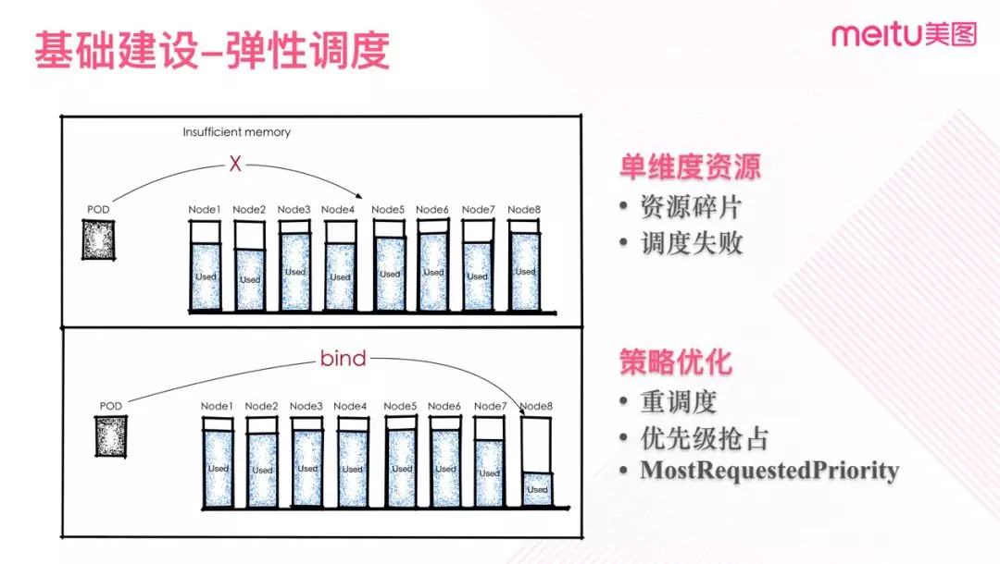

```
{
    "url": "meitu-k8s-exp",
    "time": "2019/03/18 17:59",
    "tag": "阅读"
}
```

> 本文围绕美图业务和大家分享美图容器基础平台建设中的探索经验以及在业务落地过程中的具体问题和相应的方案。


美图从 2016 年开始了容器相关的探索到 2018 年业务基本实现容器化，今天主要会围绕美图的业务情况，聊一聊在容器基础平台建设探索过程中遇见的一些问题，以及具体如何落地的方案，希望可以给大家一些参考。


美图公司成立于 2008 年 10 月，怀揣着“成为全球懂美的科技公司”的愿景，创造了一系列软硬件产品，如美图秀秀、美颜相机、短视频社区美拍以及美图拍照手机。


美图产品的多样化也催生了复杂多样的服务端技术，亿级 MAU 对服务端的技术要求也越加严苛。


2016 年我们开始调研容器化相关技术，2017 年我们开始拥抱 Kubernetes，2018 年容器平台基本落成并推进业务的整体容器化。


我们期望通过容器化可以提升公司研发人员的线上支撑能力，提升持续开发和集成的能力，提升整体资源利用率和服务的可用性。

# 美图容器化建设实践

## 容器化之前

在业务容器化之前，我们业务是以物理机的方式部署到北京、宁波等多个 IDC，部分服务部署到公有云。


其中大部分业务是单 IDC 部署，部分业务存在跨 IDC 间的调用，然后 IDC 之间通过专线打通。


**当时存在的几个重要的问题：**

- 服务部署没有进行隔离，业务混部需要控制得非常小心，资源的利用率非常低。
- 业务类型较多，缺乏完全统一和完善的自动化运维手段，业务的增长会伴随着维护人力的增加。
- 测试环境与生产环境存在较大差异，这也导致一些生产环境问题不能在测试期间发现。
- 开发人员线上意识较薄弱，线上故障率持续较高。
- 面对机房级故障时业务迁移非常困难，出问题时只能尴尬地等机房恢复。

对此，我们希望通过积极的调整来解决掉存在的种种问题，而容器化是一个非常好的机会，可行性也比较高。


同时我们希望借着这个机会对我们的技术架构以及相关人员做一次从意识到技能的全面提升，为未来的技术演进铺平部分道路。

## 选择 Kubernetes

2017 年容器编排的“战争”打完，Kubernetes 取得领先并趋于成熟。我们也彻底投入到 Kubernetes 当中，容器系统的大规模落地离不开成熟的容器编排系统。


Kubernetes 对容器的编排、资源的调度以及强大的扩展能力极大地方便了我们平台的构建。 


单体容器如集装箱，它统一的标准方便了调度运输。Kubernetes 提供了对集装进行集中调度的码头和轮渡，让一切井然有序并且易于实施。


容器基础平台则好比基于容器和 Kubernetes 之上的完整的运输系统，它需要集装箱，码头轮渡，高速公路等整套体系，实际服务容器化的过程不是一个简单的打包装箱和调度规划过程。


大部分的服务与外界是有割不开联系的，需要保持与外界的联通性，服务进驻容器更像是用户住进集装箱房子，她需要相应的基础配套设施，像水，电，燃气等等。


所以我们首先是提供各种基础设施，让服务能进驻容器而不会水土不服。比如需要做好资源隔离，打通底层网络，做好负载均衡，处理好应用日志等等。

## 容器平台建设

首先我们对多地机房及云端资源进行梳理，成为我们计算及存储的资源池。


同时我们构建起基础的容器网络，日志系统，存储服务等底层基础，然后依托 Kubernetes 完成了基于多租户的容器管理平台建设，提供完善的项目管理，服务编排，资源调度，负载均衡等能力。


我们提供同集群多租户的模式，所以对集群内的业务隔离，资源调度，弹性伸缩等都会有很高的要求。


同时我们也存在多集群混合云的应用场景，因此存在着对跨集群跨机房的容器网络互通，多集群的负载均衡等的特定需求。

### ①基础建设之网络

先来看基础建设中网络这一层。网络属于底层建设，解决的问题非常关键。


**容器网络解决的问题主要包括：**

- Pod 内部容器间的通信
- Pod 与 Pod 的通信
- Pod 与 Service 的通信
- Service 与集群外部的通信
- 跨集群跨网段通信


容器网络除了要解决上述的 5 个问题的同时也需要考虑如何将网络层的性能损失最小化。接下来先来看看在网络方案选择上我们的一些考虑。


Kubernetes 通过 CNI 提供了非常强的扩展能力，同时社区的活跃也让网络插件有了更多选择的空间。


CNI 是 CNCF 旗下的一个项目，作为容器网络标准，由一组用于配置网络接口的规范和库组成，同时还包含了一些插件。


CNI 仅关心容器创建时的网络分配和当容器被删除时释放网络资源。CNI 具有广泛的支持，而且规范易于实现，社区支持非常丰富，网络可选方案也比较多。


网络方案的选型方面，我们会比较看重性能、稳定性、可维护性相关。在对 Flannel、Opencontrail、Contiv、Weave、Calico、Romana 等开源方案进行详细的对比和分析之后，最终选择了 Calico 方案。


经过我们实际的压测验证，Calico 的性能比较接近 Host 的性能。从社区活跃度、方案成熟程度和稳定性方面考虑 Calico 也是较为良好，同时其基于 BGP 的方案也为我们后继的网络扩展提供了可能性。


那么在 Calico 方案里面，Kubernetes 创建 Pod 时的过程是怎样的呢？Kubernetes 在创建 Pod 时，会先创建 Sandbox 的虚拟网络，然后 Pod 中的容器直接继承 Sandbox 网络。


在创建网络时，Kubelet 服务会通过标准的 CNI 接口调用 Calico CNI 插件，为容器创建一个 veth-pair 类型的网卡，并写入路由表信息。


节点上的路由表通过 Calico Bird 组件以 BGP 的形式广播到其他邻居上，其他节点在收到路由条目后再进一步聚合路由写入到自身节点上。


Calico 在同子网内直接使用 BGP、跨子网时使用 IPIP。 而 IPIP 因为其单队列的设计存在着性能瓶颈，这严重限制了节点的吞吐能力，特别是作为 LB 时影响更为严重，所以我们需要规避 IPIP 的问题。


另外因为我们多机房建设需要打通不同机房、不同集群、不同网段的网络，所以我们需要进一步推进网络的优化。

.jpeg)

**进一步的网络建设主要是三方面内容：**

- 多集群的容器网络与物理网络打通
- 去掉 IP，关闭 NAT 优化性能
- 增加限速，对节点网络进行保护


图一中是简化后的一个网络拓扑图，集群的 Calico-RR（反射器） 与物理网关通过 BGP 进行打通，实现机房物理网络与容器网络拉平，解决了多集群网络互通的问题，同时因为网络已拉到同一平面，也直接规避 IPIP 的性能问题。


从上图可以看出，每个机房作为一个 AS 部署一个 Kubernetes 集群，机房内部冗余有多个 RR（反射器），RR 分别与机房内的网关建立 iBGP 连接，机房间的路由器通过 OSPF 同步彼此之间的路由。


除了私有云我们也需要解决混合云的场景，实现集群网络跨云打通。受限于协议的支持，我们并没有采用与私有云一样的打通方式。


因为云端网段相对固定，在规划完成后变动较少，因此我们采用静态路由的方式，机房网关上配置相应网段的静态路由规则，同时在云端路由上也配置上相应路由规则，最终打通路由路径。


我们在实施的过程中遇到了不少细节上的问题，比如旧集群单个集群跨了三机房，在打通网络时存在环路的情况需要通过静态路由来规避问题。


在做网络限速时，插件存在 Bug 并且社区没有解决（目前最新版本已解决了）需要手动修复。不过问题一一解决后，网络基础也完成了生产落地和打通。

### ②基础建设之 LB


Kubernetes 在设计上其实是充分考虑了负载均衡和服务发现的，它提供了 Service 资源，并通过 kube-proxy 配合 Cloud Provider 来适应不同的应用场景。


此外还有一些其他负载均衡机制，包括 Service，Ingress Controller，Service Load Balancer，Custom Load Balancer。


不过 Kuernetes 的设计有它实际适用的场景和局限性，并不能完全满足我们复杂场景落地，同时也考虑到社区方案成熟度问题，最终我们使用了自定义开发的 Custom Load Balancer。


七层负载的选型上，我们是使用了较为成熟的 Nginx Custom Controller 的方案。


我们也对 Envoy 等方案进行了仔细对比，但是考虑到我们公司对于 Nginx 有非常成熟的运维经验，以及我们很多业务依赖于 Nginx 的一些第三方扩展的功能。


所以从推动业务容器快速落地角度、维护稳定性角度，我们最终选择了Nginx 作为早期的落地方案。


不过在与 Kubernetes 结合方面，Nginx 还是存在着不少的细节问题，我们也一直在推动解决，同时我们也在考虑 Envoy 等后续的优化方案。


Custom Load Balancer 由 Nginx、 Kubenernet Controller 以及管理组件组成。


Kubenernet Controller 负责监听 Kubernetes 资源，并根据资源情况动态更新 Nginx 配置。


Nginx Upstream 直接配置对应的 Service Endpoints，并增加相应的存活检测机制。


因为在网络层面上物理网与容器网络已拉平，所以 Nginx 与各集群的 Service 的 Endpoint 是完全链路可达的，因此也可直接支撑多集群的负载均衡。


LB 提供了友好的 UI 界面，提高了发布的效率、减少人为故障。 同时，LB 也具备灰度升级，流量控制，故障降级等相关基础功能，并且提供了丰富的指标，让运维监控可视化。

### ③基础建设之日志


我们再来看一下另外一个比较重要的基础设施——日志。日志其实是较为关键的基础设施，它是审计，排障，监控报警等所必需的。


日志标准化一直是比较难推进的一件事情，特别是存在大量旧系统的情况下。


一方面面临业务代码的改造，另一方面面临着开发及运维习惯的改造。 而容器化恰好是推进日志标准化很好的一个机会。

.jpeg)

日志架构上我们选用的是 Cluster-Level 的方式，使用 Fluentd 作为节点采集 Agent。


Docker 日志驱动使用 Json log-driver，业务容器日志输出到标准输出，最终落盘到容器所属的目录中。


Fluentd 采集 Docker 输出日志，并写入 Kafka 队列。Logstash 负责消费队列数据并入 Elasticsearch，同时由 Kibana 提供统一的日志查询界面。 


在业务容器化落地的过程中，日志也暴露了很多的问题。如：兼容问题，标准输出的日志可能经过多层封装导致日志被截断或者添加了额外内容，如 PHP-FPM ，Nginx 等。


又比如日志格式不统一，不同类型业务日志格式各不相同，比较难完全统一。再比如业务日志可靠性要求，有些允许极端情况下丢失，有些不允许丢失。


为了让业务能更快速将旧业务迁移至容器平台，我们为每种特性的业务类型做了定制化方案，辅助业务快速接入。


比如对 PHP，业务将日志输出至 pipe 再由 tail 容器读取 pipe 数据输至标准输出。


再如大数据业务，因为统计日志与事件日志是分割开的，一起输到标准输出会需要较大改造量，改造时间较长，所以对采集方式进行适配调整，业务直接输出日志到 rootfs，并由宿主机 agent 直接采集 rootfs 约定目录的日志数据。


总之日志因为与其他系统以及人员习惯耦合度太高，所以要完成标准化，完成系统解耦和人员依赖改变是比较消耗时间精力的一件事情。


### ④基础建设之弹性调度


再来看关于调度的一些建设。容器调度，其实是为了解决资源利用率最大化的问题，本质上是一个整数规划问题。


Kubernetes 的调度策略源自 Borg, 但是为了更好的适应新一代的容器应用，以及各种规模的部署，Kubernetes 的调度策略相应做的更加灵活，也更加容易理解和使用。


Kubernetes 对 Pod 的调度通过两个阶段来实现。Predicates 阶段用于过滤出符合基本要求的节点，Priorities 阶段用于得到最优节点。


不过由于调度是根据分配量来进行而不是实际使用率，所以业务需要准确评估出自己的资源使用量，如果评估不准有可能会造成资源的浪费或者影响业务质量。

.jpeg)

比如我们看图三的实例，左边为空闲服务器，中间每个 Pod 都申请了内存的 Request 及 Limit，调度器根据 Request 计算，服务器能放得下这几个 Pod，于是调度到了服务器上面。


可以看到实际 Limit 是机器可用资源的两倍。那么假如这时 Pod1 内存使用超过了 Request，但是远没有达到 Limit，这时服务器有可能会出现 Swap。


而更进一步，机器资源不足后，有可能会出现 OOM，内存最多且 Request/Limit 比值最小的那个 Pod 中的进程将会被 OOM Kill。


而这种 Kill 将会造成业务的抖动。同时如果出现大量 Swap 也会使硬盘出现 IO 瓶颈，影响同机器上的其他业务。


在这样的场景下，当前 Kubernetes 的调度器实现会面临一些问题，因为它是根据配额来调度的，而业务用户不合理的配额需求导致了很多预期之外的场景，所以它无法简单解决。


**针对这种场景，我们总结出了以下几个优化点：**

- 优化业务 Request 值，根据业务历史数据调节 Request。
- 增加运行时指标，将节点当前利用率考虑进去。
- 对于特殊质量保障的业务设置 Guaranteed 级别。
- 规避 Pod 内存进行 Swap。
- 完善 IO 及网络等资源的隔离机制。


实际上我们在业务的开发测试集群中就遇到了资源紧张同时调度不均衡导致大量 OOM 的场景，并且一度影响到了业务的接入。


本质这还是资源利用率过高时调度的不合理造成。后面经过优化改进才从这种困境中逃离。


再看另外一个场景，我们在将集群分配率挤压到高于 50% 以上时，很容易出现资源碎片。这时一些资源需求较大的 Pod 会出现无法调度的情况。


在这种场景下则需要通过一些人工干预来进行调度调整。针对这种场景，我们其实是需要通过一些策略调优来优化我们的调度，包括：Reschedule、 MostRequestedPriority、以及优先级来优化集群的调度。



图四是简化后一个单资源的示例。实际应用中我们更希望集群有足够的冗余度来做资源调度。


同时在混合云场景，我们更希望是尽量使用完部分节点再扩容新的节点。比如图四所示，希望存在一些大块的空白节点，尽量减少碎片空间。


不过提高容器利用率，则会遇到上一场景提到的利用率过高时 Pod 资源不足的问题。所以必需首先解决好资源使用的预估及调度优化。


而且也需要在利用率及冗余度上做平衡，设定对相应的策略权重，通过一定水位限制确保节点仍有一定冗余度，如 MostRequestedPriority 的水位限制。水位控制与我们希望的集群利用率直接相关。

.webp)

前面考虑很多时候是先从单个维度出发来考虑问题，实际场景中我们是多维度的。


多维度下会复杂得多，并且碎片的情况更容易出现，在这种情况下很多时候得到的只是一个局部最优调度而不是全局最优。


有时候为了更接近全局最优分配需要进行一定重调度。这需要我们自定义控制器做特定的调度策略，同时考虑到大量调动 Pod 可能会带来的业务抖动，特别是对于部分优雅关闭没有做很好的业务，所以需要较严谨的保护规则和时机控制。如只在机器资源较为紧张时对优先级较低的服务进行调整。


在实际业务容器化过程中，业务对于资源的依赖复杂多样，根据业务的实际需求，我们进一步引入了 IO，网络，内存带宽等一些资源需求的调度，我们在调度策略中也新增了对应的扩展资源。


### ⑤基础建设之弹性伸缩


调度解决了业务资源合理分配，弹性伸缩组（HPA）则是在提升资源利用率的同时对业务进行资源保障的重要手段。


它保证在业务量级上来时能及时的进行扩容，在业务量级下降后又能及时回收资源，HPA 是根据特定的指标以及业务设定的目标值来增加或减少 Pod 的数量。


**这部分需要考虑三方面：**

- 伸缩指标的扩展
- 错峰调度的实现
- 伸缩时的业务抖动的优化

.jpeg)

图六左侧是我们扩展指标的架构图，从图中我们可以看到，通过扩展采集模块及 CME 构建了扩展指标的采集面，通过预测器输出预测指标，通过 custom-metrics 提供 HPA 所需要的扩展指标。


伸缩指标我们主要是扩展出了 4 个指标，包括 QPS，网络入带宽，网络出带宽，消息队列积压长度。错峰调度则是通过定时策略实现。 


我们这边有一个云处理的业务，会对于视频做 H.265 转码、编码优化等 CPU 密集型操作，经常会有突峰的转码需求导致该业务需要大量的 CPU 资源。


在这种情况下，HPA 的扩缩容有时会跟不上节奏造成业务处理延时变长，主要是伸缩组算法在计算伸缩值时算法较为简单，容易在业务量变小后马上过量缩量。


这就会导致业务量波动时反复进行伸缩影响业务稳定，所以我们引入了慢缩容机制同时增加收缩滑动窗口以达到消峰的作用。

.jpeg)

图七是一个错峰调度的案例。我们某个处理服务，白天需要大量资源占用，高峰时需要 2500 核心，而低峰期间所需求的资源则非常少，最小时仅需要 60 核。


而另外一个服务的一些离线计算任务没有太强时间急迫性要求，可以放在夜间处理，还有一些统计类定时任务也是可以放置在夜间，这样整体集群资源可以被充分利用。


### ⑥基础建设之监控


监控是我们生产稳定的一个重要的保障手段。在容器化之前，我们运维体系已经有一套成熟的监控机制，容器化之后相应的监控并不需要完全推倒重做，部分体系可以复用比如物理机监控，在这之上引入新的容器监控系统。 


**容器平台主要监控是几方面的内容：**

- 物理机基础监控，主要是像硬盘，IO，内存，网络等
- 业务指标监控，包括异常监控以及性能监控
- 容器行为的监控，监控 Pod 资源，容器事情等
- 容器组件的监控


实际上监控指标是持续在丰富及优化的过程，我们最初只监控了主要的四方面的指标，而最终进行汇总分析时则是从集群，服务，Pod，业务等等视角进行多维度的汇总分析输出。

.jpeg)

监控报表对于我们问题分析及排障会提供巨大的便利。图八是一个 CPU 监控图，图中可以看出有两个高峰期 Pod 的 CPU 是跑满了。


实际对应到的正是线上的某一次业务异常，当时业务的 SLA 在流量高峰时部分处理延时较高并导致报警。


基础平台的建设涉及到的还有很多内容，比如多集群的管理、多租户管理、DNS 的优化，镜像服务的优化，混合云落地等等，限于篇幅不一一展开。

# 业务落地

前面讲了比较多是基础平台构建的一些内容，下面我们聊一下业务接入的一些事情。


我们知道容器化给业务带来的收益是非常多的，但是我们也是需要考虑可能会给业务带来的困难。


考虑各种迁移和改造的问题，我们需要将平台更进一步优化，让业务接入成本尽量低。


提供更简单方便的 CI/CD 流程，我们需要提供友好的统一的操作界面，提供完整的接入指导，快速排障工具，定期的培训等。

.webp)

比如我们优化 CI/CD 流程，整个构建和发布过程对开发尽量透明，图九右边是新的流程，开发提交完代码之后，Gitlab-CI 会自动促发测试及构建过程，并将镜像推送到仓库。


开发同学仅需要在统一门户网上面操作对应的版本进行发布，平台会自动生成 Deployment 并发布至相应的集群。


再比如，我们提供一个友好的管理平台，它可以减少业务学习成本以及出错的概率。


同时也提供了灵活的软件阶段定制支持。可以使用简单的方式定制多个阶段，包括：Dev、Test、Pre、 Beta、Canary、Realse … … 


综上，其实我们仅基础平台建设是远不够，实际业务接入过程中需要考虑很多其他因素。同时业务的需求也不断地优化我们的平台架构，最终实现整体的落地。


实际上我们做的也确实还远远不够，业务在接入过程还是需要面临着众多的问题。


所以我们需要在各方面都进一步完善，业务其实一直在教导我们如何做好一个平台，我们也在不断地学习吸收。这也是我们不断提升的源动力之一。

# 展望未来

未来我们将长期运行多集群混合云的架构，会逐步引入多家公有云，优化调度系统，更进一步提高我们的资源利用率，同时也会保持着对 ServiceMesh、Serverless、边缘计算等方向的关注，会结合着业务的需求，更进一步优化容器基础平台。

---

- 作者：章敏鹏
- 链接：https://mp.weixin.qq.com/s/w3tTr29qYelkBeXn1ks4vg

