```
{
    "url": "order-holtwinter",
    "time": "2017/06/14 17:44",
    "tag": "阅读",
    "toc": "no"
}
```

外卖业务的快速发展对系统稳定性提出了更高的要求，每一次订单量大盘的异常波动，都需要做出及时的应对，以保证系统的整体稳定性。如何做出较为准确的波动预警，显得尤为重要。

从时间上看，外卖订单量时间序列有两个明显的特征（如下图所示）： 

- **周期性。每天订单量的变化趋势都大致相同，午高峰和晚高峰订单量集中。**
- **实时性。当天的订单量可能会受天气等因素影响，呈现整体的上涨或下降。**

订单量波动预警，初期外卖订单中心使用的是当前时刻和前一时刻订单量比较，超过一定阈值就报警的方式，误报率和漏报率都比较大。后期将业务数据上传到美团点评的服务治理平台，使用该平台下的基线报警模型进行监控报警。基线数据模型考虑到了订单量时间序列的周期性特征，但是忽略了实时性特征，在实际使用中误报率依然很高，大量的误报漏报导致RD对于报警已经麻木，出现问题时不能及时响应，因此，急需一种新的异常检测模型，提高报警的准确率。


**图1.1 外卖订单大盘趋势图**

异常，意为“异于正常”。异常检测，就是从一组数据中寻找那些和期望数据不同的数据。监控数据都是和时间相关的，每一个监控指标只有和时间组合一起才有其具体的含义。按照时间顺序，将监控指标组成一个序列，我们就得到了监控指标的时间序列。

基于预测的异常检测模型如下图所示，**xt**是真实数据，通过预测器得到预测数据，然后**xt**和**pt**分别作为比较器的输入，最终得到输出**yt**。**yt**是一个二元值，可以用+1（+1表示输入数据正常），-1（-1表示输入数据异常）表示。

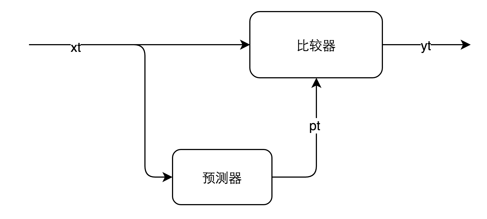

**图2.1 异常检测模型**

异常检测主要有两种策略： 

- **异常驱动的异常检测（敏感性）**：宁愿误报，也不能错过任何一个异常，这适用于非常重要的检测。简单概括，就是“宁可错杀一千，不能放过一个”。
- **预算驱动的异常检测（准确性）**：这种策略的异常检测，从字面理解就是只有定量的一些预算去处理这些报警，那么只能当一定是某种问题时，才能将报警发送出来。

这两种策略不可兼容的。对于检测模型的改善，可以从两个方面入手，一是预测器的优化，二是比较器的优化。我们从这两个方面描述模型的改善。

预测器，就是用一批历史数据预测当前的数据。使用的历史数据集大小，以及使用的预测算法都会影响最终的预测效果。

外卖订单量具有明显的周期性，同时相邻时刻的订单量数据也有很强的相关性，我们的目标，就是使用上面说的相关数据预测出当前的订单量。下面，我们分析几种常用的预测器实现。

## 3.1 同比环比预测器

同比环比是比较常用的异常检测方式，它是将当前时刻数据和前一时刻数据（环比）或者前一天同一时刻数据（同比）比较，超过一定阈值即认为该点异常。如果用图2.1模型来表示，那么预测器就可以表示为用当前时刻前一时刻或者前一天同一时刻数据作为当前时刻的预测数据。

如果将不同日期、时刻的监控数据以矩阵方式存储，每一行表示一天内不同时刻的监控数据，每一列表示同一时刻不同日期的监控数据，那么存储矩阵如下图所示：

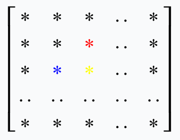

**图3.1 同比环比**

假如需要预测图中黄色数据，那么环比使用图中的蓝色数据作为预测黄点的源数据，同比使用图中红色数据作为预测黄点的源数据。

## 3.2 基线预测器

同比环比使用历史上的单点数据来预测当前数据，误差比较大。**t**时刻的监控数据，与 **t**-1,**t**-2,…时刻的监控数据存在相关性。同时，与**t**-**k**,**t**-2**k**,…时刻的数据也存在相关性（**k**为周期），如果能利用上这些相关数据对**t**时刻进行预测，预测结果的误差将会更小。

比较常用的方式是对历史数据求平均，然后过滤噪声，可以得到一个平滑的曲线（基线），使用基线数据来预测当前时刻的数据。该方法预测**t**时刻数据（图中黄色数据）使用到的历史数据如下图所示（图中红色数据）：

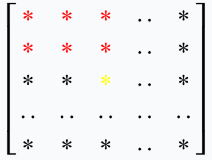

**图3.2 历史数据求平均**

基线数据预测器广泛应用在业务大盘监控中，预测效果如图3.3所示。从图中可以看出，基线比较平滑，在低峰期预测效果比较好，但是在外卖的午高峰和晚高峰预测误差比较大。


**图3.3 基线数据预测**

## 3.3 Holt-Winters预测器

同比环比预测到基线数据预测，使用的相关数据变多，预测的效果也较好。但是基线数据预测器只使用了周期相关的历史数据，没有使用上同周期相邻时刻的历史数据，相邻时刻的历史数据对于当前时刻的预测影响是比较大的。如外卖订单量，某天天气不好，很多用户不愿意出门，那么当天的外卖的订单量就会呈现整体的上涨，这种整体上涨趋势只能从同一周期相邻时刻的历史数据中预测出来。如图3.4所示，预测图中黄色数据，如果使用上图中所有的红色数据，那么预测效果会更好。

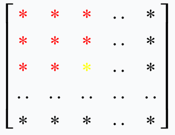

**图3.4 Holt-Winters预测**

本文使用了Holt-Winters来实现这一目标。

Holt-Winters是三次指数滑动平均算法，它将时间序列数据分为三部分：残差数据**a**(**t**)，趋势性数据**b**(**t**)，季节性数据**s**(**t**)。使用Holt-Winters预测**t**时刻数据，需要**t**时刻前包含多个周期的历史数据。相关链接：[Exponential smoothing](https://en.wikipedia.org/wiki/Exponential_smoothing)、[Holt-Winters seasonal method](https://www.otexts.org/fpp/7/5)。

各部分的迭代计算公式（周期为**k**）：


如图3.5所示，(a)显示了某一段时间内外卖订单的原始提单监控数据（分钟统计量，周期为1天），图(b)显示了其Holt-Winters的分解图（四幅图分别对应原始数据、残差数据分量、趋势数据分量、周期数据分量）。将订单量时间序列分解为残差数据**a**(**t**)，趋势数据**b**(**t**)，周期数据**s**(**t**)后，就可以使用下面的公式预测未来不同时刻时刻的订单量，其中**h**表示未来时刻距离当前时刻的跨度。


外卖订单量，是按分钟统计的离散时间序列，所以如果需要预测下一分钟的订单量，令**h**=1。

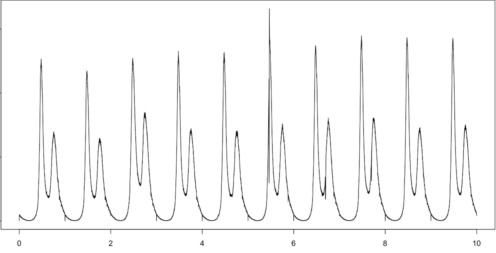

**(a)**


**(b) 图3.5 某一段时间的外卖提单数据和Holt-Winters算法分解图**

## 3.4 外卖报警模型中的预测器

在外卖订单量异常检测中，使用Holt-Winters预测器实时预测下一分钟订单量，每次需要至少5天以上的订单量数据才能有较好的预测效果，数据量要求比较大。

在实际的异常检测模型中，我们对Holt-Winters预测器进行了简化。预测器的趋势数据表示的是时间序列的总体变化趋势，如果以天为周期看待外卖的订单量时间序列，是没有明显的趋势性的，图3.5(b)的分解图也证明了这一点。因此，我们可以去掉其中的趋势数据部分。

各部分的迭代公式简化为(3-1)：


预测值：


**h**越大，预测值**Yhat**[**t**+**h**] 的误差也就越大。实时的订单流监控，令**h**=1，每当有新的监控数据时，更新输入序列，然后预测下一分钟数据。


Holt-Winters每一次预测都需要大量的输入数据序列。从上面模型的简化公式可以看出，对残差数据**a**(**t**)的预测是对序列(**a**(**t**-**m**),**a**(**t**-**m**+1),…**a**(**t**-2),**a**(**t**-1))的一次指数滑动平均，对周期数据**s**(**t**)的预测是对序列（**s**(**t**-**mk**) ,**s**(**t**-(**m**-1)**k**),…**s**(**t**-**k**)）的一次滑动平均，大量的输入数据是用于周期数据**s**(**t**)的计算。

**a**(**t**)和**s**(**t**)是互相关联的迭代计算过程，如果从周期性角度看公式**(3-1)**，可以发现：计算当前周期内的**a**(**t**)时，使用的是上一周期计算出来的**s**(**t**-**k**)，当前周期计算出的**s**(**t**)是用于下一周期**a**(**t**+**k**)的计算。为了将算法应用到线上的实时预测，我们可以将Holt-Winters算法拆分为两个独立的计算过程： 

- 1. 定时任务计算序列的周期数**s**(**t**)。 
- 2. 对残差序列做实时预测。

下面就分别从这两个步骤介绍外卖报警模型中的预测器实现。

### 3.4.1 计算序列的周期性数据

时间序列的周期性数据不需要实时计算，按周期性更新即可，如外卖订单大盘监控，**s**(**t**)只需要每天更新一次即可。对于**s**(**t**)的计算，可以有多种方法，可以使用上面提到的Holt-Winters按公式(3-1)计算出时间序列的周期性数据（如图3.5b所示），或直接使用前一天的监控数据作为当天的周期数据（这两种方式都需要对输入序列进行预处理，保证算法的输入序列不含有异常数据）。也可以用上面3.2节提到的，将历史数据做平均求出基线作为序列的周期性数据。

目前外卖订单中心报警模型采用的是Holt-Winters计算周期数据的方式。在将该模型推广到外卖其他业务线监控时，使用了计算基线数据作为周期数据的方式，这里简单对比一下两种方式的优劣。

#### 1. 使用Holt-Winters算法计算周期数据

- **优点**：如果序列中含有周期性的陡增陡降点，Holt-Winters计算出的周期数据中会保留这些陡增陡降趋势，因此可以准确的预测出这些趋势，不会产生误报。比如外卖订单的提单数据，在每天的某个时刻都有一个定期陡降，使用该方式可以正确的预测出下降的趋势。如图3.6所示，蓝色线是真实数据，棕色线是预测数据，在该时刻，棕色线准确的预测出了下降点。
- **缺点**：需要对输入数据进行预处理，去除异常数据。如果输入序列中含有异常数据，使用Holt-Winters时可能会把这些异常数据计算到周期数据中，影响下一周期的预测从而产生误报（Holt-Winters理论上也只是滑动平均的过程，因此如果输入数据中含有比较大的异常数据时，存在这种可能性，实际应用中订单的报警模型也出现过这种误报）。

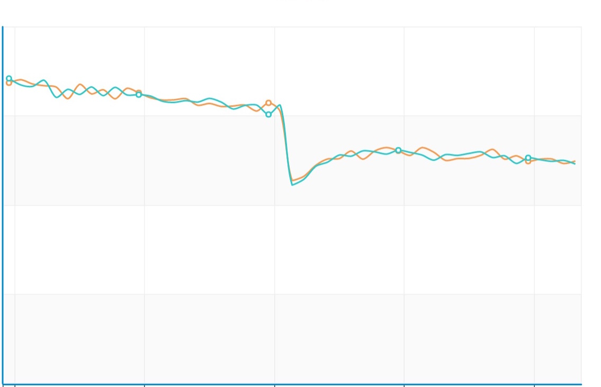

**图3.6 Holt-Winters周期数据预测**

#### 2. 历史数据平均求基线

- **优点**：计算出的周期数据比较平滑，不需要对输入序列进行预处理，计算过程中可以自动屏蔽掉异常数据的影响，计算过程简单，如图3.3所示的基线数据。
- **缺点**：周期数据比较平滑，不会出现陡增陡降点，因此对于周期性出现的陡增陡降不能很好的预测，出现误报。比如外卖活动的大盘（如图3.7所示，红线是真实数据，黑线是预测数据），提前下单优惠在每天某个时刻会出现周期性陡降，使用该方式会出现误报。

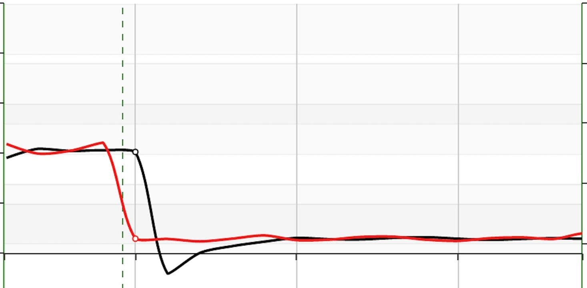


**图3.7 基线周期数据预测**

两种求周期数据的方式各有优劣，可以根据各自的监控数据特点选择合适的计算方式。如果监控数据中含有大量的周期性的陡增陡降点，那么推荐使用方式1，可以避免在这些时间点的误报。如果监控数据比较平滑，陡增陡降点很少，那么推荐方式2，计算简单的同时，也能避免因输入数据预处理不好而造成的意料之外的误报。

### 3.4.2 残差数据实时预测

计算出周期数据后，下一个目标就是对残差数据的预测。使用下面的公式，实际监控数据与周期数据相减得到残差数据，对残差数据做一次滑动平均，预测出下一刻的残差，将该时刻的残差、周期数据相加即可得到该时刻的预测数据。残差序列的长度设为60，即可以得到比较准确的预测效果。


对于实时预测，使用的是当天的周期数据和前60分钟数据。最终的预测结果如图3.8(a)(b)所示，其中蓝色线是真实数据，红色线是预测数据。

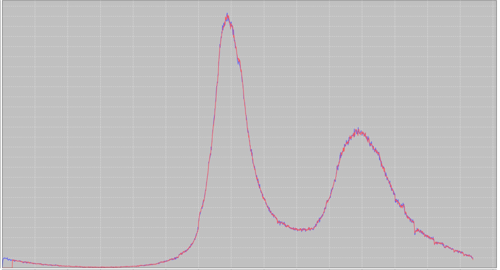

**(a)**

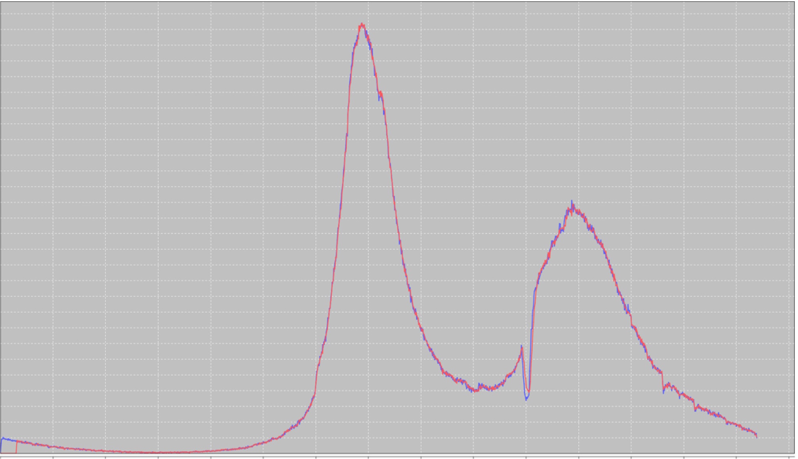

**(b) 图3.8 预测结果曲线**

预测器预测出当前时刻订单量的预测值后，还需要与真实值比较来判断当前时刻订单量是否异常。一般的比较器都是通过阈值法，比如实际值超过预测值的一定比例就认为该点出现异常，进行报警。这种方式错误率比较大。在订单模型的报警检测中没有使用这种方式，而是使用了两个串联的Filter（如图4.1所示），只有当两个Fliter都认为该点异常时，才进行报警，下面简单介绍一下两个Filter的实现。

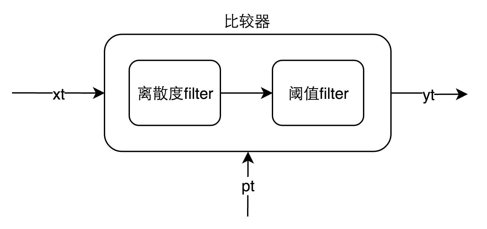

**图4.1 比较器模型**

- **离散度Filter**：根据预测误差曲线离散程度过滤出可能的异常点。一个序列的方差表示该序列离散的程度，方差越大，表明该序列波动越大。如果一个预测误差序列方差比较大，那么我们认为预测误差的报警阈值相对大一些才比较合理。离散度Filter利用了这一特性，取连续15分钟的预测误差序列，分为首尾两个序列（e1,e2），如果两个序列的均值差大于e1序列方差的某个倍数，我们就认为该点可能是异常点。
- **阈值Filter**：根据误差绝对值是否超过某个阈值过滤出可能的异常点。利用离散度Filter进行过滤时，报警阈值随着误差序列波动程度变大而变大，但是在输入数据比较小时，误差序列方差比较小，报警阈值也很小，容易出现误报。所以设计了根据误差绝对值进行过滤的阈值Filter。阈值Filter设计了一个分段阈值函数**y**=**f**(**x**)，对于实际值**x**和预测值**p**，只有当|**x**-**p**|>**f**(**x**)时报警。实际使用中，可以寻找一个对数函数替换分段阈值函数，更易于参数调优。

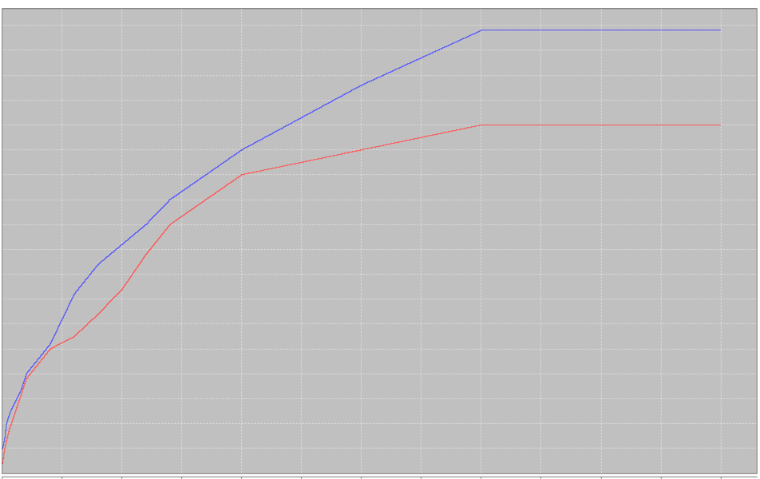

**图4.2 分段阈值Filter**

最终的外卖订单异常报警模型结构图如图5.1所示，每天会有定时Job从ETL中统计出最近10天的历史订单量，经过预处理模块，去除异常数据，经过周期数据计算模块得到周期性数据。对当前时刻预测时，取60分钟的真实数据和周期性数据，经过实时预测模块，预测出当前订单量。将连续15分钟的预测值和真实值通过比较器，判断当前时刻是否异常。

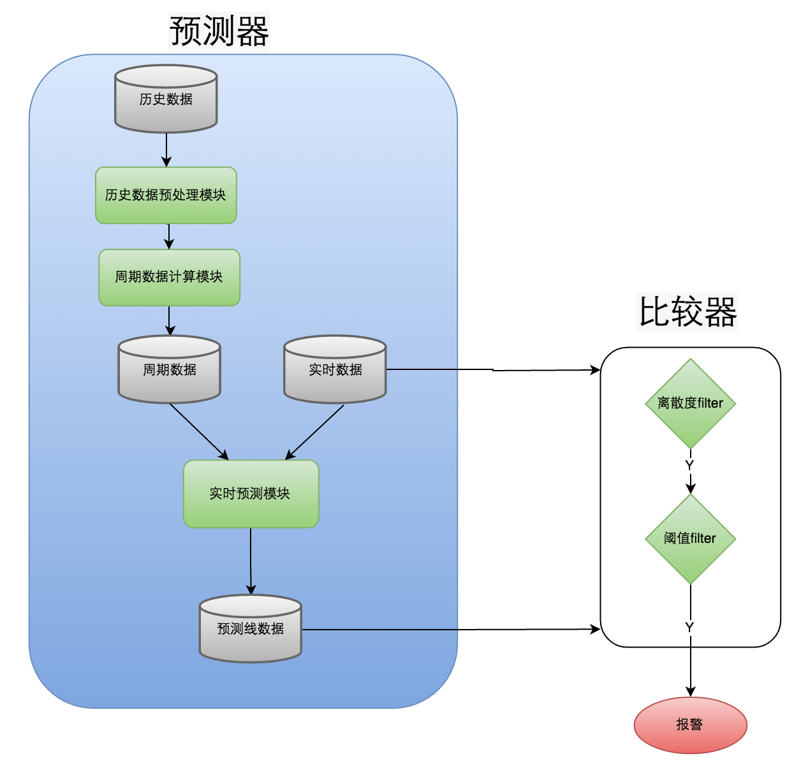

**图5.1 报警模型结构图**

新的报警模型上线后，外卖订单量的异常检测的漏报率和误报率都有显著的提升，上线半年以来，对于每一次的异常都能准确的检测出来，漏报率近乎为0。误报率在通常情况下限制在了每周0~3次误报。

报警模型目前应用在外卖订单量的异常检测中，同时推广到了外卖业务的其他各种大盘监控中，取得了不错的效果。在报警模型上线后，我们发现并解决了一些系统隐患点，如： 

- 点评侧外卖提单量在每天定时有一个下降尖刺，经过排查是因为客户端冷启动短时间内大量的请求，导致SLB性能达到瓶颈，从而导致接口成功率下降。 
- 点评侧外卖订单取消量经常会有尖刺，经过排查发现是由于在支付时，需要进行跨机房的账号转换，专线网络抖动时造成接口超时。 
- 外卖订单量在每天某些时刻都有陡降趋势，经过排查，是因为这些点大量商家开始休息导致的。

将机器学习中的预测算法运用到外卖订单的异常检测中，极大的提高了异常检测的准确性和敏感性，提升了系统稳定运维的效率。该报警模型也有很广泛的应用场景，美团点评的各个业务线的监控数据，绝大多数都是含有明显周期性的时间序列，本文提出的模型都能运用到这些监控数据的异常检测中。

当然，模型还有进一步完善的空间，如： 

- 历史数据的预处理优化。在进行周期数据计算时，对于输入序列的预处理，如果能够排除绝大部分的异常数据，那么最终检测的误报率将会进一步的降低。 
- 在不会产生持续误报的情况下替换有异常的实时数据。对于当前数据的预测，利用的都是前60分钟的真实数据，但是这些数据可能本身就存在异常数据，那么就存在一种情况，当出现异常时，真实数据开始下跌，预测数据紧接着也会下跌（如图3.8b所示）。这种情况有时候可能满足需求（比如只在异常开始的时候进行报警，异常持续时间内不再报警，防止报警太多造成的信息轰炸），有时候可能不满足需求（比如要求预测数据不跟随异常变化而变化，这种情况可以应用在故障期间的损失统计中）。如果需要预测值不随异常变化而变化，一种可能的方法是，当检测到当前数据是异常数据时，将预测数据替换当前的真实数据，作为下一时刻预测器的输入，这样可以防止异常数据对于下一时刻预测值的影响。


---

- 作者：东杰
- 链接：https://tech.meituan.com/2017/04/21/order-holtwinter.html

